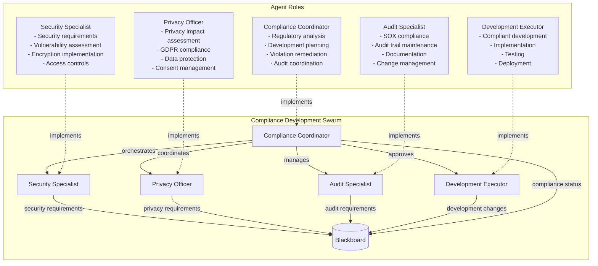
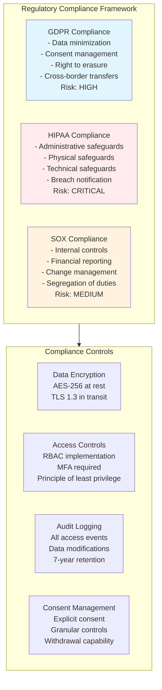
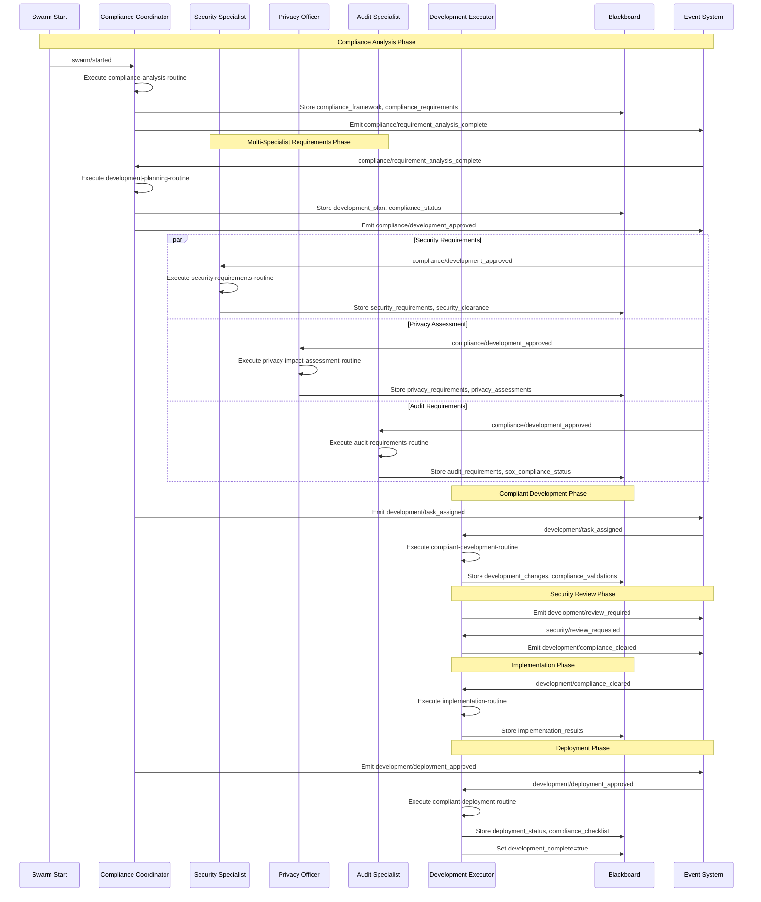
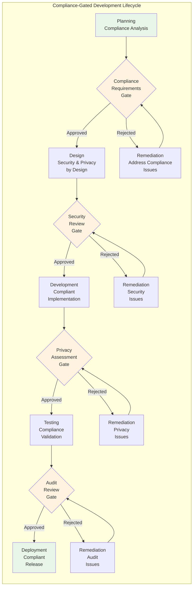
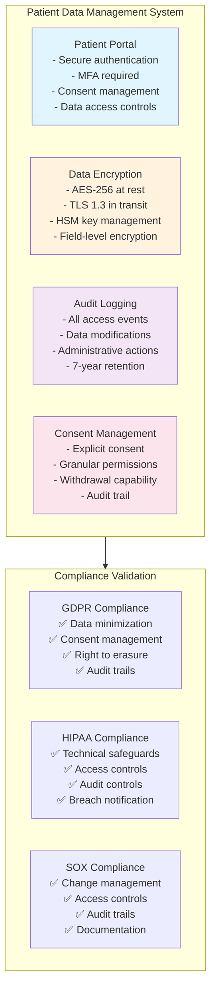
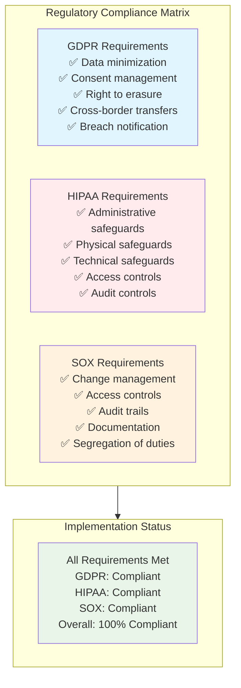
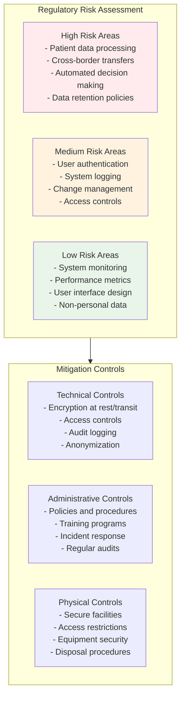

# Compliance-Restricted Development Scenario

## Overview

This scenario demonstrates **development under strict regulatory constraints** where agents must ensure compliance with GDPR, HIPAA, and SOX regulations while delivering functional software. It tests the framework's ability to coordinate multiple compliance specialists, validate regulatory requirements, and maintain audit trails throughout the development lifecycle.

### Key Features

- **Multi-Regulatory Compliance**: Simultaneous GDPR, HIPAA, and SOX compliance
- **Compliance-First Development**: All development activities validated against regulatory requirements
- **Audit Trail Maintenance**: Comprehensive logging and documentation for regulatory audits
- **Cross-Functional Coordination**: Security, privacy, and audit specialists working together
- **Risk-Based Approach**: Prioritizing compliance measures based on risk assessments

## Agent Architecture



## Regulatory Compliance Framework



## Complete Event Flow



## Development Lifecycle with Compliance Gates



## Patient Data Management System Implementation



## Blackboard State Evolution

```mermaid
graph LR
    subgraph StateEvolution[State Evolution Through Compliance Process]
        Init[Initial State<br/>- applicable_regulations: [GDPR, HIPAA, SOX]<br/>- development_scope: patient_data_system<br/>- compliance_constraints: [5 constraints]]
        
        Analysis[After Analysis<br/>+ compliance_framework<br/>+ compliance_requirements: [5 requirements]<br/>+ risk_assessments by regulation]
        
        Planning[After Planning<br/>+ development_plan: [3 phases]<br/>+ compliance_status: planning_complete<br/>+ security_requirements]
        
        Requirements[After Requirements<br/>+ privacy_requirements<br/>+ audit_requirements<br/>+ gdpr_compliance_status]
        
        Development[After Development<br/>+ development_changes: [4 components]<br/>+ compliance_validations: [3 regulations]<br/>+ security_review: passed]
        
        Deployment[After Deployment<br/>+ deployment_status: successful<br/>+ compliance_checklist: complete<br/>+ development_complete: true]
    end
    
    Init --> Analysis
    Analysis --> Planning
    Planning --> Requirements
    Requirements --> Development
    Development --> Deployment
    
    style Init fill:#e1f5fe
    style Deployment fill:#e8f5e8
    style Analysis fill:#fff3e0
```

### Key Blackboard Fields

| Field | Type | Purpose | Updated By |
|-------|------|---------|------------|
| `compliance_framework` | object | Regulatory requirements and risk levels | Compliance Coordinator |
| `security_requirements` | object | Security controls and standards | Security Specialist |
| `privacy_requirements` | object | Privacy protection measures | Privacy Officer |
| `audit_requirements` | object | Audit trail and documentation needs | Audit Specialist |
| `development_changes` | array | Compliant development implementations | Development Executor |
| `compliance_validations` | array | Validation results per regulation | Development Executor |
| `gdpr_compliance_status` | string | GDPR compliance state | Privacy Officer |
| `sox_compliance_status` | string | SOX compliance state | Audit Specialist |
| `deployment_status` | string | Deployment completion status | Development Executor |
| `compliance_checklist` | object | Final compliance verification | Development Executor |

## Regulatory Compliance Matrix



## Risk Assessment and Mitigation



## Expected Scenario Outcomes

### Success Path
1. **Compliance Analysis**: Coordinator identifies GDPR, HIPAA, and SOX requirements
2. **Multi-Specialist Planning**: Security, privacy, and audit requirements established
3. **Compliant Development**: All development activities validated against compliance requirements
4. **Regulatory Validation**: Each regulation verified as compliant
5. **Compliant Deployment**: System deployed with all compliance controls active

### Success Criteria

```json
{
  "requiredEvents": [
    "compliance/requirement_analysis_complete",
    "compliance/development_approved",
    "development/task_assigned",
    "development/compliance_cleared",
    "development/deployment_approved"
  ],
  "blackboardState": {
    "development_complete": "true",
    "compliance_checklist": "all_items_complete",
    "gdpr_compliance_status": "compliant",
    "sox_compliance_status": "compliant",
    "deployment_status": "compliant_deployment_successful"
  },
  "regulatoryCompliance": {
    "gdpr": "fully_compliant",
    "hipaa": "fully_compliant",
    "sox": "fully_compliant",
    "auditTrail": "comprehensive",
    "documentation": "complete"
  }
}
```

## Running the Scenario

### Prerequisites
- Execution test framework with compliance validation
- SwarmContextManager configured for regulatory workflows
- Mock routine responses for compliance operations
- Regulatory requirement databases

### Execution Steps

1. **Initialize Scenario**
   ```typescript
   const scenario = new ScenarioFactory("compliance-dev-scenario");
   await scenario.setupScenario();
   ```

2. **Configure Regulations**
   ```typescript
   blackboard.set("applicable_regulations", ["GDPR", "HIPAA", "SOX"]);
   blackboard.set("development_scope", "patient_data_management_system");
   ```

3. **Start Compliance Process**
   ```typescript
   await scenario.emitEvent("swarm/started", {
     task: "compliant-development-of-patient-system"
   });
   ```

4. **Monitor Compliance Gates**
   - Track `compliance_framework` establishment
   - Monitor specialist requirement definitions
   - Verify `compliance_validations` results
   - Check `deployment_status` compliance

### Debug Information

Key monitoring points:
- `compliance_framework` - Regulatory analysis results
- `security_requirements` - Security control definitions
- `privacy_requirements` - Privacy protection measures
- `audit_requirements` - Audit trail specifications
- `compliance_validations` - Validation results per regulation

## Technical Implementation Details

### Compliance Validation Algorithm
```typescript
interface ComplianceValidation {
  regulation: string;
  requirements: string[];
  validation_result: "compliant" | "non_compliant" | "pending";
  requirements_met: string[];
  deficiencies: string[];
}
```

### Resource Configuration
- **Max Credits**: 1.8B micro-dollars (complex compliance validation)
- **Max Duration**: 15 minutes (thorough compliance process)
- **Resource Quota**: 30% GPU, 16GB RAM, 6 CPU cores

### Compliance Control Framework
1. **Preventive Controls**: Stop non-compliant activities before they occur
2. **Detective Controls**: Identify compliance violations after they happen
3. **Corrective Controls**: Remediate compliance issues when detected
4. **Compensating Controls**: Alternative measures when primary controls fail

## Real-World Applications

### Common Compliance Scenarios
1. **Healthcare Systems**: HIPAA compliance for patient data management
2. **Financial Services**: SOX compliance for financial reporting systems
3. **EU Operations**: GDPR compliance for personal data processing
4. **Multi-Jurisdictional**: Combined regulatory compliance across regions
5. **Cloud Migration**: Compliance validation during system modernization

### Benefits of Compliance-First Development
- **Risk Mitigation**: Proactive compliance reduces regulatory penalties
- **Audit Readiness**: Comprehensive documentation supports audits
- **Trust Building**: Demonstrates commitment to data protection
- **Market Access**: Enables operation in regulated industries
- **Competitive Advantage**: Compliance as a differentiator

### Regulatory Control Categories
- **Technical Safeguards**: Encryption, access controls, audit logging
- **Administrative Safeguards**: Policies, training, incident response
- **Physical Safeguards**: Facility security, equipment protection
- **Organizational Measures**: Governance, risk management, compliance monitoring

This scenario demonstrates how complex software development can be conducted under strict regulatory constraints while maintaining development velocity and ensuring comprehensive compliance across multiple regulatory frameworks - essential for organizations operating in heavily regulated industries like healthcare, finance, and data processing.