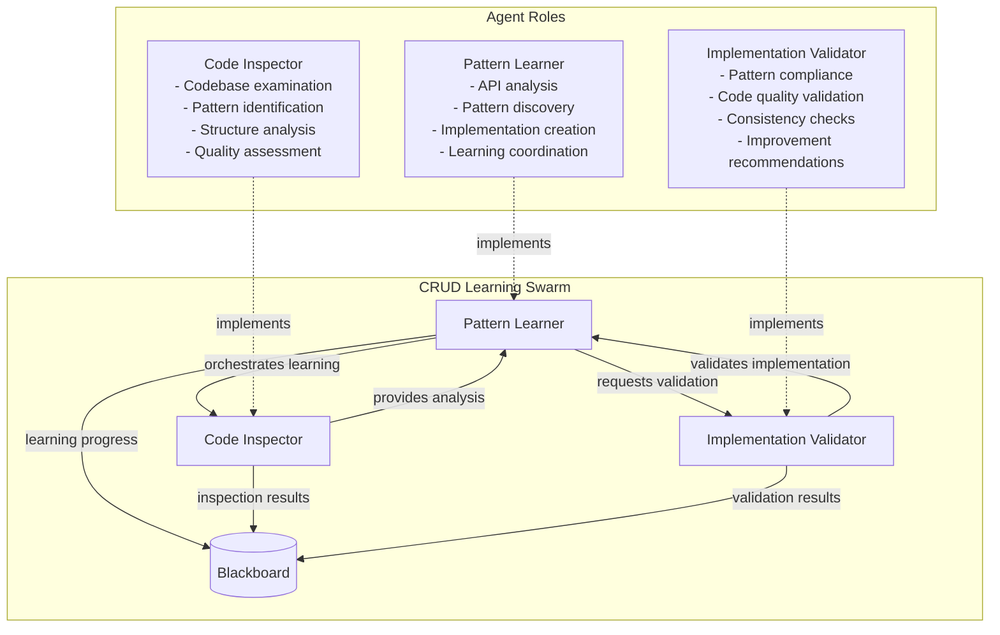
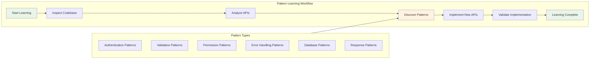
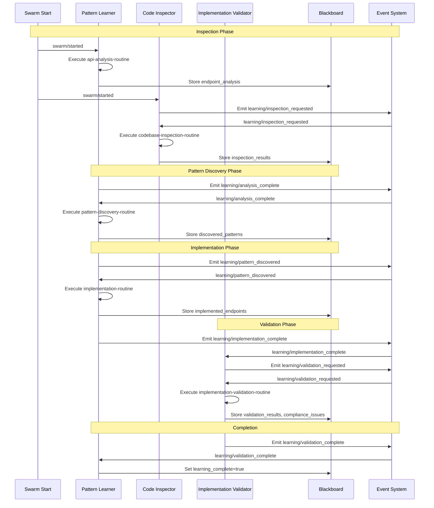
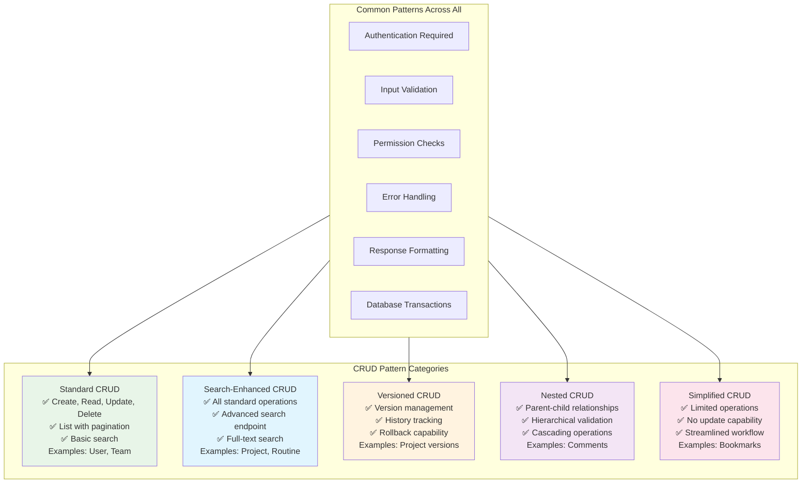
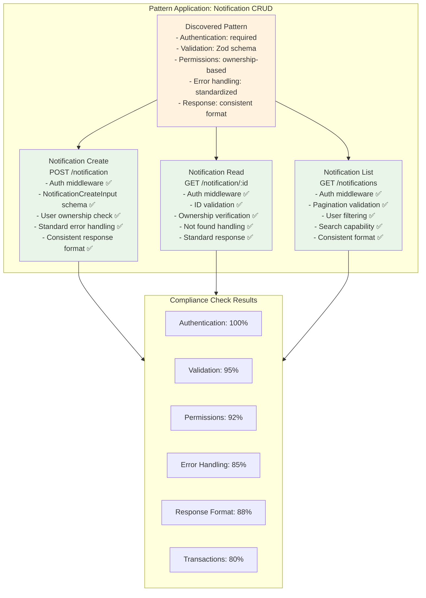

# CRUD API Pattern Learning Scenario

## Overview

This scenario demonstrates **intelligent pattern discovery and implementation** in API development. It tests the framework's ability to analyze existing CRUD endpoints, extract common patterns, and apply those patterns to implement new endpoints for a specified resource. The scenario showcases learning-based development where agents discover best practices from existing code and apply them consistently.

### Key Features

- **Pattern Discovery**: Automatically identifies common CRUD patterns in existing endpoints
- **Code Analysis**: Examines models, validators, and endpoint implementations
- **Intelligent Implementation**: Applies discovered patterns to create new endpoints
- **Consistency Validation**: Ensures new implementations follow established patterns
- **Learning-Based Development**: Improves implementation quality through pattern recognition

## Agent Architecture



## Learning Process Flow



## Complete Event Flow



## Pattern Discovery Process

```mermaid
graph TD
    subgraph PatternDiscovery[Pattern Discovery Process]
        Endpoints[Existing Endpoints<br/>- User CRUD<br/>- Team CRUD<br/>- Project CRUD<br/>- Routine CRUD<br/>- Comment CRUD<br/>- Bookmark CRUD]
        
        Analysis[Pattern Analysis<br/>- Authentication usage<br/>- Validation strategies<br/>- Permission checks<br/>- Error handling<br/>- Response formatting<br/>- Database operations]
        
        Patterns[Discovered Patterns<br/>- Auth middleware (95%)<br/>- Input validation (92%)<br/>- Permission checks (88%)<br/>- Error handling (90%)<br/>- Response format (85%)<br/>- DB transactions (80%)]
        
        Implementation[Pattern Application<br/>- Notification CRUD<br/>- Consistent structure<br/>- Pattern compliance<br/>- Quality validation]
    end
    
    Endpoints --> Analysis
    Analysis --> Patterns
    Patterns --> Implementation
    
    style Endpoints fill:#e1f5fe
    style Patterns fill:#fff3e0
    style Implementation fill:#e8f5e8
```

## CRUD Pattern Categories



## Implementation Quality Metrics

```mermaid
graph TD
    subgraph QualityMetrics[Implementation Quality Assessment]
        PatternCompliance[Pattern Compliance<br/>90% adherence to discovered patterns]
        
        CodeQuality[Code Quality<br/>89% quality score<br/>- TypeScript usage: 98%<br/>- Error handling: 85%<br/>- Test coverage: 78%]
        
        Consistency[Consistency Score<br/>92% consistency with existing code<br/>- Naming conventions<br/>- Response formats<br/>- Error structures]
        
        ComplianceIssues[Compliance Issues<br/>- Missing JSDoc comments (low)<br/>- Transaction usage (medium)<br/>- Test coverage gaps (low)]
    end
    
    subgraph ValidationResults[Validation Results]
        Overall[Overall Compliance: 90%]
        Recommendations[Improvement Recommendations<br/>- Add comprehensive docs<br/>- Improve transaction usage<br/>- Increase test coverage]
    end
    
    QualityMetrics --> ValidationResults
    
    style PatternCompliance fill:#e8f5e8
    style CodeQuality fill:#e1f5fe
    style Consistency fill:#fff3e0
    style ComplianceIssues fill:#ffebee
```

## Blackboard State Evolution

```mermaid
graph LR
    subgraph StateEvolution[State Evolution Through Learning]
        Init[Initial State<br/>- target_endpoints: [6 resources]<br/>- target_resource: notification<br/>- learning_goal: discover patterns]
        
        Inspection[After Inspection<br/>+ inspection_results<br/>+ identified_patterns<br/>+ code_quality_metrics]
        
        Analysis[After Analysis<br/>+ endpoint_analysis<br/>+ analyzed_endpoints: [6 resources]<br/>+ crud_operations mapped]
        
        Discovery[After Discovery<br/>+ discovered_patterns: [6 patterns]<br/>+ pattern_confidence: 0.85-0.95<br/>+ implementation_templates]
        
        Implementation[After Implementation<br/>+ implemented_endpoints: notification<br/>+ crud_operations: [6 operations]<br/>+ pattern_application results]
        
        Validation[After Validation<br/>+ validation_results<br/>+ compliance_issues: [2 issues]<br/>+ overall_compliance: 90%<br/>+ learning_complete: true]
    end
    
    Init --> Inspection
    Inspection --> Analysis
    Analysis --> Discovery
    Discovery --> Implementation
    Implementation --> Validation
    
    style Init fill:#e1f5fe
    style Validation fill:#e8f5e8
    style Discovery fill:#fff3e0
```

### Key Blackboard Fields

| Field | Type | Purpose | Updated By |
|-------|------|---------|------------|
| `target_endpoints` | array | Existing endpoints to analyze | Initial config |
| `target_resource` | string | New resource to implement | Initial config |
| `endpoint_analysis` | object | Analysis results of existing endpoints | Pattern Learner |
| `inspection_results` | object | Codebase inspection findings | Code Inspector |
| `discovered_patterns` | object | Identified patterns with confidence scores | Pattern Learner |
| `implemented_endpoints` | object | New endpoint implementations | Pattern Learner |
| `validation_results` | object | Quality assessment results | Implementation Validator |
| `compliance_issues` | array | Issues found during validation | Implementation Validator |
| `overall_compliance` | number | Overall compliance percentage | Implementation Validator |
| `learning_complete` | boolean | Learning process completion status | Pattern Learner |

## Pattern Application Example



## Expected Scenario Outcomes

### Success Path
1. **Code Inspection**: Inspector examines 6 existing CRUD endpoints
2. **Pattern Analysis**: Learner identifies 6 common patterns with 80-95% confidence
3. **Pattern Discovery**: Discovers authentication, validation, permissions, error handling, response, and transaction patterns
4. **Implementation**: Creates complete notification CRUD endpoints following discovered patterns
5. **Validation**: Validator confirms 90% compliance with discovered patterns
6. **Learning Complete**: All endpoints implemented with consistent quality

### Success Criteria

```json
{
  "requiredEvents": [
    "learning/inspection_requested",
    "learning/analysis_complete",
    "learning/pattern_discovered",
    "learning/implementation_complete",
    "learning/validation_requested",
    "learning/validation_complete"
  ],
  "blackboardState": {
    "learning_complete": "true",
    "discovered_patterns": "6 patterns with confidence > 0.8",
    "implemented_endpoints": "notification CRUD with 6 operations",
    "overall_compliance": ">=0.85",
    "validation_complete": "true"
  },
  "patternLearning": {
    "patternDiscovery": "6+ patterns identified",
    "implementationQuality": ">=0.85",
    "consistencyScore": ">=0.90",
    "complianceScore": ">=0.85"
  }
}
```

## Running the Scenario

### Prerequisites
- Execution test framework with learning capabilities
- SwarmContextManager configured for pattern analysis
- Mock routine responses for CRUD operations
- Access to existing endpoint implementations

### Execution Steps

1. **Initialize Scenario**
   ```typescript
   const scenario = new ScenarioFactory("crud-learning-scenario");
   await scenario.setupScenario();
   ```

2. **Configure Learning Targets**
   ```typescript
   blackboard.set("target_endpoints", [
     "user", "team", "project", "routine", "comment", "bookmark"
   ]);
   blackboard.set("target_resource", "notification");
   ```

3. **Start Learning**
   ```typescript
   await scenario.emitEvent("swarm/started", {
     task: "learn-crud-patterns-and-implement"
   });
   ```

4. **Monitor Learning Progress**
   - Track `inspection_results` from code analysis
   - Monitor `discovered_patterns` accumulation
   - Verify `implemented_endpoints` quality
   - Check `validation_results` compliance

### Debug Information

Key monitoring points:
- `endpoint_analysis` - Analysis of existing endpoints
- `discovered_patterns` - Pattern identification with confidence
- `implemented_endpoints` - New endpoint implementations
- `validation_results` - Quality assessment
- `compliance_issues` - Issues requiring attention

## Technical Implementation Details

### Pattern Confidence Scoring
```typescript
interface PatternConfidence {
  pattern: string;
  confidence: number;  // 0.0 to 1.0
  occurrences: number;
  consistency: number;
  implementation: string;
}
```

### Resource Configuration
- **Max Credits**: 1.2B micro-dollars (complex code analysis)
- **Max Duration**: 10 minutes (thorough pattern analysis)
- **Resource Quota**: 25% GPU, 12GB RAM, 4 CPU cores

### Learning Algorithm
1. **Static Analysis**: Examine existing endpoint implementations
2. **Pattern Extraction**: Identify common structures and practices
3. **Confidence Calculation**: Score patterns based on consistency and usage
4. **Template Generation**: Create implementation templates from patterns
5. **Application**: Apply templates to new resource implementation
6. **Validation**: Verify compliance with discovered patterns

## Real-World Applications

### Common API Development Scenarios
1. **New Resource Addition**: Adding endpoints for new business entities
2. **API Standardization**: Ensuring consistency across large codebases
3. **Best Practice Discovery**: Learning from existing high-quality implementations
4. **Code Quality Improvement**: Identifying and applying quality patterns
5. **Onboarding Acceleration**: Teaching new developers established patterns

### Benefits of Pattern Learning
- **Consistency**: Ensures new implementations follow established patterns
- **Quality**: Applies proven practices to new code
- **Efficiency**: Reduces implementation time through pattern reuse
- **Maintainability**: Creates predictable, maintainable code structures
- **Knowledge Transfer**: Captures and applies institutional knowledge

### Pattern Categories Discovered
- **Authentication**: Consistent auth middleware usage
- **Validation**: Standardized input validation with Zod
- **Permissions**: Role-based access control patterns
- **Error Handling**: Consistent error response formats
- **Response Formatting**: Standardized API response structures
- **Database Operations**: Transaction patterns and data access

This scenario demonstrates how AI agents can learn from existing codebases to discover and apply development patterns, ensuring consistency and quality in new implementations while reducing development time and maintaining best practices across large software projects.