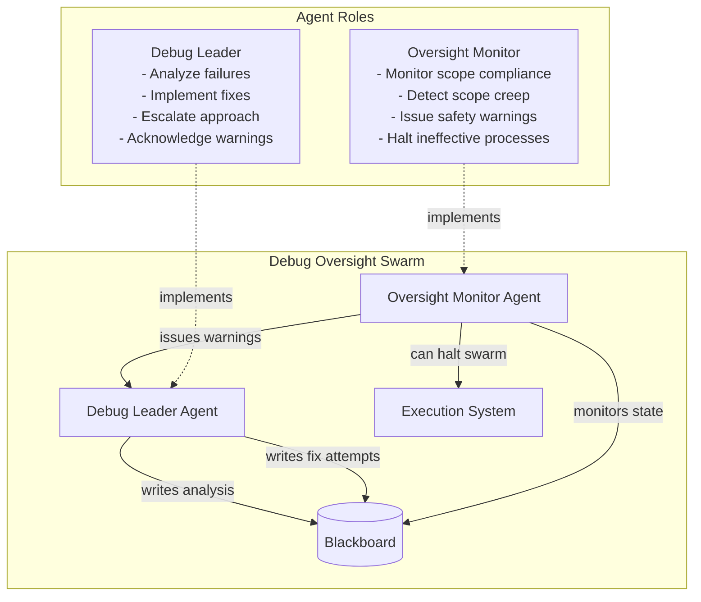
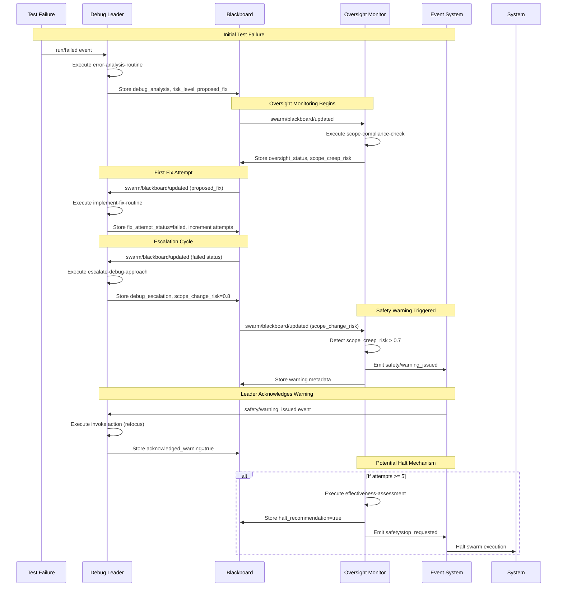
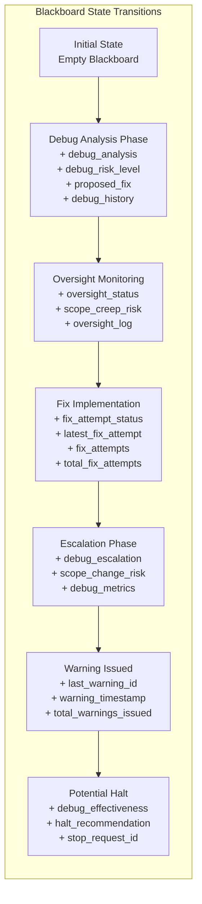
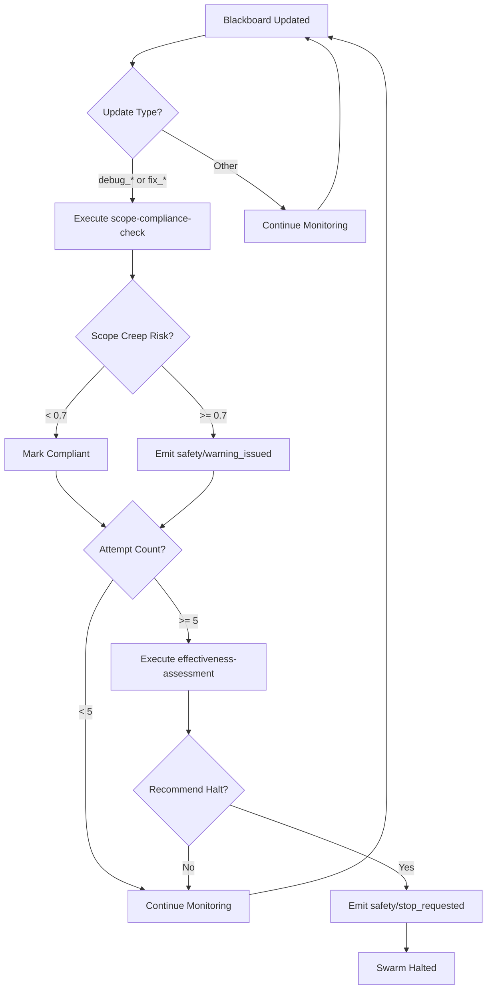
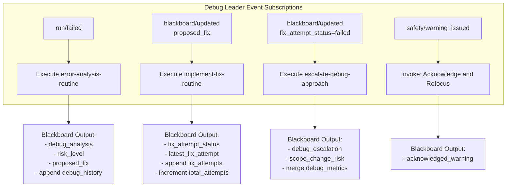
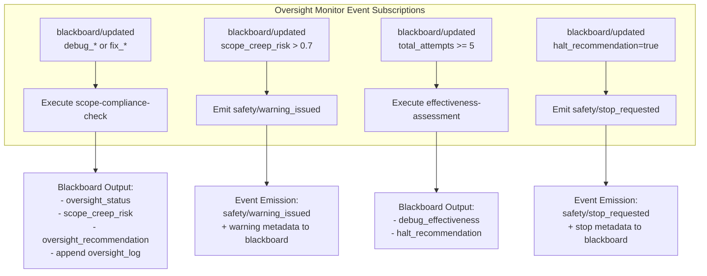
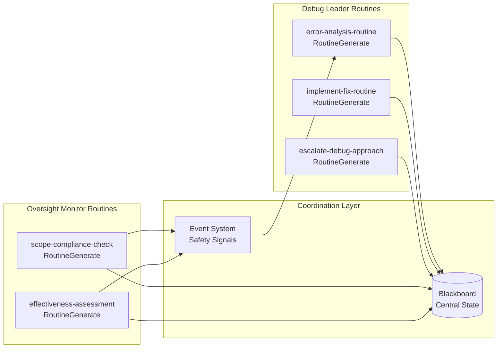

# Debug Oversight Scenario

## Overview

This scenario demonstrates sophisticated multi-agent coordination with built-in safety mechanisms. It models a realistic debugging workflow where a **Debug Leader** agent continuously troubleshoots test failures while an **Oversight Monitor** agent watches for scope creep and can halt the swarm if debugging becomes ineffective.

### Key Features

- **Progressive Intervention**: Monitor → Warn → Halt escalation pattern
- **Scope Creep Detection**: Prevents debugging from expanding beyond original issue
- **Resource Protection**: Halts ineffective debugging cycles
- **Event-Driven Coordination**: Agents communicate through blackboard and event emission
- **Safety Mechanisms**: Built-in oversight prevents runaway processes

## Agent Architecture



## Coordination Flow

### Complete Event Sequence



## Blackboard State Evolution

The blackboard serves as the central coordination mechanism, accumulating state through sophisticated OutputOperations:



### Key Blackboard Operations

| Operation Type | Usage | Example |
|---------------|-------|---------|
| **set** | Current status/state | `debug_analysis`, `oversight_status` |
| **append** | Historical records | `debug_history[]`, `fix_attempts[]` |
| **increment** | Counters/metrics | `total_fix_attempts`, `total_warnings_issued` |
| **merge** | Complex metrics | `debug_metrics`, `escalation_metrics` |

## Safety Mechanism Decision Tree



## Agent Behavior Patterns

### Debug Leader Behaviors



### Oversight Monitor Behaviors



## Routine Coordination Architecture



## Progressive Intervention Model

The scenario implements a sophisticated **graduated response** system:

### Level 1: Continuous Monitoring
- **Trigger**: All blackboard updates
- **Action**: Scope compliance checking
- **Outcome**: Risk assessment and logging

### Level 2: Early Warning
- **Trigger**: Scope creep risk ≥ 0.7
- **Action**: Emit `safety/warning_issued`
- **Outcome**: Debug leader acknowledgment and refocus

### Level 3: Effectiveness Assessment
- **Trigger**: 5+ failed fix attempts
- **Action**: Comprehensive effectiveness evaluation
- **Outcome**: Halt recommendation if ineffective

### Level 4: Swarm Termination
- **Trigger**: Halt recommendation = true
- **Action**: Emit `safety/stop_requested`
- **Outcome**: Complete swarm shutdown

## Expected Scenario Outcomes

### Success Criteria

The scenario is considered successful when:

1. **Event Flow Completion**
   - Initial `run/failed` triggers debug analysis
   - Blackboard updates trigger oversight monitoring
   - Scope creep detection triggers safety warning
   - Debug leader acknowledges oversight warning

2. **Blackboard State Achievement**
   ```json
   {
     "debug_analysis": "exists",
     "total_fix_attempts": ">=1", 
     "scope_creep_risk": ">=0.7",
     "oversight_status": "exists",
     "total_warnings_issued": ">=1"
   }
   ```

3. **Agent Coordination Validation**
   - Minimum 4 routine calls executed
   - Cross-agent communication verified
   - Safety mechanisms activated appropriately

### Failure Detection Patterns

The scenario specifically tests detection of:

- **Scope Creep**: Moving from simple auth test to "middleware redesign"
- **Complexity Escalation**: Suggesting architectural changes for simple bugs
- **Ineffective Iteration**: Multiple failed attempts without learning
- **Resource Misallocation**: Extended debugging without progress

## Running the Scenario

### Prerequisites
- Execution test framework initialized
- SwarmContextManager and ScenarioFactory operational
- Mock routine responses configured

### Execution Steps

1. **Initialize Scenario**
   ```typescript
   const scenario = new ScenarioFactory("debug-oversight-scenario");
   await scenario.setupScenario();
   ```

2. **Trigger Initial Event**
   ```typescript
   await scenario.emitEvent("run/failed", {
     routine_name: "user-authentication-test",
     error: "AssertionError: Expected status 200, got 401",
     context: "Login endpoint test failing consistently"
   });
   ```

3. **Monitor Coordination**
   - Watch for blackboard state updates
   - Verify agent routine executions
   - Confirm safety event emissions

4. **Validate Success Criteria**
   - Check required events occurred
   - Verify blackboard final state
   - Confirm agent coordination patterns

### Debug Information

Monitor these blackboard keys for troubleshooting:
- `debug_analysis` - Initial error analysis results
- `scope_creep_risk` - Current scope compliance risk
- `total_fix_attempts` - Number of fix attempts made
- `oversight_log` - Complete monitoring history
- `total_warnings_issued` - Safety intervention count

## Technical Implementation Details

### Event Quality of Service (QoS)
- **QoS 1**: Standard debugging operations (at-least-once delivery)
- **QoS 2**: Safety events (exactly-once delivery for critical warnings/halts)

### Resource Constraints
- **Max Credits**: 1B micro-dollars ($1000)
- **Max Duration**: 5 minutes
- **Resource Quota**: 25% GPU, 16GB RAM, 4 CPU cores

### Mock Response Strategy
The scenario uses carefully crafted mock responses that demonstrate realistic debugging failure patterns:
1. Initial analysis suggests simple fix
2. Fix implementation fails
3. Escalation suggests architectural changes (scope creep trigger)
4. Oversight detects and warns about scope expansion

This scenario serves as a comprehensive test of the execution framework's ability to handle sophisticated agent coordination with built-in safety mechanisms, demonstrating emergent intelligence through simple event-driven rules.