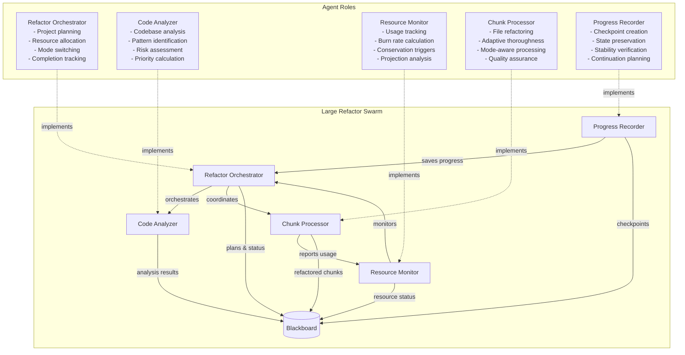
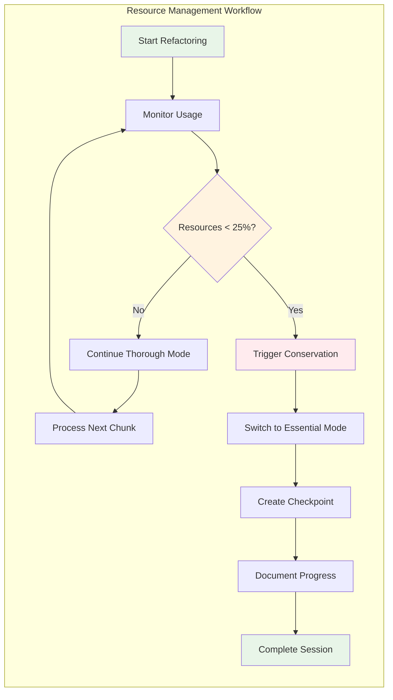
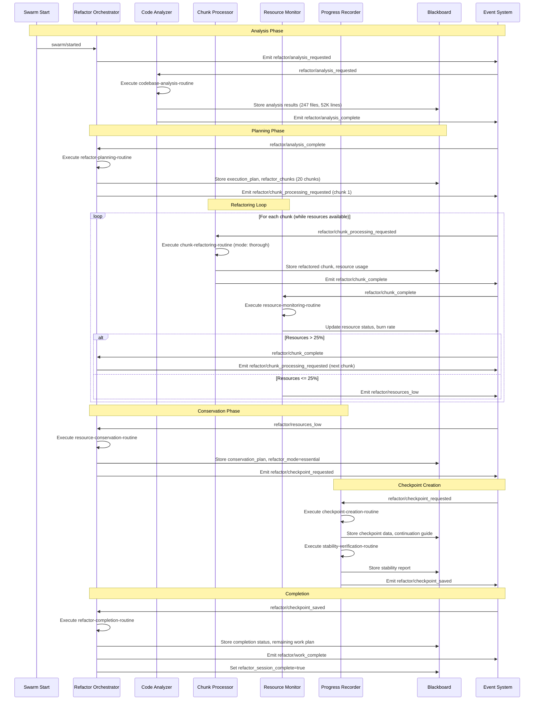
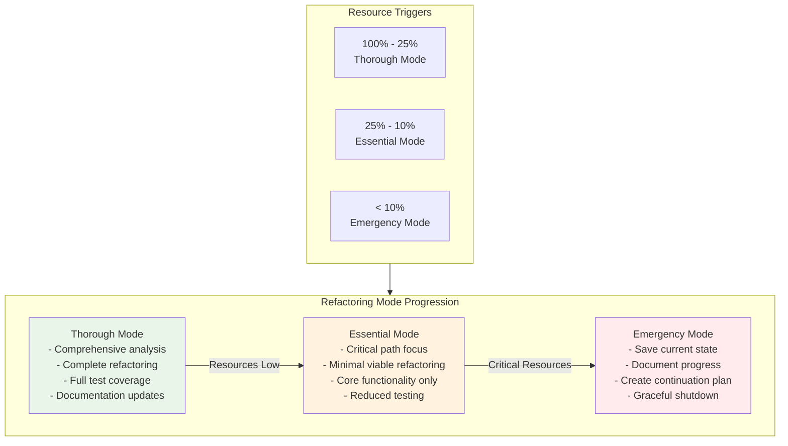
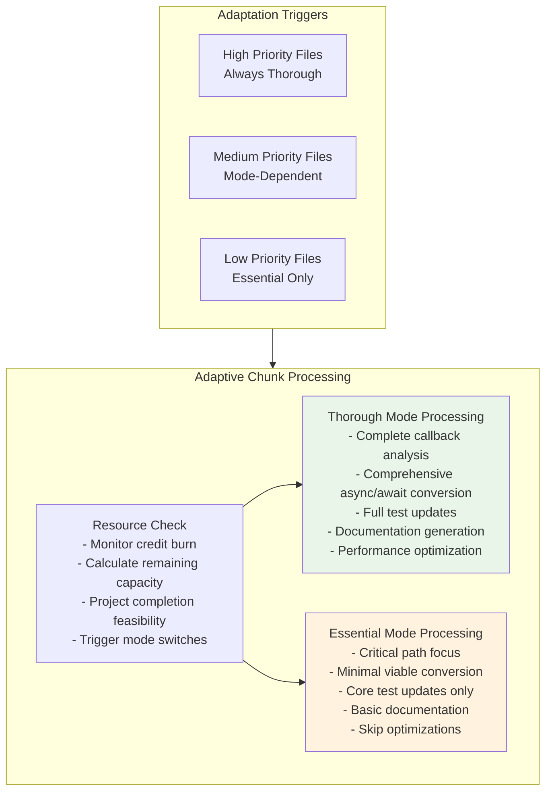
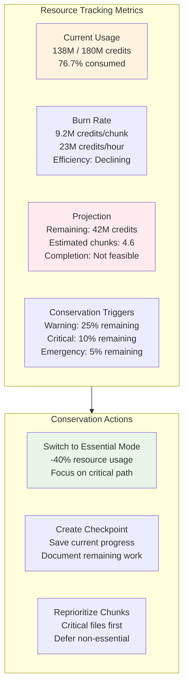
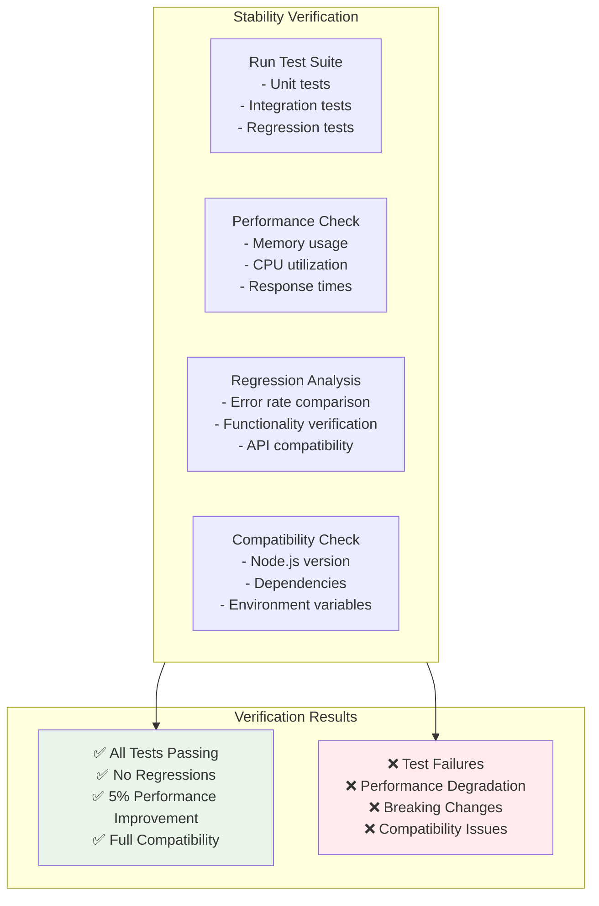

# Large Codebase Refactoring Scenario

## Overview

This scenario demonstrates **resource-aware refactoring** of a massive legacy codebase (50,000+ lines) with intelligent resource management, graceful degradation, and comprehensive checkpoint creation. It tests the framework's ability to handle large-scale software engineering tasks while managing resource constraints and ensuring work continuity.

### Key Features

- **Resource Monitoring**: Real-time tracking of credit consumption and burn rates
- **Progressive Degradation**: Switches from thorough to essential mode when resources are low
- **Checkpoint System**: Saves progress and creates continuation plans
- **Stability Verification**: Ensures partial refactoring doesn't break the system
- **Intelligent Prioritization**: Focuses on critical-path files when resources are constrained

## Agent Architecture



## Resource Management Flow



## Complete Event Flow



## Progressive Degradation Strategy



## Blackboard State Evolution

```mermaid
graph LR
    subgraph StateEvolution[State Evolution Through Refactoring]
        Init[Initial State<br/>- target_codebase<br/>- resource_budget: 180M<br/>- refactor_mode: thorough]
        
        Analysis[After Analysis<br/>+ codebase_analysis: 247 files<br/>+ refactor_complexity<br/>+ execution_plan: 20 chunks]
        
        Progress[During Processing<br/>+ completed_chunks: [1,2,3...]<br/>+ total_resources_used: 138M<br/>+ resource_burn_rate: 9.2M/chunk]
        
        Conservation[Resource Conservation<br/>+ current_resource_status: 23.3%<br/>+ conservation_plan<br/>+ refactor_mode: essential]
        
        Checkpoint[Checkpoint Created<br/>+ latest_checkpoint: 60% complete<br/>+ refactor_stability: tests passing<br/>+ work_continuation_plan]
        
        Complete[Session Complete<br/>+ refactor_completion: 60%<br/>+ remaining_work_plan<br/>+ refactor_session_complete: true]
    end
    
    Init --> Analysis
    Analysis --> Progress
    Progress --> Conservation
    Conservation --> Checkpoint
    Checkpoint --> Complete
    
    style Init fill:#e1f5fe
    style Complete fill:#e8f5e8
    style Conservation fill:#fff3e0
```

### Key Blackboard Fields

| Field | Type | Purpose | Updated By |
|-------|------|---------|------------|
| `resource_budget` | object | Total credits and thresholds | Initial config |
| `codebase_analysis` | object | File analysis and complexity mapping | Code Analyzer |
| `execution_plan` | object | Refactoring strategy and chunks | Refactor Orchestrator |
| `refactor_chunks` | array | Prioritized work chunks | Refactor Orchestrator |
| `completed_chunks` | array | Successfully processed chunks | Chunk Processor |
| `total_resources_used` | number | Cumulative resource consumption | Resource Monitor |
| `current_resource_status` | object | Real-time resource availability | Resource Monitor |
| `resource_burn_rate` | object | Usage rate and projections | Resource Monitor |
| `refactor_mode` | string | Current processing mode (thorough/essential) | Refactor Orchestrator |
| `conservation_plan` | object | Resource conservation strategy | Refactor Orchestrator |
| `latest_checkpoint` | object | Saved progress and state | Progress Recorder |
| `refactor_stability` | object | System stability verification | Progress Recorder |
| `work_continuation_plan` | object | Plan for resuming work | Progress Recorder |

## Chunk Processing Adaptation



## Resource Monitoring Dashboard



## Stability Verification Process



## Expected Scenario Outcomes

### Success Path
1. **Analysis**: Code analyzer identifies 247 files with 1,834 callback patterns
2. **Planning**: Orchestrator creates 20 prioritized chunks with resource estimates
3. **Processing**: Chunk processor refactors files in thorough mode initially
4. **Monitoring**: Resource monitor tracks 9.2M credits/chunk burn rate
5. **Conservation**: When resources hit 25%, switches to essential mode
6. **Checkpoint**: Progress recorder saves 60% completion state
7. **Completion**: Creates comprehensive continuation plan for remaining 40%

### Success Criteria

```json
{
  "requiredEvents": [
    "refactor/analysis_requested",
    "refactor/analysis_complete",
    "refactor/chunk_processing_requested",
    "refactor/chunk_complete",
    "refactor/resources_low",
    "refactor/checkpoint_requested",
    "refactor/checkpoint_saved",
    "refactor/work_complete"
  ],
  "blackboardState": {
    "refactor_session_complete": "true",
    "completed_chunks": "length>0",
    "refactor_completion": "percentage>=50",
    "refactor_stability": "tests_passing=true",
    "work_continuation_plan": "exists"
  },
  "resourceManagement": {
    "resourcesMonitored": "Real-time tracking active",
    "conservationTriggered": "Essential mode activated",
    "checkpointCreated": "Progress saved with continuation plan",
    "stabilityVerified": "Tests passing, no regressions"
  }
}
```

## Running the Scenario

### Prerequisites
- Execution test framework with resource monitoring
- SwarmContextManager configured for resource tracking
- Mock routine responses for large-scale refactoring operations

### Execution Steps

1. **Initialize Scenario**
   ```typescript
   const scenario = new ScenarioFactory("large-refactor-scenario");
   await scenario.setupScenario();
   ```

2. **Configure Resource Budget**
   ```typescript
   blackboard.set("resource_budget", {
     total_credits: 180000000,
     warning_threshold: 0.25,
     critical_threshold: 0.10
   });
   ```

3. **Start Refactoring**
   ```typescript
   await scenario.emitEvent("swarm/started", {
     task: "refactor-legacy-nodejs-codebase"
   });
   ```

4. **Monitor Resource Management**
   - Track `total_resources_used` progression
   - Monitor `resource_burn_rate` calculations
   - Verify `refactor_mode` switches from thorough to essential
   - Check `conservation_plan` activation

### Debug Information

Key monitoring points:
- `codebase_analysis` - Initial analysis results
- `current_resource_status` - Real-time resource availability
- `refactor_mode` - Current processing mode
- `completed_chunks` - Progress tracking
- `latest_checkpoint` - Saved state information

## Technical Implementation Details

### Resource Monitoring Algorithm
```typescript
interface ResourceStatus {
  remaining: number;
  remaining_percentage: number;
  estimated_remaining_chunks: number;
  completion_feasible: boolean;
  burn_rate: number;
}
```

### Resource Configuration
- **Max Credits**: 180M micro-dollars (intentionally constrained)
- **Warning Threshold**: 25% remaining (45M credits)
- **Critical Threshold**: 10% remaining (18M credits)
- **Max Duration**: 10 minutes (resource-intensive operations)

### Checkpoint Data Structure
```typescript
interface Checkpoint {
  id: string;
  timestamp: string;
  completion_percentage: number;
  files_completed: number;
  callbacks_converted: number;
  tests_passing: boolean;
  resource_usage: number;
  continuation_plan: ContinuationPlan;
}
```

## Real-World Applications

### Common Large-Scale Refactoring Scenarios
1. **Framework Migration**: Angular.js to React, jQuery to vanilla JS
2. **Language Modernization**: ES5 to ES6+, Python 2 to 3
3. **Architecture Overhaul**: Monolith to microservices, MVC to component-based
4. **Dependency Updates**: Major version upgrades, security patches
5. **Performance Optimization**: Bundle size reduction, render optimization

### Benefits of Resource-Aware Refactoring
- **Cost Control**: Prevents budget overruns on large projects
- **Progress Preservation**: Ensures work isn't lost when resources run out
- **Intelligent Prioritization**: Focuses on critical-path improvements
- **Graceful Degradation**: Adapts thoroughness based on constraints
- **Continuation Planning**: Enables resuming work with additional resources

### Resource Conservation Strategies
- **Mode Switching**: Thorough → Essential → Emergency
- **Selective Processing**: Critical files first, defer non-essential
- **Batch Optimization**: Group related changes to reduce overhead
- **Checkpoint Frequency**: Save progress more frequently as resources dwindle

This scenario demonstrates how large-scale software engineering projects can be executed intelligently within resource constraints, ensuring maximum value delivery while maintaining system stability and providing clear continuation paths for future work - essential for production environments with budget limitations.