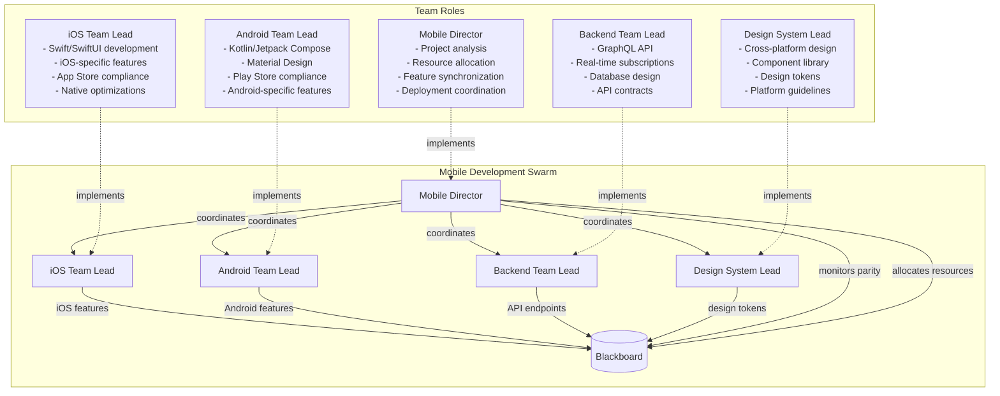
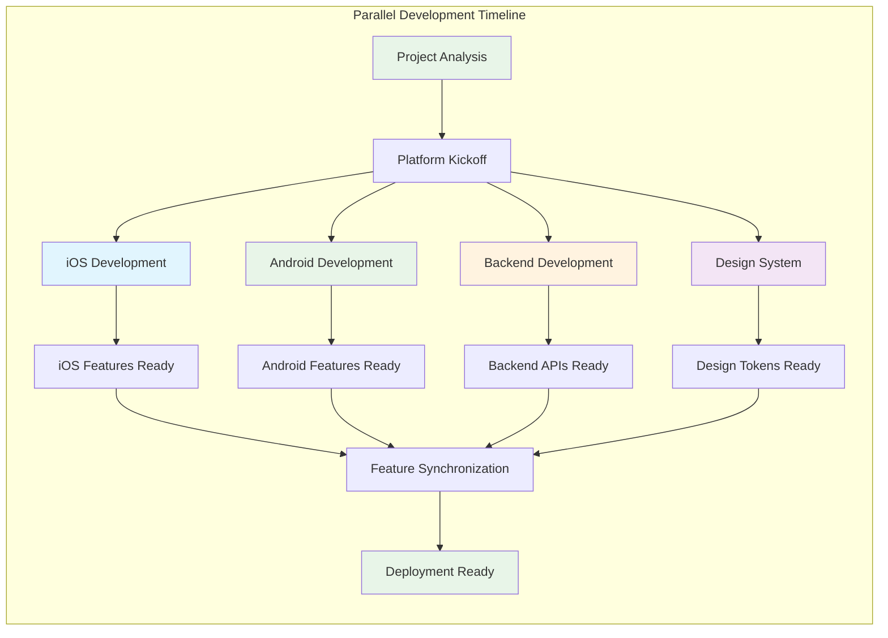
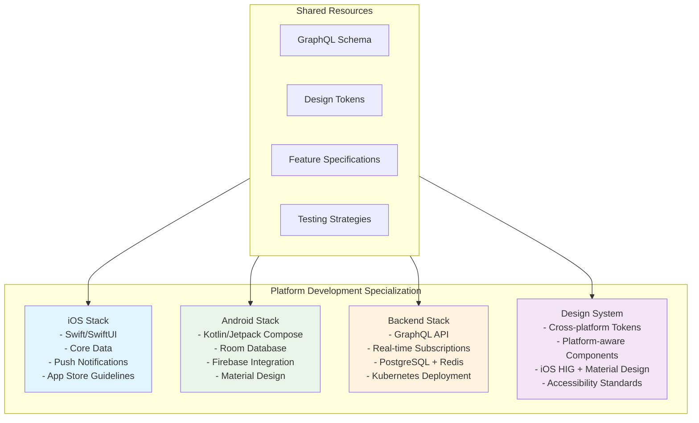
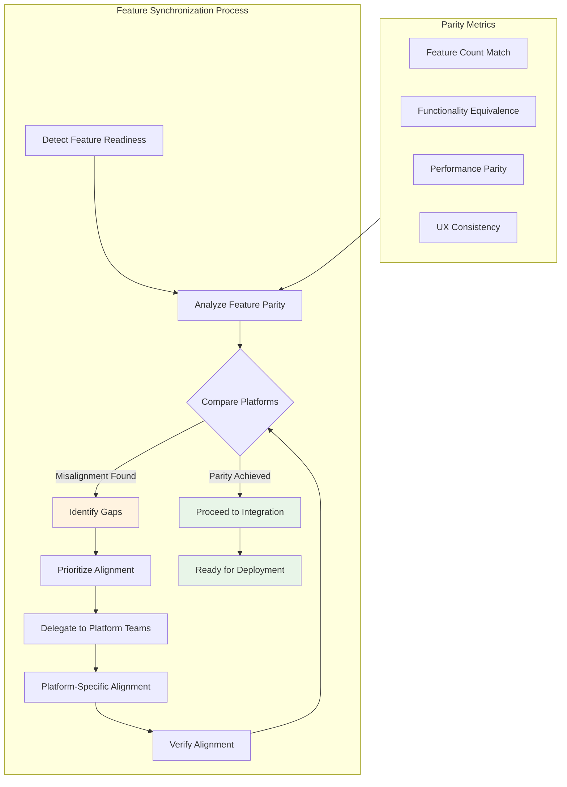
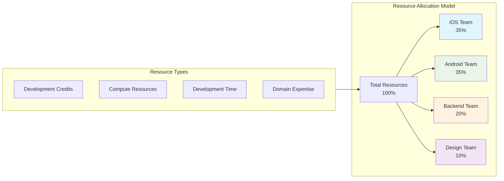
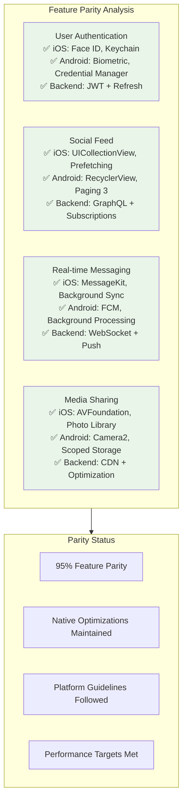

# Mobile App Development Scenario

## Overview

This scenario demonstrates **director-coordinated parallel mobile app development** across iOS and Android platforms. It tests the framework's ability to coordinate multiple specialized teams working simultaneously on different platforms while maintaining feature parity, synchronizing development milestones, and ensuring consistent user experience.

### Key Features

- **Parallel Platform Development**: iOS and Android teams work simultaneously
- **Shared Backend Coordination**: GraphQL API serves both platforms
- **Design System Consistency**: Unified design language across platforms
- **Feature Parity Management**: Automated synchronization and alignment
- **Resource Allocation**: Director manages resources across teams
- **Cross-Platform Communication**: Teams coordinate through shared events

## Agent Architecture



## Parallel Development Flow



## Complete Event Flow

```mermaid
sequenceDiagram
    participant START as Swarm Start
    participant MD as Mobile Director
    participant IOS as iOS Team Lead
    participant AND as Android Team Lead
    participant BE as Backend Team Lead
    participant DS as Design System Lead
    participant BB as Blackboard
    participant ES as Event System
    
    Note over START,ES: Project Initialization
    START->>MD: swarm/started
    MD->>MD: Execute project-analysis-routine
    MD->>BB: Store project_plan, resource_allocation
    MD->>ES: Emit platform/development_requested<br/>(platforms=[ios, android, backend, design])
    
    Note over IOS,DS: Parallel Platform Development
    ES->>IOS: platform/development_requested
    ES->>AND: platform/development_requested
    ES->>BE: platform/development_requested
    ES->>DS: platform/development_requested
    
    par iOS Development
        IOS->>IOS: Execute ios-development-routine
        IOS->>BB: Store ios_development_result, completed_features.ios
        IOS->>ES: Emit platform/feature_ready (platform=ios)
    and Android Development
        AND->>AND: Execute android-development-routine
        AND->>BB: Store android_development_result, completed_features.android
        AND->>ES: Emit platform/feature_ready (platform=android)
    and Backend Development
        BE->>BE: Execute backend-development-routine
        BE->>BB: Store backend_apis, completed_features.backend
        BE->>ES: Emit platform/feature_ready (platform=backend)
    and Design System Development
        DS->>DS: Execute design-system-routine
        DS->>BB: Store design_system, completed_features.design
        DS->>ES: Emit platform/feature_ready (platform=design)
    end
    
    Note over MD,BB: Feature Synchronization
    ES->>MD: platform/feature_ready (multiple platforms)
    MD->>MD: Check: iOS + Android features both exist
    MD->>MD: Execute feature-synchronization-routine
    MD->>BB: Store synchronization_status, cross_platform_parity
    
    Note over MD,ES: Deployment Coordination
    ES->>MD: platform/development_complete (3+ platforms)
    MD->>MD: Execute deployment-readiness-routine
    MD->>BB: Store ready_for_deployment, final_deliverables
    MD->>ES: Emit app/deployment_ready
    MD->>BB: Set development_complete=true
```

## Platform-Specific Development



## Feature Synchronization Pattern



## Resource Allocation Strategy



## Blackboard State Evolution

```mermaid
graph LR
    subgraph StateEvolution[State Evolution Through Development]
        Init[Initial State<br/>- app_requirements<br/>- target_platforms<br/>- api_specifications]
        
        Planning[After Planning<br/>+ project_plan<br/>+ resource_allocation<br/>+ completed_features: {ios:[], android:[], backend:[], design:[]}]
        
        Development[During Development<br/>+ ios_development_result<br/>+ android_development_result<br/>+ backend_apis<br/>+ design_system]
        
        Features[Features Ready<br/>+ completed_features.ios: [4 features]<br/>+ completed_features.android: [4 features]<br/>+ completed_features.backend: [4 APIs]<br/>+ completed_features.design: [tokens, components]]
        
        Sync[After Synchronization<br/>+ synchronization_status<br/>+ cross_platform_parity: 95%<br/>+ completed_platforms: [ios, android, backend, design]]
        
        Deploy[Deployment Ready<br/>+ ready_for_deployment: true<br/>+ final_deliverables<br/>+ development_complete: true]
    end
    
    Init --> Planning
    Planning --> Development
    Development --> Features
    Features --> Sync
    Sync --> Deploy
    
    style Init fill:#e1f5fe
    style Deploy fill:#e8f5e8
```

### Key Blackboard Fields

| Field | Type | Purpose | Updated By |
|-------|------|---------|------------|
| `app_requirements` | object | Feature specifications and platform targets | Initial config |
| `project_plan` | object | Development strategy and timeline | Mobile Director |
| `resource_allocation` | object | Resource distribution across teams | Mobile Director |
| `completed_features.ios` | array | iOS-specific features completed | iOS Team Lead |
| `completed_features.android` | array | Android-specific features completed | Android Team Lead |
| `completed_features.backend` | array | Backend APIs completed | Backend Team Lead |
| `completed_features.design` | array | Design system components completed | Design System Lead |
| `synchronization_status` | object | Feature parity analysis results | Mobile Director |
| `cross_platform_parity` | object | Parity metrics and percentage | Mobile Director |
| `ready_for_deployment` | object | Deployment readiness status | Mobile Director |
| `final_deliverables` | object | App packages and deployment artifacts | Mobile Director |

## Cross-Platform Feature Comparison



## Expected Scenario Outcomes

### Success Path
1. **Project Analysis**: Director analyzes social media app requirements
2. **Parallel Kickoff**: All platform teams receive development requests simultaneously
3. **Platform Development**: Teams develop native apps while sharing design system and API
4. **Feature Synchronization**: Director detects feature parity across platforms
5. **Deployment Preparation**: All platforms verified ready for app store submission

### Success Criteria

```json
{
  "requiredEvents": [
    "platform/development_requested",
    "platform/feature_ready",
    "platform/development_complete",
    "app/deployment_ready"
  ],
  "blackboardState": {
    "development_complete": "true",
    "completed_platforms": ["ios", "android", "backend", "design"],
    "cross_platform_parity": ">=90%",
    "ready_for_deployment": "true"
  },
  "platformCoordination": {
    "parallelDevelopment": "All teams work simultaneously",
    "featureParity": "95% parity achieved",
    "resourceAllocation": "Efficient resource distribution",
    "nativeOptimizations": "Platform-specific optimizations maintained"
  }
}
```

## Running the Scenario

### Prerequisites
- Execution test framework with multi-agent coordination
- SwarmContextManager configured for parallel workflows
- Mock routine responses for platform development

### Execution Steps

1. **Initialize Scenario**
   ```typescript
   const scenario = new ScenarioFactory("mobile-app-dev-scenario");
   await scenario.setupScenario();
   ```

2. **Configure App Requirements**
   ```typescript
   blackboard.set("app_requirements", {
     type: "social_media_app",
     features: ["user_authentication", "social_feed", "messaging", "media_sharing"],
     platforms: ["ios", "android"],
     backend: "graphql_api"
   });
   ```

3. **Start Development**
   ```typescript
   await scenario.emitEvent("swarm/started", {
     task: "develop-social-media-app"
   });
   ```

4. **Monitor Coordination**
   - Track parallel `platform/development_requested` handling
   - Monitor `completed_features` accumulation per platform
   - Verify `cross_platform_parity` calculation
   - Check `ready_for_deployment` status

### Debug Information

Key monitoring points:
- `project_plan` - Development strategy
- `resource_allocation` - Resource distribution
- `completed_features.*` - Platform-specific progress
- `synchronization_status` - Feature parity analysis
- `cross_platform_parity` - Parity metrics

## Technical Implementation Details

### Platform Team Coordination
```typescript
interface PlatformCoordination {
  parallelDevelopment: boolean;
  sharedResources: string[];
  communicationPattern: "event-driven";
  synchronizationPoints: string[];
}
```

### Resource Configuration
- **Max Credits**: 2B micro-dollars (complex multi-platform development)
- **Max Duration**: 15 minutes (parallel development coordination)
- **Resource Quota**: 40% GPU, 24GB RAM, 6 CPU cores

### Feature Parity Algorithm
1. **Collect Features**: Gather completed features from all platforms
2. **Compare Functionality**: Analyze feature equivalence across platforms
3. **Calculate Parity**: Determine percentage of matching features
4. **Identify Gaps**: Find missing or misaligned features
5. **Trigger Alignment**: Request platform-specific updates

## Real-World Applications

### Common Mobile Development Patterns
1. **Cross-Platform Coordination**: React Native, Flutter, Xamarin projects
2. **Feature Parity Management**: Ensuring consistent user experience
3. **Resource Optimization**: Efficient allocation across platform teams
4. **Release Coordination**: Synchronized app store submissions
5. **API Contract Management**: Maintaining consistent backend interfaces

### Benefits of Director Orchestration
- **Parallel Efficiency**: Maximum resource utilization
- **Consistent Quality**: Unified standards across platforms
- **Risk Mitigation**: Early detection of platform divergence
- **Scalable Process**: Framework for adding new platforms
- **Automated Coordination**: Reduces manual synchronization overhead

### Platform-Specific Optimizations
- **iOS**: Native performance, App Store compliance, iOS-specific features
- **Android**: Material Design, Play Store requirements, Android-specific APIs
- **Backend**: Efficient data fetching, real-time capabilities, scalable architecture
- **Design**: Cross-platform consistency with platform-aware adaptations

This scenario demonstrates how complex mobile development projects can be coordinated across multiple platforms while maintaining native performance, platform-specific optimizations, and consistent user experience - essential for successful mobile app launches.