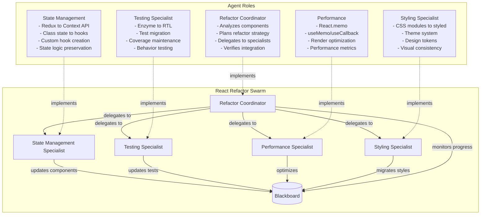
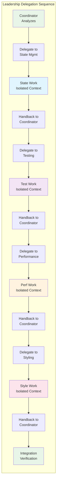
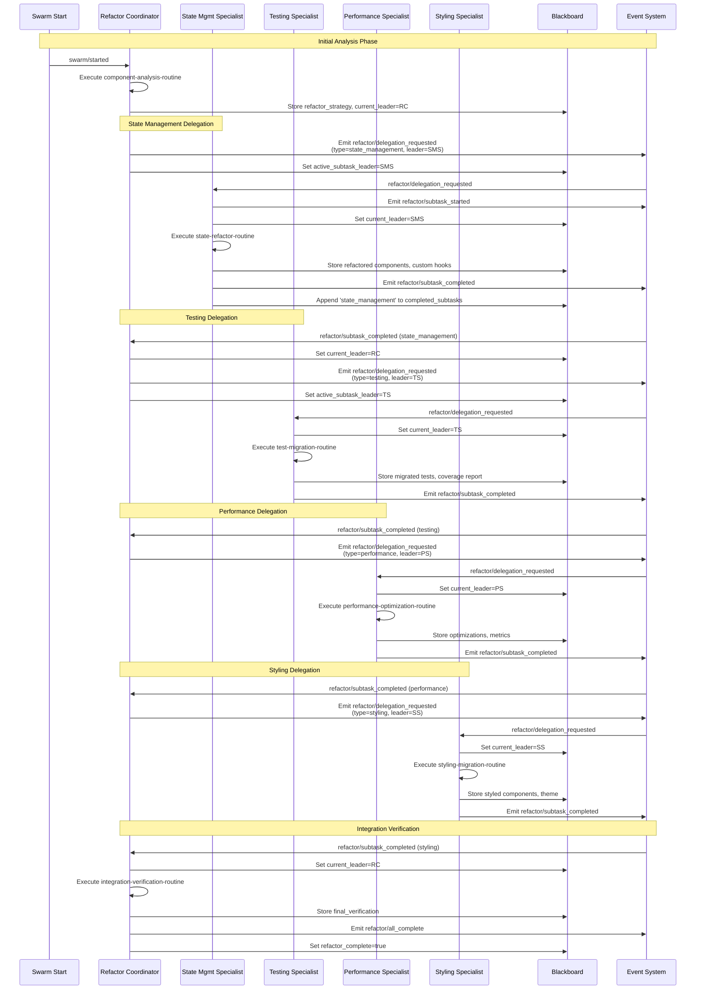
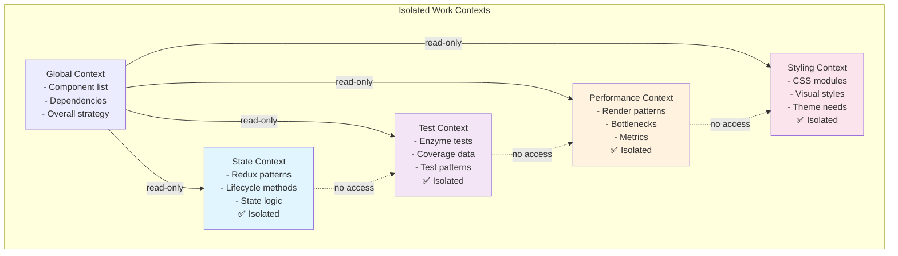
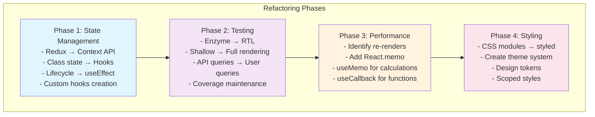

# React Component Refactor Scenario

## Overview

This scenario demonstrates **leader delegation during complex refactoring tasks** in a React codebase. It tests the framework's ability to hand off leadership to domain specialists, maintain context isolation between subtasks, and coordinate multiple parallel refactoring efforts while preserving application functionality.

### Key Features

- **Sequential Leader Delegation**: Main coordinator hands leadership to specialists in sequence
- **Context Isolation**: Each specialist works independently without affecting others
- **Handback Protocol**: Leadership returns to coordinator after subtask completion
- **State Preservation**: Overall refactoring progress maintained across delegations
- **Parallel Work Capability**: Multiple specialists can work on isolated components

## Agent Architecture



## Leader Delegation Flow



## Complete Event Flow



## Context Isolation Pattern



## Blackboard State Evolution

```mermaid
graph LR
    subgraph StateEvolution[Blackboard State Through Delegations]
        Init[Initial State<br/>- target_components[15]<br/>- current_leader: RC<br/>- completed_subtasks: []]
        
        AfterState[After State Refactor<br/>+ state_refactor_result<br/>+ created_hooks[3]<br/>+ refactored_components<br/>+ completed: [state]]
        
        AfterTest[After Testing<br/>+ test_migration_result<br/>+ test_coverage: 82%<br/>+ refactored_tests<br/>+ completed: [state, test]]
        
        AfterPerf[After Performance<br/>+ performance_result<br/>+ render_improvements: 47%<br/>+ performance_optimized<br/>+ completed: [state, test, perf]]
        
        AfterStyle[After Styling<br/>+ styling_result<br/>+ design_tokens<br/>+ migrated_styles<br/>+ completed: [state, test, perf, style]]
        
        Final[Final State<br/>+ final_verification<br/>+ refactor_complete: true<br/>+ current_leader: RC]
    end
    
    Init --> AfterState
    AfterState --> AfterTest
    AfterTest --> AfterPerf
    AfterPerf --> AfterStyle
    AfterStyle --> Final
    
    style Init fill:#e1f5fe
    style Final fill:#e8f5e8
```

### Leadership Transition Tracking

| Step | Current Leader | Active Subtask Leader | Activity |
|------|---------------|----------------------|----------|
| 1 | Refactor Coordinator | - | Initial analysis |
| 2 | Refactor Coordinator | State Mgmt Specialist | Delegation |
| 3 | State Mgmt Specialist | State Mgmt Specialist | State refactoring |
| 4 | Refactor Coordinator | - | Handback after state |
| 5 | Refactor Coordinator | Testing Specialist | Delegation |
| 6 | Testing Specialist | Testing Specialist | Test migration |
| 7 | Refactor Coordinator | - | Handback after testing |
| 8 | Refactor Coordinator | Performance Specialist | Delegation |
| 9 | Performance Specialist | Performance Specialist | Optimization |
| 10 | Refactor Coordinator | - | Handback after perf |
| 11 | Refactor Coordinator | Styling Specialist | Delegation |
| 12 | Styling Specialist | Styling Specialist | Style migration |
| 13 | Refactor Coordinator | - | Final verification |

## Refactoring Strategy Breakdown



## Component Transformation Example

```mermaid
graph LR
    subgraph BeforeRefactor[Before: UserProfile Component]
        ClassComp[Class Component<br/>- Redux connect()<br/>- componentDidMount<br/>- Local state<br/>- CSS modules]
    end
    
    subgraph AfterRefactor[After: UserProfile Component]
        FuncComp[Functional Component<br/>- useSelector/useDispatch<br/>- useEffect<br/>- useState/useAuth<br/>- Styled components]
    end
    
    subgraph Improvements[Improvements]
        Imp1[✅ 30% smaller bundle]
        Imp2[✅ 50% fewer renders]
        Imp3[✅ Better test coverage]
        Imp4[✅ Type-safe styles]
    end
    
    ClassComp --> FuncComp
    FuncComp --> Improvements
    
    style ClassComp fill:#ffebee
    style FuncComp fill:#e8f5e8
```

## Expected Scenario Outcomes

### Success Path
1. **Coordinator Analysis**: Identifies 15 components needing refactoring
2. **State Delegation**: SMS converts Redux/class state to hooks (creates 3 custom hooks)
3. **Testing Delegation**: TS migrates 45 tests, improves coverage to 82%
4. **Performance Delegation**: PS reduces renders by 47% with optimizations
5. **Styling Delegation**: SS creates unified theme system, migrates all styles
6. **Integration Verification**: RC confirms all components work together

### Success Criteria

```json
{
  "requiredEvents": [
    "refactor/delegation_requested",
    "refactor/subtask_started",
    "refactor/subtask_completed",
    "refactor/all_complete"
  ],
  "blackboardState": {
    "refactor_complete": "true",
    "completed_subtasks": ["state_management", "testing", "performance", "styling"],
    "current_leader": "refactor-coordinator",
    "created_hooks": ["useAuth", "useCart", "useProductData"]
  },
  "leadershipTransitions": {
    "minimumHandoffs": 4,
    "correctSequence": true,
    "contextIsolation": true,
    "handbackProtocol": "verified"
  }
}
```

## Running the Scenario

### Prerequisites
- Execution test framework with leader delegation support
- SwarmContextManager configured for leadership transitions
- Mock routine responses for refactoring operations

### Execution Steps

1. **Initialize Scenario**
   ```typescript
   const scenario = new ScenarioFactory("react-refactor-scenario");
   await scenario.setupScenario();
   ```

2. **Configure Components**
   ```typescript
   blackboard.set("target_components", [
     "UserProfile", "ProductList", "ShoppingCart", // ... 15 total
   ]);
   ```

3. **Start Refactoring**
   ```typescript
   await scenario.emitEvent("swarm/started", {
     task: "refactor-react-components"
   });
   ```

4. **Monitor Delegations**
   - Track `current_leader` changes
   - Verify `active_subtask_leader` assignments
   - Monitor `completed_subtasks` accumulation
   - Check specialist work isolation

### Debug Information

Key monitoring points:
- `current_leader` - Active leadership holder
- `active_subtask_leader` - Delegated specialist
- `completed_subtasks` - Progress tracking
- `refactor_strategy` - Overall plan
- Component-specific results (hooks, tests, optimizations, styles)

## Technical Implementation Details

### Leader Delegation Protocol
```typescript
interface LeadershipTransition {
  from: string;              // Current leader
  to: string;                // New leader
  context: "isolated";       // Context handling
  handbackTrigger: string;   // Event for return
}
```

### Resource Configuration
- **Max Credits**: 1.5B micro-dollars (complex refactoring)
- **Max Duration**: 10 minutes (sequential specialists)
- **Resource Quota**: 30% GPU, 16GB RAM (code analysis heavy)

### Context Isolation Rules
1. Specialists cannot access other specialists' work
2. Global read-only access to component list
3. Work results stored in isolated blackboard sections
4. No cross-contamination between refactoring phases

## Real-World Applications

### Common Refactoring Patterns
1. **Framework Migration**: Angular to React, Vue to React
2. **Version Upgrades**: React 16 to 18 with concurrent features
3. **Architecture Changes**: MVC to component-based
4. **Performance Optimization**: Addressing React DevTools warnings
5. **Testing Strategy**: Shifting from implementation to behavior testing

### Benefits of Leader Delegation
- **Parallel Work**: Multiple specialists can prepare while waiting
- **Domain Expertise**: Each specialist focuses on their strength
- **Clean Boundaries**: No conflicts between different refactoring aspects
- **Progress Tracking**: Clear handoff points for monitoring

This scenario demonstrates how complex software engineering tasks can be decomposed and delegated to specialists while maintaining coordination and ensuring successful integration - a critical pattern for large-scale refactoring projects.