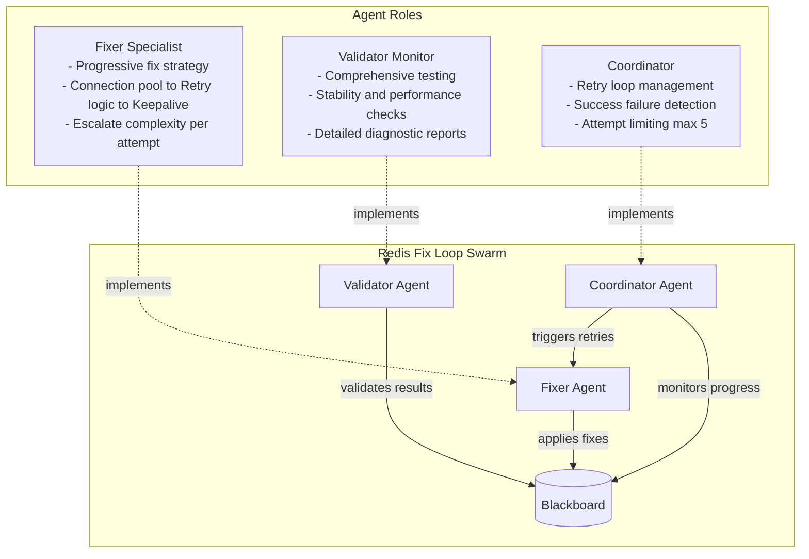
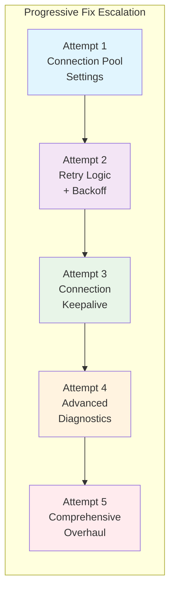
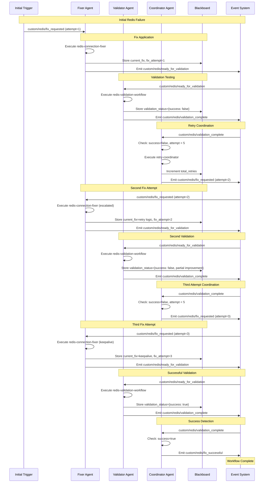
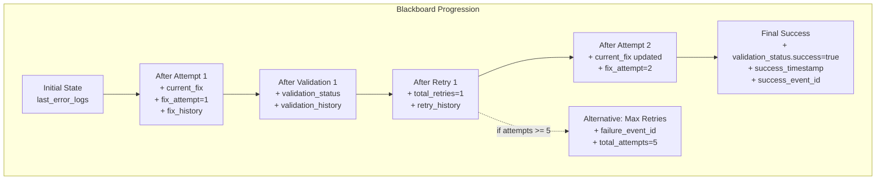
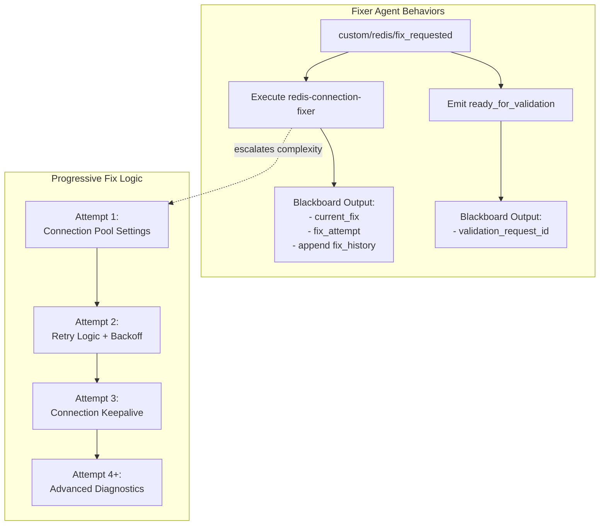
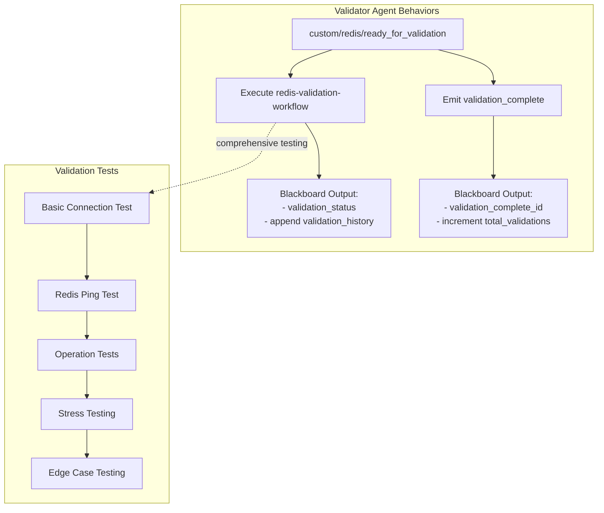
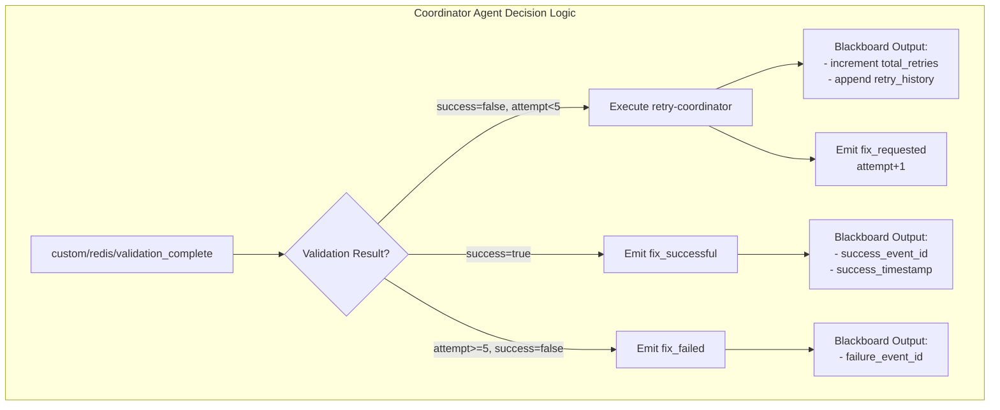
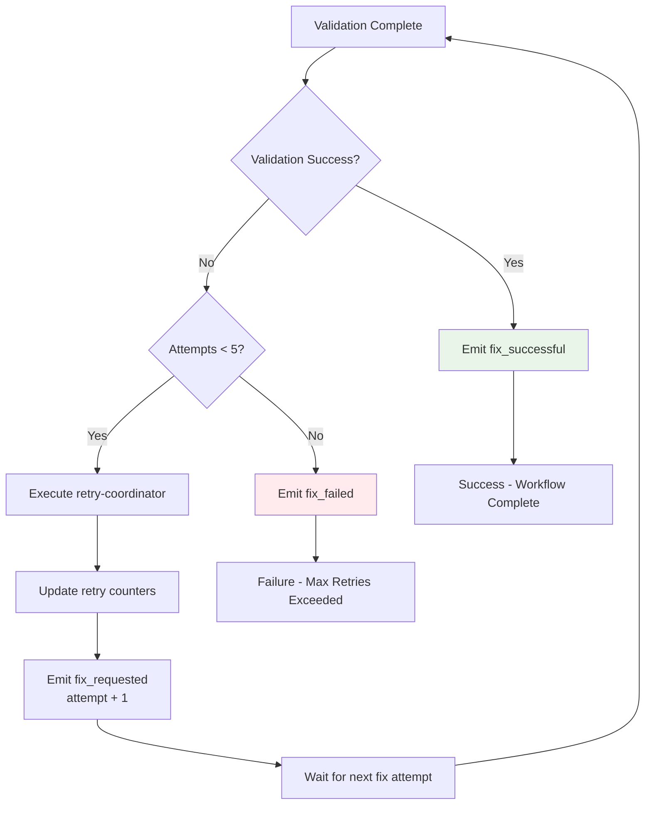
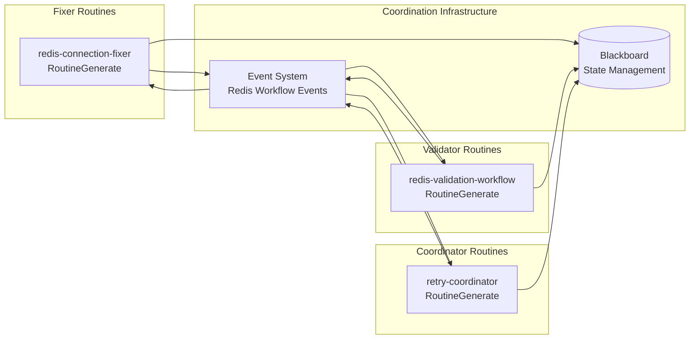

# Redis Fix Loop Scenario

## Overview

This scenario demonstrates a **progressive retry coordination pattern** for infrastructure problem resolution. It models a realistic Redis connection failure where three specialized agents work together to diagnose, fix, and validate the connection through multiple retry attempts with increasing sophistication.

### Key Features

- **Progressive Fix Strategy**: Each attempt applies more sophisticated fixes
- **Retry Coordination**: Automatic retry loop with attempt limiting (max 5)
- **Comprehensive Validation**: Multi-step validation with detailed diagnostics
- **Event-Driven Workflow**: Agents coordinate through custom Redis events
- **Blackboard History**: Complete audit trail of fixes and validations

## Agent Architecture



## Progressive Fix Strategy

The fixer agent applies increasingly sophisticated fixes based on attempt number:



## Complete Event Flow



## Blackboard State Evolution

The blackboard accumulates comprehensive state through each retry cycle:



### Blackboard Data Structure

| Key | Type | Purpose | Updated By |
|-----|------|---------|------------|
| `current_fix` | string | Latest fix description | Fixer Agent |
| `fix_attempt` | number | Current attempt number | Fixer Agent |
| `fix_history[]` | array | All fix attempts | Fixer Agent |
| `validation_status` | object | Latest validation result | Validator Agent |
| `validation_history[]` | array | All validation results | Validator Agent |
| `total_retries` | number | Retry count | Coordinator Agent |
| `retry_history[]` | array | Retry coordination details | Coordinator Agent |
| `success_timestamp` | string | Success completion time | Coordinator Agent |

## Agent Behavior Patterns

### Fixer Agent (Specialist)



### Validator Agent (Monitor)



### Coordinator Agent (Coordinator)



## Retry Loop Decision Tree



## Routine Coordination Architecture



## Expected Scenario Outcomes

### Success Path (3 Attempts)
1. **Attempt 1**: Connection pool settings → Validation fails (timeout)
2. **Attempt 2**: Retry logic + backoff → Validation fails (partial improvement)
3. **Attempt 3**: Connection keepalive → Validation succeeds ✅

### Alternative Paths
- **Early Success**: Fix works on attempt 1 or 2
- **Maximum Retries**: All 5 attempts fail, emit `fix_failed`
- **Partial Success**: Progressive improvement but never fully succeeds

### Success Criteria

```json
{
  "requiredEvents": [
    "custom/redis/fix_requested",
    "custom/redis/ready_for_validation", 
    "custom/redis/validation_complete",
    "custom/redis/fix_successful"
  ],
  "blackboardState": {
    "validation_status": "exists",
    "fix_attempt": ">=1",
    "current_fix": "exists", 
    "total_validations": ">=1"
  },
  "routineCallsMin": 6,
  "agentCoordination": true
}
```

## Mock Response Strategy

The scenario uses **progressive improvement mocks** that demonstrate realistic fix progression:

### Fix Responses (Progressive Complexity)
1. **Attempt 1**: "Updated connection pool settings"
2. **Attempt 2**: "Added retry logic with exponential backoff"  
3. **Attempt 3**: "Implemented connection keepalive"

### Validation Responses (Gradual Improvement)
1. **Attempt 1**: `{success: false, logs: "Connection timeout"}`
2. **Attempt 2**: `{success: false, logs: "Partial improvement"}`
3. **Attempt 3**: `{success: true, logs: "All operations successful"}`

## Running the Scenario

### Prerequisites
- Execution test framework operational
- SwarmContextManager configured
- Mock routine response system active

### Execution Steps

1. **Initialize Scenario**
   ```typescript
   const scenario = new ScenarioFactory("redis-fix-loop");
   await scenario.setupScenario();
   ```

2. **Trigger Initial Fix Request**
   ```typescript
   await scenario.emitEvent("custom/redis/fix_requested", {
     attemptNumber: 1,
     previousResult: null,
     retryReason: "Initial Redis connection failure detected"
   });
   ```

3. **Monitor Progress**
   - Watch blackboard for `fix_attempt` progression
   - Monitor `validation_status` changes
   - Track `total_retries` and `total_validations` counters

4. **Validate Completion**
   - Confirm `custom/redis/fix_successful` event
   - Verify final `validation_status.success = true`
   - Check complete audit trail in blackboard

### Debug Monitoring

Track these blackboard keys for troubleshooting:
- `current_fix` - Latest fix description
- `fix_attempt` - Current attempt number  
- `validation_status` - Latest validation result
- `total_retries` - Retry coordination count
- `fix_history[]` - Complete fix audit trail
- `validation_history[]` - Complete validation audit trail

## Technical Implementation Details

### Event Quality of Service
- **QoS 1**: All coordination events (at-least-once delivery)
- **No QoS 2**: This scenario doesn't require exactly-once semantics

### Resource Constraints
- **Max Credits**: 500M micro-dollars ($500)
- **Max Duration**: 5 minutes  
- **Resource Quota**: 20% GPU, 16GB RAM, 4 CPU cores

### Custom Event Schema
All events use the `custom/redis/*` namespace:
- `custom/redis/fix_requested` - Trigger new fix attempt
- `custom/redis/ready_for_validation` - Fix applied, ready for testing
- `custom/redis/validation_complete` - Validation results available
- `custom/redis/fix_successful` - Successful resolution
- `custom/redis/fix_failed` - Maximum retries exceeded

This scenario demonstrates **progressive problem resolution** with sophisticated agent coordination, providing a comprehensive test of retry logic, escalation strategies, and multi-agent workflow orchestration in the execution framework.