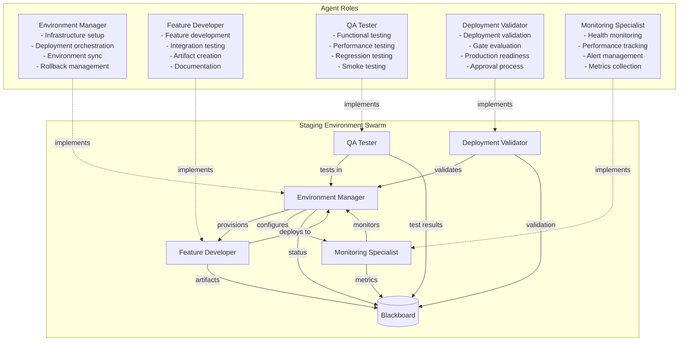
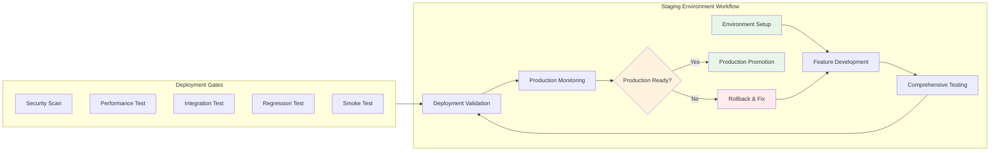
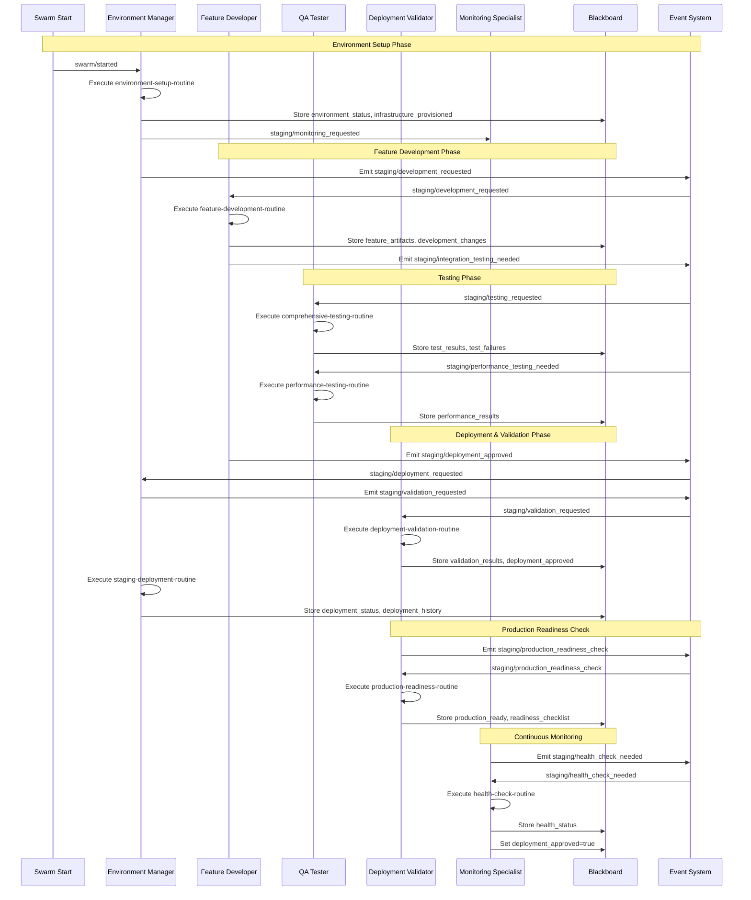
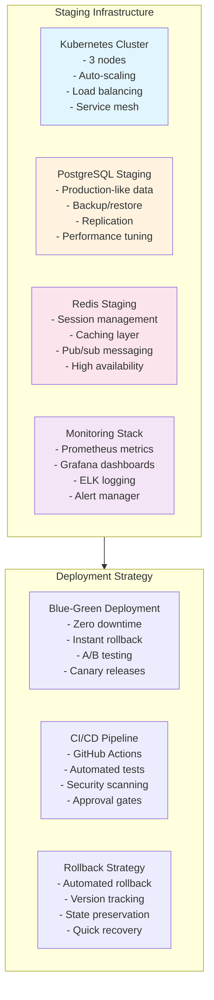
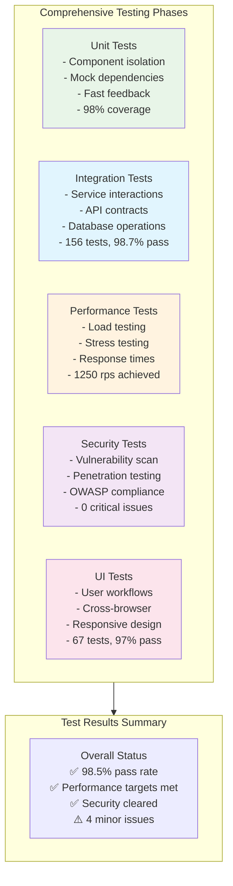
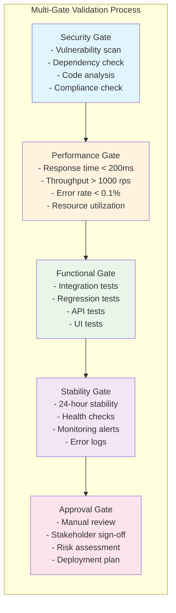
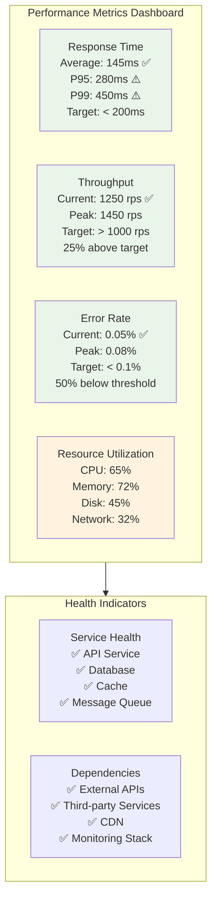
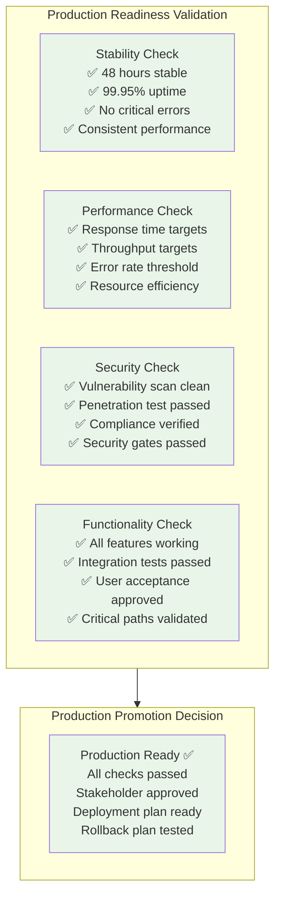
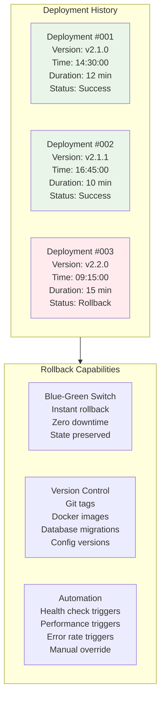

# Staging Environment Development Scenario

## Overview

This scenario demonstrates **comprehensive staging environment management** where agents coordinate feature development, testing, deployment, and validation before production release. It tests the framework's ability to manage complex deployment pipelines, coordinate multiple testing phases, and ensure production readiness through systematic validation.

### Key Features

- **Environment Management**: Infrastructure provisioning and deployment orchestration
- **Feature Development**: Coordinated development and integration in staging
- **Comprehensive Testing**: Functional, performance, security, and regression testing
- **Deployment Validation**: Multi-gate deployment approval process
- **Production Readiness**: Systematic validation before production promotion

## Agent Architecture



## Staging Environment Workflow



## Complete Event Flow



## Infrastructure and Deployment Architecture



## Testing Strategy in Staging



## Deployment Validation Gates



## Blackboard State Evolution

```mermaid
graph LR
    subgraph StateEvolution[State Evolution Through Staging Process]
        Init[Initial State<br/>- staging_environment_config<br/>- deployment_pipeline<br/>- staging_test_suite]
        
        Setup[After Setup<br/>+ environment_status: ready<br/>+ infrastructure_provisioned<br/>+ monitoring_configured]
        
        Development[After Development<br/>+ feature_artifacts: [2 features]<br/>+ development_changes<br/>+ integration_test_results]
        
        Testing[After Testing<br/>+ test_results: 98.5% pass<br/>+ performance_results: exceeds targets<br/>+ test_failures: [4 minor]]
        
        Validation[After Validation<br/>+ validation_status: passed<br/>+ deployment_approved: true<br/>+ gate_evaluations: all passed]
        
        Deployment[After Deployment<br/>+ deployment_status: successful<br/>+ production_ready: true<br/>+ deployment_approved: true]
    end
    
    Init --> Setup
    Setup --> Development
    Development --> Testing
    Testing --> Validation
    Validation --> Deployment
    
    style Init fill:#e1f5fe
    style Deployment fill:#e8f5e8
    style Testing fill:#fff3e0
```

### Key Blackboard Fields

| Field | Type | Purpose | Updated By |
|-------|------|---------|------------|
| `environment_status` | string | Current staging environment state | Environment Manager |
| `feature_artifacts` | array | Developed feature components | Feature Developer |
| `test_results` | array | Comprehensive test outcomes | QA Tester |
| `performance_results` | object | Performance testing metrics | QA Tester |
| `validation_results` | array | Deployment validation outcomes | Deployment Validator |
| `deployment_status` | string | Current deployment state | Environment Manager |
| `health_status` | object | Environment health metrics | Monitoring Specialist |
| `production_ready` | boolean | Production promotion readiness | Deployment Validator |
| `deployment_approved` | boolean | Final deployment approval | Deployment Validator |

## Performance Monitoring Dashboard



## Production Readiness Checklist



## Deployment History and Rollback



## Expected Scenario Outcomes

### Success Path
1. **Environment Setup**: Manager provisions Kubernetes cluster with monitoring stack
2. **Feature Development**: Two features developed with full test coverage
3. **Comprehensive Testing**: 98.5% test pass rate, performance targets exceeded
4. **Deployment Validation**: All gates passed, security and performance validated
5. **Production Readiness**: 48-hour stability achieved, all criteria met
6. **Production Promotion**: Approved for production deployment

### Success Criteria

```json
{
  "requiredEvents": [
    "staging/environment_setup_requested",
    "staging/development_requested",
    "staging/testing_requested",
    "staging/deployment_requested",
    "staging/validation_requested",
    "staging/production_readiness_check"
  ],
  "blackboardState": {
    "deployment_approved": "true",
    "production_ready": "true",
    "environment_status": "staging_environment_ready",
    "validation_status": "deployment_validated",
    "health_status": "healthy"
  },
  "deploymentMetrics": {
    "testPassRate": ">=95%",
    "performanceTargetsMet": "all",
    "securityIssues": "no_critical",
    "stabilityPeriod": ">=24_hours",
    "deploymentSuccess": "true"
  }
}
```

## Running the Scenario

### Prerequisites
- Execution test framework with deployment capabilities
- SwarmContextManager configured for staging workflows
- Mock routine responses for deployment operations
- Staging environment infrastructure

### Execution Steps

1. **Initialize Scenario**
   ```typescript
   const scenario = new ScenarioFactory("staging-env-scenario");
   await scenario.setupScenario();
   ```

2. **Configure Environment**
   ```typescript
   blackboard.set("staging_environment_config", {
     infrastructure: "kubernetes_cluster",
     scaling: "auto_scaling_enabled",
     monitoring: "prometheus_grafana"
   });
   ```

3. **Start Staging Process**
   ```typescript
   await scenario.emitEvent("swarm/started", {
     task: "staging-environment-deployment"
   });
   ```

4. **Monitor Deployment Progress**
   - Track `environment_status` for infrastructure readiness
   - Monitor `test_results` for quality validation
   - Verify `validation_results` for gate compliance
   - Check `production_ready` for promotion approval

### Debug Information

Key monitoring points:
- `environment_status` - Infrastructure and deployment state
- `feature_artifacts` - Developed features ready for deployment
- `test_results` - Comprehensive testing outcomes
- `performance_results` - Performance testing metrics
- `validation_results` - Gate validation outcomes
- `deployment_history` - Deployment tracking and rollback info

## Technical Implementation Details

### Environment Configuration
```typescript
interface StagingEnvironment {
  infrastructure: "kubernetes_cluster";
  database: "postgresql_staging";
  cache: "redis_staging";
  monitoring: "prometheus_grafana";
  logging: "elk_stack";
}
```

### Resource Configuration
- **Max Credits**: 1.6B micro-dollars (complex staging operations)
- **Max Duration**: 14 minutes (full deployment cycle)
- **Resource Quota**: 35% GPU, 18GB RAM, 6 CPU cores

### Deployment Strategy
1. **Blue-Green Deployment**: Zero-downtime deployments with instant rollback
2. **Canary Releases**: Gradual rollout to subset of users
3. **Feature Flags**: Controlled feature activation
4. **Automated Rollback**: Health check triggered reversions
5. **Version Management**: Comprehensive versioning of all components

## Real-World Applications

### Common Staging Environment Scenarios
1. **Enterprise Deployments**: Large-scale application releases
2. **Microservices Architecture**: Complex service coordination
3. **Continuous Delivery**: Automated staging to production pipelines
4. **A/B Testing**: Feature validation before full release
5. **Disaster Recovery**: Testing backup and recovery procedures

### Benefits of Staging Environment Management
- **Risk Mitigation**: Catch issues before production impact
- **Quality Assurance**: Comprehensive testing in production-like environment
- **Performance Validation**: Ensure scalability before release
- **Security Verification**: Identify vulnerabilities pre-production
- **Stakeholder Confidence**: Demonstrate readiness before go-live

### Staging Environment Best Practices
- **Production Parity**: Mirror production as closely as possible
- **Data Anonymization**: Use production-like data safely
- **Automated Testing**: Comprehensive test automation
- **Monitoring Coverage**: Full observability stack
- **Rollback Readiness**: Always maintain rollback capability

This scenario demonstrates how complex staging environments can be managed systematically to ensure high-quality software releases, with comprehensive testing, validation gates, and production readiness checks - essential for enterprise software delivery and DevOps practices.