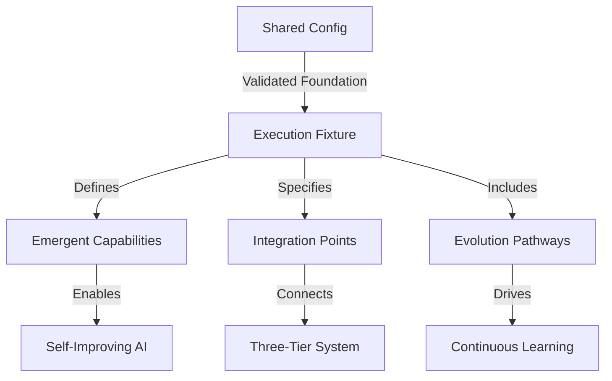

# Config to Fixture Mapping Guide

This guide shows how shared package configs map to execution fixtures, enabling emergent AI capabilities through validated configuration.

## 🎯 Quick Reference: Config → Fixture → Emergence

### 1. Chat Config → Swarm Fixture (Tier 1)
```typescript
// Start with shared chat config
import { chatConfigFixtures } from "@vrooli/shared";

// Transform to swarm fixture
const swarmFixture: SwarmFixture = {
    config: chatConfigFixtures.variants.supportSwarm, // ← Validated foundation
    emergence: {
        capabilities: ["coordination", "delegation"], // ← What emerges
        evolutionPath: "reactive → proactive"         // ← How it improves
    },
    integration: {
        tier: "tier1",                               // ← Where it runs
        producedEvents: ["swarm.task.assigned"]      // ← What it produces
    }
};
```

**Emergence**: Multi-agent coordination, collective intelligence, consensus building

### 2. Routine Config → Routine Fixture (Tier 2)
```typescript
// Start with shared routine config
import { routineConfigFixtures } from "@vrooli/shared";

// Transform to routine fixture
const routineFixture: RoutineFixture = {
    config: routineConfigFixtures.action.simple,     // ← Validated foundation
    emergence: {
        capabilities: ["workflow_optimization"],      // ← What emerges
        evolutionPath: "conversational → deterministic" // ← How it evolves
    },
    integration: {
        tier: "tier2",                               // ← Where it runs
        consumedEvents: ["swarm.task.assigned"]      // ← What it responds to
    },
    evolutionStage: {
        current: "reasoning",                        // ← Current optimization level
        performanceMetrics: { ... }                  // ← Measurable improvements
    }
};
```

**Emergence**: Self-optimization, pattern learning, adaptive workflows

### 3. Run Config → Execution Context Fixture (Tier 3)
```typescript
// Start with shared run config
import { runConfigFixtures } from "@vrooli/shared";

// Transform to execution context fixture
const executionFixture: ExecutionContextFixture = {
    config: runConfigFixtures.variants.highPerformance, // ← Validated foundation
    emergence: {
        capabilities: ["resource_optimization"],         // ← What emerges
        evolutionPath: "baseline → self_tuning"         // ← How it adapts
    },
    integration: {
        tier: "tier3",                                  // ← Where it runs
        mcpTools: ["SendMessage", "ResourceManage"]     // ← Tools it uses
    }
};
```

**Emergence**: Performance tuning, intelligent caching, predictive allocation

## 🔗 The Complete Flow



## 📋 Config Type Mapping

| Shared Config Type | Execution Fixture Type | Tier | Key Emergence |
|-------------------|------------------------|------|---------------|
| `ChatConfigObject` | `SwarmFixture` | Tier 1 | Multi-agent coordination |
| `BotConfigObject` | `AgentFixture` | Tier 1 | Specialized intelligence |
| `RoutineConfigObject` | `RoutineFixture` | Tier 2 | Workflow optimization |
| `RunConfigObject` | `ExecutionContextFixture` | Tier 3 | Resource management |

## 🚀 Usage Pattern

1. **Import Shared Config**
   ```typescript
   import { chatConfigFixtures } from "@vrooli/shared";
   ```

2. **Create Execution Fixture**
   ```typescript
   const fixture = FixtureCreationUtils.createCompleteFixture(
       chatConfigFixtures.variants.supportSwarm,
       "chat",
       {
           emergence: { capabilities: ["customer_support"] },
           integration: { tier: "tier1" }
       }
   );
   ```

3. **Validate Automatically**
   ```typescript
   runComprehensiveExecutionTests(fixture, "chat", "my-swarm");
   ```

## ✅ Validation Guarantees

When you use this pattern, you get:
- **Config Validation**: Ensures config matches schema
- **Emergence Validation**: Verifies capabilities are defined
- **Integration Validation**: Checks event patterns and tier assignment
- **Evolution Validation**: Confirms improvement pathways
- **Compatibility Validation**: Tests against ALL shared variants

## 🎯 Key Principle

**Configs define the structure, fixtures define the emergence.**

The shared configs provide the validated foundation (what resources exist), while execution fixtures define what intelligence emerges from those resources through agent collaboration.