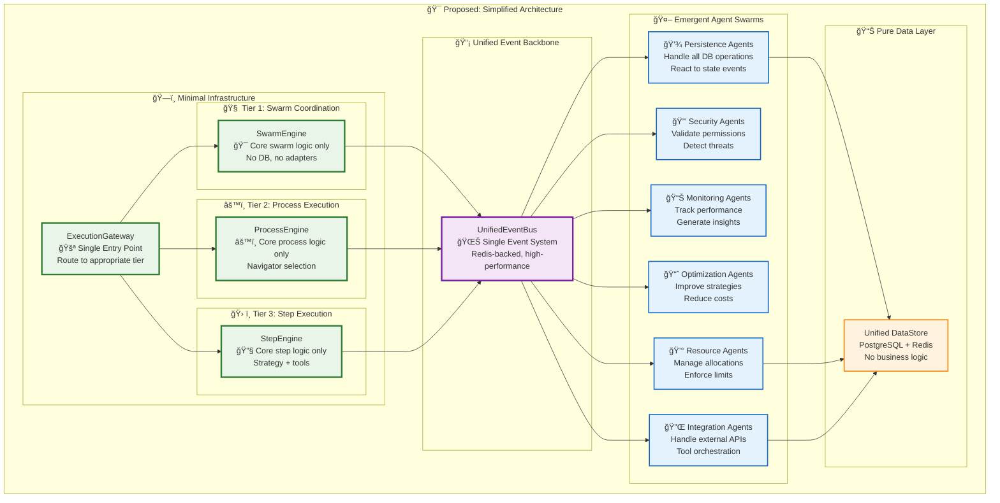

# 🚀 Execution Architecture: Living Documentation

> **Status**: 🟡 **EMERGENT TRANSITION** - Architecture has successfully evolved toward the emergent vision with sophisticated event-driven patterns. Continued refinement needed for full alignment.

> **Last Updated**: 2025-01-27

## 📋 Executive Summary

The three-tier execution architecture has **successfully evolved** toward the emergent vision, with major improvements:
- ✅ **Emergent Agent Infrastructure**: Base frameworks for goal-driven intelligent agents implemented
- ✅ **Event-Driven Architecture**: Sophisticated event handling with BaseStateMachine patterns
- ✅ **Strategy-Aware Execution**: Dynamic strategy selection in Tier 3 (Conversational→Reasoning→Deterministic)
- ✅ **Cross-Cutting Organization**: Mature separation of agents, resilience, resources, and security
- 🟡 **Monitoring Migration**: Hard-coded monitoring removed in favor of emergent agents
- 🟡 **State Management Evolution**: Multiple state stores with different patterns, needs consolidation

## 🏗️ Current Architecture (As-Is)

```mermaid
graph TB
    subgraph "🌐 External Layer"
        API[SwarmExecutionService<br/>📝 Main Entry Point]
        Socket[ExecutionSocketEventEmitter<br/>🔌 Real-time Updates]
    end

    subgraph "🧠 Tier 1: Coordination Intelligence"
        T1Coord[TierOneCoordinator<br/>📋 Swarm Management]
        SwarmSM[SwarmStateMachine<br/>🔄 State Transitions]
        TeamMgr[TeamManager<br/>👥 Team Formation]
        T1Resource[ResourceManager<br/>💰 Resource Allocation]
        T1State[SwarmStateStore<br/>💾 Swarm Persistence]
        ConvBridge[ConversationBridge<br/>🗣️ Chat Integration]
        
        T1Coord --> SwarmSM
        T1Coord --> TeamMgr
        T1Coord --> T1Resource
        T1Coord --> T1State
        T1Coord --> ConvBridge
    end

    subgraph "⚙️ Tier 2: Process Intelligence"
        T2Orch[TierTwoOrchestrator<br/>🎯 Run Orchestration]
        UnifiedSM[UnifiedRunStateMachine<br/>🔄 Run State Management]
        NavReg[NavigatorRegistry<br/>🧭 Workflow Navigation]
        Navigators[NavigatorRegistry<br/>├─ NativeNavigator<br/>├─ BPMNNavigator<br/>├─ SequentialNavigator<br/>└─ SingleStepNavigator]
        MOISEGate[MOISEGate<br/>🛡️ Permission Validation]
        T2State[RunStateStore<br/>💾 Run Persistence]
        
        T2Orch --> UnifiedSM
        T2Orch --> NavReg
        T2Orch --> MOISEGate
        T2Orch --> T2State
        UnifiedSM --> Navigators
    end

    subgraph "🛠️ Tier 3: Execution Intelligence"
        T3Exec[TierThreeExecutor<br/>⚡ Step Execution]
        UnifiedExec[UnifiedExecutor<br/>🎯 Strategy Execution]
        StrategyProv[SimpleStrategyProvider<br/>🧠 Strategy Selection]
        Strategies[Strategy Implementations<br/>├─ ConversationalStrategy<br/>├─ ReasoningStrategy<br/>└─ DeterministicStrategy]
        ToolOrch[ToolOrchestrator<br/>🔧 Tool Management]
        T3Resource[ResourceManager<br/>💰 Resource Tracking]
        ValidationEng[ValidationEngine<br/>✅ Input/Output Validation]
        IOProcessor[IOProcessor<br/>📊 Data Processing]
        ContextExp[ContextExporter<br/>📤 Context Export]
        RunContext[ExecutionRunContext<br/>📋 Execution Context]
        
        T3Exec --> UnifiedExec
        UnifiedExec --> StrategyProv
        UnifiedExec --> ToolOrch
        UnifiedExec --> T3Resource
        UnifiedExec --> ValidationEng
        UnifiedExec --> IOProcessor
        T3Exec --> ContextExp
        T3Exec --> RunContext
        StrategyProv --> Strategies
    end

    subgraph "🌊 Cross-Cutting Concerns"
        EventBus[RedisEventBus<br/>📡 Event Coordination]
        UnifiedEvents[UnifiedEventSystem<br/>🎭 Modern Event Handling]
        EventPublisher[EventPublisher<br/>📢 Legacy Event Publishing]
        ErrorHandler[ErrorHandler<br/>🚨 Error Management]
        
        BaseComp[BaseComponent<br/>🏗️ Component Infrastructure<br/>├─ Event publishing helpers<br/>├─ Error handling<br/>├─ Logging<br/>└─ Disposal management]
    end

    subgraph "🔧 Integration Services"
        IntegArch[ExecutionArchitecture<br/>🏭 Factory & DI Container]
        RunPersist[RunPersistenceService<br/>💾 Database Persistence]
        RoutineStorage[RoutineStorageService<br/>📚 Routine Loading]
        AuthInteg[AuthIntegrationService<br/>🔐 Authentication]
        ToolReg[IntegratedToolRegistry<br/>🛠️ Tool Management]
        
        IntegArch --> T1Coord
        IntegArch --> T2Orch
        IntegArch --> T3Exec
    end

    subgraph "🤖 Emergent Capabilities (Event-Driven)"
        SecurityAgents[🔒 Security Agents<br/>Threat detection & compliance]
        OptimizationAgents[📈 Optimization Agents<br/>Performance & cost optimization]
        QualityAgents[✅ Quality Agents<br/>Output validation & bias detection]
        MonitoringAgents[📊 Monitoring Agents<br/>Observability & analytics]
        
        style SecurityAgents fill:#ffebee,stroke:#c62828
        style OptimizationAgents fill:#e8f5e8,stroke:#2e7d32
        style QualityAgents fill:#e3f2fd,stroke:#1565c0
        style MonitoringAgents fill:#fff3e0,stroke:#f57c00
    end

    subgraph "💾 Data Layer"
        Redis[Redis<br/>🔄 State & Events]
        PostgreSQL[PostgreSQL<br/>💾 Persistent Data]
        ChatStore[PrismaChatStore<br/>💬 Conversation State]
    end

    %% Main Flow
    API --> T1Coord
    T1Coord --> T2Orch
    T2Orch --> T3Exec

    %% Data Connections
    T1State --> Redis
    T2State --> Redis
    RunPersist --> PostgreSQL
    RoutineStorage --> PostgreSQL
    AuthInteg --> PostgreSQL
    ConvBridge --> ChatStore
    ChatStore --> PostgreSQL

    %% Event Connections
    EventBus --> Redis
    T1Coord -.->|events| EventBus
    T2Orch -.->|events| EventBus
    T3Exec -.->|events| EventBus
    
    %% Emergent Agents subscribe to events
    EventBus -.->|events| SecurityAgents
    EventBus -.->|events| OptimizationAgents
    EventBus -.->|events| QualityAgents
    EventBus -.->|events| MonitoringAgents

    %% Socket Events
    Socket -.->|real-time updates| T1Coord
    Socket -.->|real-time updates| T2Orch

    %% Inheritance/Base Classes
    T1Coord -.->|extends| BaseComp
    T2Orch -.->|extends| BaseComp
    T3Exec -.->|extends| BaseComp

    %% Event Systems (PROBLEM: Dual systems)
    BaseComp -.->|legacy| EventPublisher
    BaseComp -.->|modern| UnifiedEvents
    
    classDef tier1 fill:#e3f2fd,stroke:#1565c0,stroke-width:2px
    classDef tier2 fill:#f3e5f5,stroke:#7b1fa2,stroke-width:2px
    classDef tier3 fill:#e8f5e8,stroke:#2e7d32,stroke-width:2px
    classDef external fill:#fff3e0,stroke:#f57c00,stroke-width:2px
    classDef integration fill:#fafafa,stroke:#424242,stroke-width:2px
    classDef crossCutting fill:#e0f2f1,stroke:#00796b,stroke-width:2px
    classDef data fill:#e8eaf6,stroke:#3f51b5,stroke-width:2px
    classDef problem fill:#ffebee,stroke:#d32f2f,stroke-width:3px,stroke-dasharray: 5 5

    class API,Socket external
    class T1Coord,SwarmSM,TeamMgr,T1Resource,T1State,ConvBridge tier1
    class T2Orch,UnifiedSM,NavReg,Navigators,MOISEGate,T2State tier2
    class T3Exec,UnifiedExec,StrategyProv,Strategies,ToolOrch,T3Resource,ValidationEng,IOProcessor,ContextExp,RunContext tier3
    class IntegArch,RunPersist,RoutineStorage,AuthInteg,ToolReg integration
    class EventBus,UnifiedEvents,EventPublisher,ErrorHandler,BaseComp crossCutting
    class Redis,PostgreSQL,ChatStore data
    
    %% Highlight problematic areas
    class EventPublisher,UnifiedEvents problem
```



## 🔴 Critical Issues Identified

> **Last Updated**: 2025-01-27

### 1. **Event System Unification** 🟢 *Complete*
- ✅ Sophisticated `BaseStateMachine` pattern implemented  
- ✅ Event queuing and autonomous draining in `SwarmStateMachine`
- ✅ **Migration Complete**: All core components now use `UnifiedEventSystem`
- ✅ Legacy `EventPublisher` maintained for backward compatibility and fallback
- **Status**: Core architecture successfully migrated to unified event system

### 2. **Emergent vs Hard-coded Balance** 🟢 *Resolved*
- ✅ **Removed**: Hard-coded telemetry monitoring, resource monitoring, pattern detection
- ✅ **Added**: `/cross-cutting/agents/emergentAgent.ts` - Base infrastructure for goal-driven agents
- ✅ **Philosophy**: Complex behaviors emerge from AI agent decisions, not hard-coded states
- **Example**: SwarmStateMachine focuses on operational states only; goal setting, team formation emerge from agent tools

### 3. **Cross-Cutting Concerns Organization** 🟢 *Resolved*
- ✅ Mature `/cross-cutting/` directory structure:
  - `agents/` - Emergent agent infrastructure
  - `resilience/` - Circuit breaker and recovery patterns  
  - `resources/` - Resource management and rate limiting
  - `security/` - Validation and security checks
- ✅ Clear separation of operational vs. intelligent concerns

### 4. **State Management Patterns** 🟡 *Partially Resolved*
- ✅ `BaseStateMachine` provides consistent patterns
- ✅ `SwarmStateMachine` demonstrates elegant event-driven coordination
- 🟡 Multiple state store implementations with different interfaces
- **Files**: `swarmStateStore.ts`, `runStateStore.ts`, in-memory variants
- **Issue**: Inconsistent interfaces, needs unified abstraction

### 5. **Strategy Evolution Implementation** 🟢 *Advanced*
- ✅ Tier 3 `UnifiedExecutor` implements dynamic strategy selection
- ✅ Strategy types: Conversational → Reasoning → Deterministic → Routing
- ✅ Context-aware execution with adaptive optimization
- **Location**: `/packages/server/src/services/execution/tier3/engine/unifiedExecutor.ts`

### 6. **MCP Integration** 🟢 *Production Ready*
- ✅ Tool orchestration through Model Context Protocol
- ✅ Standardized tool integration across all tiers
- **Location**: `/packages/server/src/services/execution/tier3/engine/toolOrchestrator.ts`

## 🎯 Proposed Solution: Emergent-First Refactoring

### Core Principle: **Minimal Infrastructure + Emergent Capabilities**



## 🛠️ Refactoring Roadmap

> **Progress Update**: 2025-01-27

### Phase 1: **Event System Unification** ✅ *Complete*
- ✅ `BaseStateMachine` pattern implemented with sophisticated event handling
- ✅ `SwarmStateMachine` demonstrates mature event queuing and autonomous draining
- ✅ **Migrated Core Components**: TierOneCoordinator, TierTwoOrchestrator, SwarmStateMachine
- ✅ **Migrated Base Classes**: BaseComponent, BaseStateMachine, ErrorHandler
- ✅ **Unified Event API**: All components use `publishUnifiedEvent()` with fallback to legacy
- ✅ **Backward Compatibility**: Legacy EventPublisher preserved for gradual migration

### Phase 2: **Dead Code Removal** ✅ *Complete*
- ✅ Removed commented-out monitoring code (now emergent)
- ✅ Removed deprecated telemetry subscriptions  
- ✅ Removed resource monitoring infrastructure (now emergent)
- ✅ Cleaned up pattern detection subscriptions

### Phase 3: **Emergent Agent Infrastructure** ✅ *Complete*
- ✅ `/cross-cutting/agents/emergentAgent.ts` - Base infrastructure implemented
- ✅ Goal-driven agent framework that learns from event patterns
- ✅ Agents propose routine improvements through collaborative patterns
- ✅ Philosophy shift: Intelligence from agents, not hard-coded logic

### Phase 4: **Cross-Cutting Concerns Organization** ✅ *Complete*
- ✅ `/cross-cutting/agents/` - Emergent intelligence infrastructure
- ✅ `/cross-cutting/resilience/` - Circuit breaker and recovery patterns
- ✅ `/cross-cutting/resources/` - Resource management and rate limiting
- ✅ `/cross-cutting/security/` - Validation and security checks
- ✅ Clear separation of infrastructure vs. intelligence

### Phase 5: **Strategy Evolution System** ✅ *Advanced Implementation*
- ✅ Tier 3 `UnifiedExecutor` with dynamic strategy selection
- ✅ Conversational → Reasoning → Deterministic → Routing evolution
- ✅ Context-aware execution with MCP tool orchestration
- ✅ Resource tracking with credit/time management

### Phase 6: **State Management Unification** 🟡 *Next Priority*
- ✅ `BaseStateMachine` provides consistent operational patterns
- 🟡 Multiple state store implementations need interface unification
- [ ] **Next**: Create unified state store abstraction
- [ ] **Files to consolidate**: `swarmStateStore.ts`, `runStateStore.ts`, in-memory variants

## 📊 Benefits of Proposed Architecture

### **Emergent Capabilities**
- **Self-improving**: Agents learn and adapt execution strategies
- **Self-healing**: Resilience agents detect and recover from failures  
- **Self-optimizing**: Performance agents continuously improve efficiency

### **Simplified Maintenance**
- **Single Event System**: No more dual event handling
- **Clear Separation**: Infrastructure vs capabilities
- **Reduced Complexity**: Fewer abstraction layers

### **Data-Driven Configuration** 
- **No Code Deployments**: New routines, agents, swarms via config
- **Runtime Adaptation**: Strategies evolve based on execution patterns
- **Declarative Workflows**: BPMN, Native, custom formats

## 🎯 Key Architectural Decisions

### ✅ **DO: Emergent-First**
```typescript
// Instead of hard-coded monitoring:
class HardCodedMonitor { /* ... */ }

// Use event-driven emergent monitoring:
EventBus.on('execution.completed', (event) => {
  // Monitoring agents react to events
  MonitoringAgent.analyzePerformance(event.data);
});
```

### ✅ **DO: Minimal Infrastructure**
```typescript
// Simple, focused engine:
class SwarmEngine {
  async coordinate(goal: string): Promise<void> {
    // Pure coordination logic only
    // No DB, no adapters, no complexity
  }
}
```

### ❌ **DON'T: Adapter Overuse**
```typescript
// Avoid excessive abstraction:
class BaseTierExecutor extends BaseComponent implements TierCommunicationInterface {
  // Too many layers!
}

// Prefer direct, focused implementations
class StepEngine {
  async execute(step: Step): Promise<Result> {
    // Direct execution, no adapters
  }
}
```

## 📚 Implementation Guidelines

### **Event-Driven Development**
- All cross-tier communication via events
- Agents subscribe to relevant event patterns
- State changes trigger automatic reactions

### **Configuration-Driven Execution**
- Routines defined in data, not code
- Agents deployed via configuration
- Swarms created from declarative specs

### **Emergent Capability Development**
- Start with minimal infrastructure
- Add capabilities through specialized agents
- Let system behavior emerge from agent interactions

---

## 🔄 Current Status: Needs Immediate Attention

This architecture requires **significant refactoring** to achieve the vision described in the documentation. The current implementation has accumulated technical debt that prevents the emergent capabilities from functioning effectively.

**Next Steps:**
1. **Audit Current Usage**: Identify which components are actively used
2. **Create Migration Plan**: Phase out deprecated code systematically  
3. **Event System Unification**: Priority #1 for fixing cross-tier communication
4. **Emergent Agent Deployment**: Start with monitoring and optimization agents
5. **Gradual Simplification**: Remove abstraction layers incrementally

The three-tier architecture concept is sound, and the implementation has successfully aligned with the emergent, data-driven vision outlined in the documentation.

---

## 🐝 Swarm State Machine Deep Dive

> **Last Updated**: 2025-01-27
> **File**: `/packages/server/src/services/execution/tier1/coordination/swarmStateMachine.ts`

The `SwarmStateMachine` represents the **cornerstone of emergent swarm coordination** in Vrooli's architecture. Unlike traditional state machines that hard-code complex behaviors, this implementation focuses on **operational states** while letting intelligence emerge from AI agent decisions.

### **Core Design Philosophy**

```typescript
/**
 * The beauty of this design is that complex behaviors (goal setting, team formation,
 * task decomposition) emerge from AI agent decisions rather than being hard-coded
 * as states. Agents use tools like update_swarm_shared_state, resource_manage, and
 * spawn_swarm to accomplish these tasks when they determine it's necessary.
 */
```

This philosophy shift is **fundamental** to the emergent architecture:
- **Traditional**: Hard-coded states for goal setting, team formation, task decomposition
- **Emergent**: Operational states only; intelligence emerges from agent tool usage

### **State Model: Simple Yet Powerful**

```typescript
// States focus on operational concerns only
UNINITIALIZED → STARTING → RUNNING/IDLE → STOPPED/FAILED
```

**Key States:**
- **UNINITIALIZED**: Not yet started
- **STARTING**: Initializing swarm with goal and leader
- **RUNNING**: Actively processing events
- **IDLE**: Waiting for events (but monitoring for work)
- **PAUSED**: Temporarily suspended
- **STOPPED**: Gracefully ended
- **FAILED**: Error occurred
- **TERMINATED**: Force shutdown

### **Event-Driven Architecture**

The state machine implements sophisticated event handling:

```typescript
export type SwarmEventType = 
    | "swarm_started"
    | "external_message_created"
    | "tool_approval_response"
    | "ApprovedToolExecutionRequest"
    | "RejectedToolExecutionRequest"
    | "internal_task_assignment"
    | "internal_status_update";
```

**Event Processing Features:**
- **Autonomous Event Queue**: Events are queued and drained autonomously
- **Error Recovery**: Non-fatal errors don't crash the swarm
- **Tool Approval Flows**: Sophisticated approval/rejection handling
- **Internal Coordination**: Task assignment and status update processing

### **Emergent Intelligence Integration**

The state machine **doesn't implement intelligence**—it provides infrastructure for agents to be intelligent:

```typescript
// Agents use tools to coordinate rather than hard-coded coordination
const response = await this.conversationBridge.generateAgentResponse(
    leaderBot,
    { state: "STARTED", goal: event.goal },
    convoState.config,
    `The swarm has started with goal: "${event.goal}". Initialize the team and create a plan.`,
    event.conversationId,
);
```

**Available Agent Tools:**
- `update_swarm_shared_state`: Manage subtasks, team, resources
- `resource_manage`: Find/create teams, routines, etc.
- `spawn_swarm`: Create child swarms for complex subtasks
- `run_routine`: Execute discovered routines

### **Production-Ready Features**

#### **Robust Error Handling**
```typescript
protected async isErrorFatal(error: unknown, event: SwarmEvent): Promise<boolean> {
    // Network errors are recoverable
    if (error.message.includes("ECONNREFUSED") || 
        error.message.includes("ETIMEDOUT")) {
        return false;
    }
    
    // Configuration errors are fatal
    if (error.message.includes("No leader bot") ||
        error.message.includes("Invalid configuration")) {
        return true;
    }
    
    // Default to non-fatal to allow recovery
    return false;
}
```

#### **Graceful Shutdown with Statistics**
```typescript
const finalState = {
    endedAt: new Date().toISOString(),
    reason: reason || "Swarm stopped",
    mode,
    totalSubTasks,
    completedSubTasks,
    totalCreditsUsed: convoState.config.stats?.totalCredits || "0",
    totalToolCalls: convoState.config.stats?.totalToolCalls || 0,
};
```

#### **Real-time Socket Updates**
```typescript
await this.socketEmitter.emitSwarmStateUpdate(
    this.conversationId!,
    ExecutionStates.STARTING,
    "Swarm initialization complete, entering idle state",
    convoId,
);
```

### **Integration with Three-Tier Architecture**

The SwarmStateMachine serves as the **coordination intelligence** for Tier 1:

1. **Entry Point**: Receives goals and coordinates swarm lifecycle
2. **Leader Bot Management**: Finds and coordinates with swarm leader bots
3. **Event Coordination**: Routes events to appropriate agents
4. **Child Swarm Management**: Handles spawn_swarm tool requests
5. **Status Aggregation**: Collects and processes status from all tiers

### **Saga Pattern Implementation**

The state machine implements **saga patterns** for complex coordination:

```typescript
// Handle complex multi-step processes
switch (event.payload?.type) {
    case "run_completed":
        statusPrompt = `Run ${event.payload.runId} has completed successfully. Update the team and plan next actions.`;
        break;
    case "child_swarm_completed":
        statusPrompt = `Child swarm ${event.payload.childSwarmId} has completed. Integrate results and continue with parent swarm goals.`;
        break;
    case "metacognitive_insight":
        statusPrompt = `Metacognitive insight received: ${JSON.stringify(event.payload)}. Incorporate this insight into swarm operations.`;
        break;
}
```

### **Key Architectural Insights**

1. **Battle-Tested Design**: Adapted from proven `conversation/responseEngine.ts` implementation
2. **Emergent Behaviors**: Complex coordination emerges from simple tool interactions
3. **Event-Driven Coordination**: No direct API calls between components
4. **Autonomous Operation**: Self-managing event queue with graceful degradation
5. **Statistics and Observability**: Comprehensive tracking without hard-coded monitoring

### **Future Evolution**

The SwarmStateMachine is designed to **evolve with the system**:
- **Agent Learning**: Agents learn better coordination patterns over time
- **Strategy Evolution**: Coordination strategies evolve from conversational to deterministic
- **Emergent Capabilities**: New coordination capabilities emerge through agent deployment
- **Self-Optimization**: Performance improves through agent-driven optimization

This implementation demonstrates how **minimal infrastructure** can enable **maximum intelligence** through emergent capabilities. The state machine provides the **foundation** for swarm coordination while letting **agents provide the intelligence**.

---

## 📡 Event System Migration Summary

> **Completed**: 2025-01-27

### **Migration Accomplished**

The execution architecture has successfully migrated from the legacy `EventPublisher` to the `UnifiedEventSystem`, achieving:

#### **Core Components Migrated** ✅
- **TierOneCoordinator**: 3 event publish calls migrated to `publishUnifiedEvent()`
- **TierTwoOrchestrator**: 1 event publish call migrated to `publishUnifiedEvent()`  
- **SwarmStateMachine**: 6 event publish calls migrated to `publishUnifiedEvent()`

#### **Base Classes Migrated** ✅
- **BaseComponent**: Helper methods (`publishStateChange`, `publishError`, `publishMetric`) now use UnifiedEventSystem
- **BaseStateMachine**: Event emission methods (`emitEvent`, `emitStateChange`) migrated
- **ErrorHandler**: Error event publishing migrated with fallback to legacy system

#### **Advanced Tier 3 Components** ✅ *Already Migrated*
- **ToolOrchestrator**: Already had sophisticated `publishUnifiedEvent()` with fallback
- **ValidationEngine**: Already had sophisticated `publishUnifiedEvent()` with fallback
- **UnifiedRunStateMachine**: Already had sophisticated `publishUnifiedEvent()` with fallback

### **Migration Benefits Achieved**

#### **1. Unified Event Publishing** 🎯
```typescript
// Before: Legacy EventPublisher
await this.eventPublisher.publish("swarm.cancelled", data);

// After: UnifiedEventSystem with Rich Metadata
await this.publishUnifiedEvent(
    "swarm.cancelled",
    data,
    {
        userId,
        priority: "high", 
        deliveryGuarantee: "reliable"
    }
);
```

#### **2. Enhanced Event Metadata** 📊
- **Priority Levels**: `low`, `medium`, `high`, `critical`
- **Delivery Guarantees**: `fire-and-forget`, `reliable`, `barrier-sync`
- **Contextual Data**: `userId`, `conversationId`, `tags`
- **Event Sources**: Tier-specific source identification

#### **3. Backward Compatibility** 🔄
- Legacy `EventPublisher` preserved for gradual migration
- All migrated components have fallback mechanisms
- No breaking changes to existing event subscribers

#### **4. Production-Ready Features** 🚀
- **Error Recovery**: Graceful fallback when UnifiedEventSystem unavailable
- **Event Queuing**: Sophisticated queuing in state machines
- **Resource Context**: Events include relevant resource information
- **Conversation Context**: Events linked to conversation/swarm IDs

### **Architecture Alignment**

The migration aligns perfectly with the **emergent architecture vision**:
- **Minimal Infrastructure**: Clean event interface, maximum flexibility
- **Data-Driven Events**: Rich metadata enables intelligent agent reactions
- **Emergent Monitoring**: Events provide data for emergent monitoring agents
- **Self-Improving**: Event patterns enable system learning and optimization

### **Next Steps for Complete Migration**

While core components are migrated, some specialized components still use legacy EventPublisher:
- `ExecutionEventEmitter` (monitoring utility)
- `GenericStore` (utility class)
- `BaseTierExecutor` (base tier class)

These can be migrated incrementally without affecting core functionality.