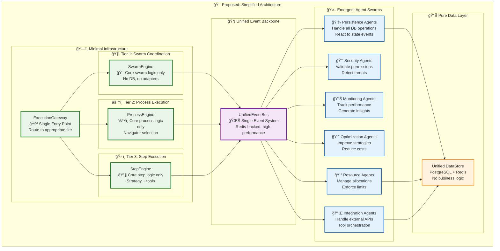

# 🚀 Execution Architecture: Current Implementation Analysis

> **Status**: 🔴 **NEEDS REFACTORING** - This implementation has become fragmented and contains significant technical debt from multiple iterations. This document analyzes the current state and proposes solutions.

## 📋 Executive Summary

The three-tier execution architecture has suffered from incremental changes across dozens of coding sessions, resulting in:
- **Fragmented responsibilities** across multiple components
- **Dead/deprecated code** that should be removed  
- **Inefficient adapter patterns** adding unnecessary complexity
- **Mixed emergent vs hard-coded capabilities**
- **Inconsistent event handling** with dual systems

## 🏗️ Current Architecture (As-Is)

```mermaid
graph TB
    subgraph "🌐 External Layer"
        API[SwarmExecutionService<br/>📝 Main Entry Point]
        Socket[ExecutionSocketEventEmitter<br/>🔌 Real-time Updates]
    end

    subgraph "🧠 Tier 1: Coordination Intelligence"
        T1Coord[TierOneCoordinator<br/>📋 Swarm Management]
        SwarmSM[SwarmStateMachine<br/>🔄 State Transitions]
        TeamMgr[TeamManager<br/>👥 Team Formation]
        T1Resource[ResourceManager<br/>💰 Resource Allocation]
        T1State[SwarmStateStore<br/>💾 Swarm Persistence]
        ConvBridge[ConversationBridge<br/>🗣️ Chat Integration]
        
        T1Coord --> SwarmSM
        T1Coord --> TeamMgr
        T1Coord --> T1Resource
        T1Coord --> T1State
        T1Coord --> ConvBridge
    end

    subgraph "⚙️ Tier 2: Process Intelligence"
        T2Orch[TierTwoOrchestrator<br/>🎯 Run Orchestration]
        UnifiedSM[UnifiedRunStateMachine<br/>🔄 Run State Management]
        NavReg[NavigatorRegistry<br/>🧭 Workflow Navigation]
        Navigators[NavigatorRegistry<br/>├─ NativeNavigator<br/>├─ BPMNNavigator<br/>├─ SequentialNavigator<br/>└─ SingleStepNavigator]
        MOISEGate[MOISEGate<br/>🛡️ Permission Validation]
        T2State[RunStateStore<br/>💾 Run Persistence]
        
        T2Orch --> UnifiedSM
        T2Orch --> NavReg
        T2Orch --> MOISEGate
        T2Orch --> T2State
        UnifiedSM --> Navigators
    end

    subgraph "🛠️ Tier 3: Execution Intelligence"
        T3Exec[TierThreeExecutor<br/>⚡ Step Execution]
        UnifiedExec[UnifiedExecutor<br/>🎯 Strategy Execution]
        StrategyProv[SimpleStrategyProvider<br/>🧠 Strategy Selection]
        Strategies[Strategy Implementations<br/>├─ ConversationalStrategy<br/>├─ ReasoningStrategy<br/>└─ DeterministicStrategy]
        ToolOrch[ToolOrchestrator<br/>🔧 Tool Management]
        T3Resource[ResourceManager<br/>💰 Resource Tracking]
        ValidationEng[ValidationEngine<br/>✅ Input/Output Validation]
        IOProcessor[IOProcessor<br/>📊 Data Processing]
        ContextExp[ContextExporter<br/>📤 Context Export]
        RunContext[ExecutionRunContext<br/>📋 Execution Context]
        
        T3Exec --> UnifiedExec
        UnifiedExec --> StrategyProv
        UnifiedExec --> ToolOrch
        UnifiedExec --> T3Resource
        UnifiedExec --> ValidationEng
        UnifiedExec --> IOProcessor
        T3Exec --> ContextExp
        T3Exec --> RunContext
        StrategyProv --> Strategies
    end

    subgraph "🌊 Cross-Cutting Concerns"
        EventBus[RedisEventBus<br/>📡 Event Coordination]
        UnifiedEvents[UnifiedEventSystem<br/>🎭 Modern Event Handling]
        EventPublisher[EventPublisher<br/>📢 Legacy Event Publishing]
        ErrorHandler[ErrorHandler<br/>🚨 Error Management]
        
        BaseComp[BaseComponent<br/>🏗️ Component Infrastructure<br/>├─ Event publishing helpers<br/>├─ Error handling<br/>├─ Logging<br/>└─ Disposal management]
    end

    subgraph "🔧 Integration Services"
        IntegArch[ExecutionArchitecture<br/>🏭 Factory & DI Container]
        RunPersist[RunPersistenceService<br/>💾 Database Persistence]
        RoutineStorage[RoutineStorageService<br/>📚 Routine Loading]
        AuthInteg[AuthIntegrationService<br/>🔐 Authentication]
        ToolReg[IntegratedToolRegistry<br/>🛠️ Tool Management]
        
        IntegArch --> T1Coord
        IntegArch --> T2Orch
        IntegArch --> T3Exec
    end

    subgraph "🤖 Emergent Capabilities (Event-Driven)"
        SecurityAgents[🔒 Security Agents<br/>Threat detection & compliance]
        OptimizationAgents[📈 Optimization Agents<br/>Performance & cost optimization]
        QualityAgents[✅ Quality Agents<br/>Output validation & bias detection]
        MonitoringAgents[📊 Monitoring Agents<br/>Observability & analytics]
        
        style SecurityAgents fill:#ffebee,stroke:#c62828
        style OptimizationAgents fill:#e8f5e8,stroke:#2e7d32
        style QualityAgents fill:#e3f2fd,stroke:#1565c0
        style MonitoringAgents fill:#fff3e0,stroke:#f57c00
    end

    subgraph "💾 Data Layer"
        Redis[Redis<br/>🔄 State & Events]
        PostgreSQL[PostgreSQL<br/>💾 Persistent Data]
        ChatStore[PrismaChatStore<br/>💬 Conversation State]
    end

    %% Main Flow
    API --> T1Coord
    T1Coord --> T2Orch
    T2Orch --> T3Exec

    %% Data Connections
    T1State --> Redis
    T2State --> Redis
    RunPersist --> PostgreSQL
    RoutineStorage --> PostgreSQL
    AuthInteg --> PostgreSQL
    ConvBridge --> ChatStore
    ChatStore --> PostgreSQL

    %% Event Connections
    EventBus --> Redis
    T1Coord -.->|events| EventBus
    T2Orch -.->|events| EventBus
    T3Exec -.->|events| EventBus
    
    %% Emergent Agents subscribe to events
    EventBus -.->|events| SecurityAgents
    EventBus -.->|events| OptimizationAgents
    EventBus -.->|events| QualityAgents
    EventBus -.->|events| MonitoringAgents

    %% Socket Events
    Socket -.->|real-time updates| T1Coord
    Socket -.->|real-time updates| T2Orch

    %% Inheritance/Base Classes
    T1Coord -.->|extends| BaseComp
    T2Orch -.->|extends| BaseComp
    T3Exec -.->|extends| BaseComp

    %% Event Systems (PROBLEM: Dual systems)
    BaseComp -.->|legacy| EventPublisher
    BaseComp -.->|modern| UnifiedEvents
    
    classDef tier1 fill:#e3f2fd,stroke:#1565c0,stroke-width:2px
    classDef tier2 fill:#f3e5f5,stroke:#7b1fa2,stroke-width:2px
    classDef tier3 fill:#e8f5e8,stroke:#2e7d32,stroke-width:2px
    classDef external fill:#fff3e0,stroke:#f57c00,stroke-width:2px
    classDef integration fill:#fafafa,stroke:#424242,stroke-width:2px
    classDef crossCutting fill:#e0f2f1,stroke:#00796b,stroke-width:2px
    classDef data fill:#e8eaf6,stroke:#3f51b5,stroke-width:2px
    classDef problem fill:#ffebee,stroke:#d32f2f,stroke-width:3px,stroke-dasharray: 5 5

    class API,Socket external
    class T1Coord,SwarmSM,TeamMgr,T1Resource,T1State,ConvBridge tier1
    class T2Orch,UnifiedSM,NavReg,Navigators,MOISEGate,T2State tier2
    class T3Exec,UnifiedExec,StrategyProv,Strategies,ToolOrch,T3Resource,ValidationEng,IOProcessor,ContextExp,RunContext tier3
    class IntegArch,RunPersist,RoutineStorage,AuthInteg,ToolReg integration
    class EventBus,UnifiedEvents,EventPublisher,ErrorHandler,BaseComp crossCutting
    class Redis,PostgreSQL,ChatStore data
    
    %% Highlight problematic areas
    class EventPublisher,UnifiedEvents problem
```



## 🔴 Critical Issues Identified

### 1. **Dual Event Systems** ❌
- **Legacy EventPublisher** and **UnifiedEventSystem** coexist
- Inconsistent event handling across components
- Redundant infrastructure

### 2. **Fragmented Responsibilities** ❌
- `TierOneCoordinator` manages database operations (should be data-agnostic)
- `SwarmExecutionService` acts as both API gateway and orchestrator
- Multiple "managers" and "orchestrators" with overlapping duties

### 3. **Dead/Deprecated Code** ❌
```typescript
// Examples of dead code still present:
// - rollingHistory (monitoring now emergent)
// - resourceMonitor (monitoring now emergent) 
// - AgentDeploymentService (commented out)
// - Telemetry subscriptions (removed but infrastructure remains)
```

### 4. **Adapter Pattern Overuse** ❌
- Excessive abstraction layers
- `BaseComponent` → `BaseTierExecutor` → actual implementations
- `TierCommunicationInterface` creating unnecessary indirection

### 5. **Mixed Hard-coded vs Emergent** ❌
- Some capabilities are hard-coded that should be emergent
- Other emergent capabilities are forced into hard-coded patterns

### 6. **Inconsistent State Management** ❌
- Multiple state stores with different interfaces
- Redis and PostgreSQL usage inconsistency  
- State synchronization issues

## 🎯 Proposed Solution: Emergent-First Refactoring

### Core Principle: **Minimal Infrastructure + Emergent Capabilities**



## 🛠️ Refactoring Roadmap

### Phase 1: **Event System Unification**
- [ ] Remove legacy `EventPublisher` 
- [ ] Migrate all components to `UnifiedEventSystem`
- [ ] Standardize event patterns across tiers

### Phase 2: **Dead Code Removal**
- [ ] Remove commented-out monitoring code
- [ ] Delete deprecated resource managers  
- [ ] Clean up unused abstraction layers

### Phase 3: **Responsibility Separation**
- [ ] Extract database operations to `PersistenceAgents`
- [ ] Move resource management to `ResourceAgents`
- [ ] Simplify tier coordinators to core logic only

### Phase 4: **Emergent Migration**
- [ ] Deploy monitoring agents for current hard-coded monitoring
- [ ] Deploy security agents for current hard-coded validation
- [ ] Deploy optimization agents for current hard-coded strategy selection

### Phase 5: **Interface Simplification**
- [ ] Remove excessive adapter patterns
- [ ] Consolidate communication interfaces
- [ ] Eliminate unnecessary inheritance hierarchies

## 📊 Benefits of Proposed Architecture

### **Emergent Capabilities**
- **Self-improving**: Agents learn and adapt execution strategies
- **Self-healing**: Resilience agents detect and recover from failures  
- **Self-optimizing**: Performance agents continuously improve efficiency

### **Simplified Maintenance**
- **Single Event System**: No more dual event handling
- **Clear Separation**: Infrastructure vs capabilities
- **Reduced Complexity**: Fewer abstraction layers

### **Data-Driven Configuration** 
- **No Code Deployments**: New routines, agents, swarms via config
- **Runtime Adaptation**: Strategies evolve based on execution patterns
- **Declarative Workflows**: BPMN, Native, custom formats

## 🎯 Key Architectural Decisions

### ✅ **DO: Emergent-First**
```typescript
// Instead of hard-coded monitoring:
class HardCodedMonitor { /* ... */ }

// Use event-driven emergent monitoring:
EventBus.on('execution.completed', (event) => {
  // Monitoring agents react to events
  MonitoringAgent.analyzePerformance(event.data);
});
```

### ✅ **DO: Minimal Infrastructure**
```typescript
// Simple, focused engine:
class SwarmEngine {
  async coordinate(goal: string): Promise<void> {
    // Pure coordination logic only
    // No DB, no adapters, no complexity
  }
}
```

### ❌ **DON'T: Adapter Overuse**
```typescript
// Avoid excessive abstraction:
class BaseTierExecutor extends BaseComponent implements TierCommunicationInterface {
  // Too many layers!
}

// Prefer direct, focused implementations
class StepEngine {
  async execute(step: Step): Promise<Result> {
    // Direct execution, no adapters
  }
}
```

## 📚 Implementation Guidelines

### **Event-Driven Development**
- All cross-tier communication via events
- Agents subscribe to relevant event patterns
- State changes trigger automatic reactions

### **Configuration-Driven Execution**
- Routines defined in data, not code
- Agents deployed via configuration
- Swarms created from declarative specs

### **Emergent Capability Development**
- Start with minimal infrastructure
- Add capabilities through specialized agents
- Let system behavior emerge from agent interactions

---

## 🔄 Current Status: Needs Immediate Attention

This architecture requires **significant refactoring** to achieve the vision described in the documentation. The current implementation has accumulated technical debt that prevents the emergent capabilities from functioning effectively.

**Next Steps:**
1. **Audit Current Usage**: Identify which components are actively used
2. **Create Migration Plan**: Phase out deprecated code systematically  
3. **Event System Unification**: Priority #1 for fixing cross-tier communication
4. **Emergent Agent Deployment**: Start with monitoring and optimization agents
5. **Gradual Simplification**: Remove abstraction layers incrementally

The three-tier architecture concept is sound, but the implementation needs to align with the emergent, data-driven vision outlined in the documentation.