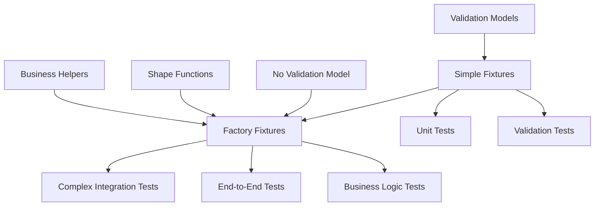

# API Fixtures Architecture Analysis

## Two-Tier Fixture System

The API fixtures are organized into **two distinct patterns** that serve different purposes:

### 📁 **Tier 1: Simple Fixtures (api/ directory)**
**Location**: `/src/__test/fixtures/api/*.ts`  
**Count**: 39 files  
**Pattern**: `ModelTestFixtures<CreateInput, UpdateInput>`

#### Characteristics:
- **Simple data structures** - plain objects with test data
- **Direct mapping** - 1:1 correspondence with validation models
- **Basic type safety** - uses `ModelTestFixtures` interface
- **Validation integration** - connected to Yup schemas
- **Static data** - predefined test objects

#### Example Structure:
```typescript
export const userFixtures: ModelTestFixtures<BotCreateInput, ProfileUpdateInput> = {
    minimal: { create: {...}, update: {...} },
    complete: { create: {...}, update: {...} },
    invalid: { missingRequired: {...}, invalidTypes: {...} },
    edgeCases: { ... }
};
```

#### Use Cases:
- Unit testing individual validation rules
- Basic API endpoint testing
- Simple data scenarios
- Validation error testing

---

### 🏭 **Tier 2: Factory Fixtures (api/factories/ directory)**  
**Location**: `/src/__test/fixtures/api/factories/*.ts`  
**Count**: 7 files  
**Pattern**: `APIFixtureFactory<CreateInput, UpdateInput, FindResult>`

#### Characteristics:
- **Advanced factory pattern** - extends `BaseAPIFixtureFactory`
- **Dynamic data generation** - programmatic fixture creation
- **Complex relationships** - handles nested objects and relationships
- **Shape integration** - connected to transformation functions
- **Full lifecycle** - create, update, find, validate, transform
- **Business logic helpers** - domain-specific factory methods

#### Example Structure:
```typescript
export class ProjectAPIFixtureFactory extends BaseAPIFixtureFactory<
    ResourceCreateInput, ResourceUpdateInput, Resource
> {
    // Core fixture data
    minimal = { create: {...}, update: {...}, find: {...} };
    
    // Dynamic factories
    createFactory(overrides?: Partial<ResourceCreateInput>): ResourceCreateInput;
    
    // Business helpers
    createTeamProject(teamId: string, name: string): ResourceCreateInput;
    addProjectVersion(projectId: string, version: string): ResourceUpdateInput;
    
    // Integration
    validateCreate(input: ResourceCreateInput): Promise<ValidationResult>;
    transformToAPI(formData: ProjectFormData): ResourceCreateInput;
}
```

#### Current Factory Files:
1. **projectAPIFixtures.ts** - Projects (Resources with `resourceType: Project`)
2. **routineAPIFixtures.ts** - Routines (complex multi-step workflows)
3. **userAPIFixtures.ts** - Enhanced user fixtures with relationships
4. **teamAPIFixtures.ts** - Enhanced team fixtures with members/projects
5. **bookmarkAPIFixtures.ts** - Enhanced bookmark fixtures
6. **runAPIFixtures.ts** - Enhanced run execution fixtures
7. **BaseAPIFixtureFactory.ts** - Base class for all factories

#### Use Cases:
- Integration testing with complex relationships
- End-to-end API testing
- Business logic testing
- Dynamic test data generation
- Performance testing with realistic data

---

## Why Two Tiers?

### 🎯 **Design Rationale**

1. **Complexity Separation**:
   - Simple fixtures for straightforward models (User, Team, Tag, etc.)
   - Factory fixtures for complex composite objects (Project, Routine)

2. **Different Use Cases**:
   - **Simple**: Validation testing, unit tests, basic scenarios
   - **Factory**: Integration tests, complex workflows, realistic data

3. **Evolution Path**:
   - Simple fixtures are the foundation (39 models covered)
   - Factory fixtures are enhanced versions for complex scenarios
   - Projects and Routines **only** exist as factories (no simple validation models)

4. **Performance**:
   - Simple fixtures are fast and lightweight
   - Factory fixtures provide rich functionality when needed

### 🔄 **Relationship Between Tiers**



### 📊 **Current State**

#### Simple Fixtures (Tier 1): ✅ **Complete**
- **39/39 files** with proper type safety
- All validation models covered
- Zero `any` types
- Comprehensive test scenarios

#### Factory Fixtures (Tier 2): ⚠️ **Partial**
- **7 factory files** implemented
- **32 models** could potentially have factory versions
- Advanced features for complex objects
- Integration with shape functions and validation

### 🚀 **Recommendations**

1. **Keep Both Tiers**: They serve different purposes and complement each other well

2. **Expand Factory Tier Selectively**: 
   - Add factory fixtures for models that need complex relationship testing
   - Focus on models with business logic (Chat, Resource, Schedule)
   - Don't create factories for simple models unless there's a clear need

3. **Clear Documentation**: 
   - Update index.ts to clearly separate simple vs factory exports
   - Add usage guidelines for when to use each tier
   - Document the relationship between tiers

4. **Migration Path**:
   - Simple fixtures remain the foundation
   - Factory fixtures added as enhancement layer
   - Backward compatibility maintained

The two-tier system is actually a **well-designed architecture** that provides both simplicity for basic testing and power for complex scenarios. The apparent "inconsistency" is actually **intentional specialization**.