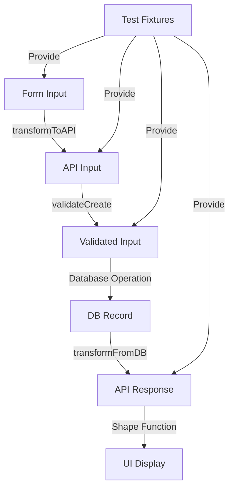

# API Fixtures - Validation and Transformation Layer

This directory contains API fixtures that serve as the **validation and transformation layer** in our unified testing system. API fixtures bridge the gap between form inputs (UI layer) and database operations (persistence layer), ensuring type safety and consistency across the entire data pipeline.

## Current State Analysis

### What's Working Well
1. **Comprehensive Coverage**: 40+ fixture files covering most object types
2. **Type Imports**: Using proper TypeScript types from `api/types.ts`
3. **Validation Integration**: Some fixtures use `validationTestUtils` for enhanced testing
4. **Factory Pattern**: `TestDataFactory` provides programmatic fixture generation
5. **Scenario Coverage**: Minimal, complete, invalid, and edge case scenarios

### Critical Issues
1. **Extensive Use of `any` Types**: Most fixtures use `any` in their interfaces and customizers
2. **Inconsistent Patterns**: Some fixtures are fully typed (e.g., `userFixtures`), others aren't
3. **Missing Validation Integration**: Many fixtures don't use validation schemas
4. **No Shape Function Integration**: Fixtures don't leverage shape transformation functions
5. **Incomplete Error Scenarios**: Limited coverage of business logic errors
6. **No Factory Pattern Consistency**: Not all fixtures export factories

### Type Safety Problems

**Current (Bad)**:
```typescript
// From teamFixtures.ts
export const teamFixtures: ModelTestFixtures = {  // No type parameters!
    minimal: {
        create: { /* any type */ },
        update: { /* any type */ }
    }
};

const customizers = {
    create: (base: any) => ({ ...base }),  // any type!
    update: (base: any) => ({ ...base })   // any type!
};
```

**Should Be**:
```typescript
export const teamFixtures: ModelTestFixtures<TeamCreateInput, TeamUpdateInput> = {
    minimal: {
        create: { /* fully typed */ },
        update: { /* fully typed */ }
    }
};
```

## Ideal Architecture Design

### Core Principles

1. **Type Safety First**: Zero `any` types, full TypeScript coverage
2. **Validation Integration**: Every fixture validates against its schema
3. **Shape Function Integration**: Leverage existing transformation logic
4. **Comprehensive Error Coverage**: Include all validation and business errors
5. **Factory Pattern**: Consistent factory exports for all fixtures

### Architectural Structure

```typescript
// Base interface for all API fixtures
interface APIFixtureFactory<TCreateInput, TUpdateInput, TFindResult> {
  // Core fixture sets
  minimal: { 
    create: TCreateInput; 
    update: TUpdateInput; 
    find: TFindResult;
  };
  complete: { 
    create: TCreateInput; 
    update: TUpdateInput; 
    find: TFindResult;
  };
  
  // Error scenarios
  invalid: {
    missingRequired: { create: Partial<TCreateInput>; update: Partial<TUpdateInput> };
    invalidTypes: { create: Record<string, unknown>; update: Record<string, unknown> };
    businessLogicErrors: Record<string, Partial<TCreateInput | TUpdateInput>>;
    validationErrors: Record<string, Partial<TCreateInput | TUpdateInput>>;
  };
  
  // Edge cases
  edgeCases: {
    minimalValid: { create: TCreateInput; update: TUpdateInput };
    maximalValid: { create: TCreateInput; update: TUpdateInput };
    boundaryValues: Record<string, TCreateInput | TUpdateInput>;
    permissionScenarios: Record<string, TCreateInput | TUpdateInput>;
  };
  
  // Factory methods with full type safety
  createFactory: (overrides?: Partial<TCreateInput>) => TCreateInput;
  updateFactory: (id: string, overrides?: Partial<TUpdateInput>) => TUpdateInput;
  findFactory: (overrides?: Partial<TFindResult>) => TFindResult;
  
  // Validation integration
  validateCreate: (input: TCreateInput) => Promise<ValidationResult>;
  validateUpdate: (input: TUpdateInput) => Promise<ValidationResult>;
  
  // Shape integration
  transformToAPI: (formData: FormDataType) => TCreateInput;
  transformFromDB: (dbRecord: DatabaseType) => TFindResult;
  
  // Relationship helpers
  withRelationships: (base: TFindResult, relations: RelationshipConfig) => TFindResult;
  withPermissions: (base: TFindResult, permissions: PermissionConfig) => TFindResult;
}
```

### Integration Flow



## Implementation Roadmap

### Phase 1: Type Safety Improvements (Priority: HIGH)
1. **Audit all fixtures** for `any` usage
2. **Add proper type parameters** to all `ModelTestFixtures` declarations
3. **Type all customizer functions** with proper input/output types
4. **Create type-safe base factory** class

### Phase 2: Validation Integration (Priority: HIGH)
1. **Import validation schemas** for each object type
2. **Add validation methods** to factories
3. **Create validation test suites** using fixtures
4. **Document validation patterns**

### Phase 3: Shape Function Integration (Priority: MEDIUM)
1. **Import shape functions** from shared package
2. **Add transformation methods** to factories
3. **Create round-trip tests** (Form → API → DB → API → UI)
4. **Document transformation flow**

### Phase 4: Error Scenario Expansion (Priority: MEDIUM)
1. **Catalog all error types** per object
2. **Add business logic errors** (e.g., duplicate names, circular dependencies)
3. **Add permission errors** (e.g., unauthorized, forbidden)
4. **Add relationship errors** (e.g., orphaned records, invalid references)

### Phase 5: Factory Pattern Standardization (Priority: LOW)
1. **Create base factory class** with common methods
2. **Extend for each object type** with specific logic
3. **Add relationship builders** for complex scenarios
4. **Export typed factories** for all fixtures

## Usage Examples

### Current Usage (Problematic)
```typescript
import { teamFixtures } from "@vrooli/shared/__test/fixtures/api";

// No type safety!
const team = teamFixtures.minimal.create;
team.unknownField = "compiles but wrong!"; // TypeScript doesn't catch this
```

### Ideal Usage (Type-Safe)
```typescript
import { teamAPIFixtures } from "@vrooli/shared/__test/fixtures/api";

// Full type safety
const team = teamAPIFixtures.createFactory({
  name: "Test Team",
  isPrivate: true
});

// Validation integration
const validationResult = await teamAPIFixtures.validateCreate(team);
expect(validationResult.isValid).toBe(true);

// Shape transformation
const formData = { teamName: "Test", private: "yes" };
const apiInput = teamAPIFixtures.transformToAPI(formData);

// Error scenarios
const duplicateName = teamAPIFixtures.invalid.businessLogicErrors.duplicateName;
await expect(createTeam(duplicateName)).rejects.toThrow("Team name already exists");

// Relationship building
const teamWithMembers = teamAPIFixtures.withRelationships(
  teamAPIFixtures.complete.find,
  { 
    members: [userAPIFixtures.minimal.find],
    projects: [projectAPIFixtures.complete.find]
  }
);
```

## Missing Fixtures

Based on the 41 object types mentioned in the overview, we're missing fixtures for:
- Run configurations (beyond basic run fixtures)
- Routine variations (single-step, multi-step)
- Permission-related fixtures
- Relationship junction fixtures
- Notification fixtures
- Audit/history fixtures

## Cross-Reference with Overview

The [fixtures overview](../../../../../../../docs/testing/fixtures-overview.md) mentions API fixtures as the bridge layer. This README expands on that concept by:

1. **Defining the transformation role** explicitly
2. **Providing concrete implementation patterns**
3. **Addressing current type safety issues**
4. **Creating a roadmap for improvement**
5. **Showing integration with validation and shape functions**

## Integration with Other Layers

### Form Layer (UI)
- API fixtures provide the expected output format
- Validate form transformations produce correct API inputs
- Test error handling for invalid form submissions

### Database Layer
- API fixtures define the input for create/update operations
- Provide expected query results for find operations
- Test database constraints match API validation

### Service Layer
- API fixtures feed into service methods
- Test business logic with various scenarios
- Validate service responses match API contracts

## Best Practices

1. **Always use TypeScript types** - No `any` types allowed
2. **Validate fixtures on creation** - Ensure fixtures are always valid
3. **Test transformations** - Verify shape functions work correctly
4. **Include error cases** - Test what happens when things go wrong
5. **Document scenarios** - Explain what each fixture represents
6. **Keep fixtures minimal** - Only include required fields in minimal fixtures
7. **Make complete fixtures comprehensive** - Include all possible fields

## Next Steps

1. **Start with high-value objects** - User, Team, Project, Routine
2. **Create example refactor** - Pick one fixture file and fully refactor it
3. **Establish patterns** - Document the patterns for others to follow
4. **Gradual migration** - Update fixtures as you work on related features
5. **Automate validation** - Add fixture validation to CI pipeline

## Conclusion

API fixtures are critical for ensuring data integrity across Vrooli's complex architecture. By addressing the current type safety issues and implementing proper validation and transformation integration, we can create a robust testing foundation that catches errors early and provides confidence in our data flow.

The roadmap prioritizes type safety and validation integration as these provide immediate value and prevent runtime errors. Shape function integration and comprehensive error scenarios follow, with factory standardization as a nice-to-have improvement.

Remember: **Every `any` type is a potential runtime error waiting to happen!**