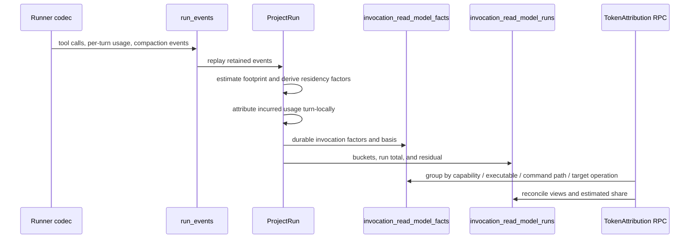

# Token Attribution Reference

Agent Manager stores token attribution below the run boundary in the durable
invocation read model. The measure answers three different questions; the
numbers must not be compared as though they were interchangeable costs.

## The three views

| View | Question | Basis |
| --- | --- | --- |
| `footprint` | How large was this command's returned payload intrinsically? | Estimated from the invocation payload; measured provider usage is not rewritten. |
| `residency` | How much context did this payload occupy while it remained resident? | Footprint multiplied by turn residency factors, with compaction attenuation. |
| `incurred` | What provider-reported turn usage was attributed to this action? | Measured per-turn usage, with an explicit unattributed residual. |

Footprint is the optimization surface for shrinking command output. Residency
is the context-bloat surface. Incurred is the accounting surface. A row carries
its `token_basis` (`estimated`, `measured`, or `unknown`) wherever a token
number is persisted; consumers must not present an estimate as provider billing.

## Factors, not products

The durable fact stores independent factors: result tokens, residency turns,
compaction attenuation, turn-local usage, and attribution basis. It does not
persist a precomputed product as if that product were a measured provider
charge. Aggregates may calculate a view-specific product at read time, but the
underlying factors remain inspectable and replayable. This prevents a later
change to the residency approximation from being mistaken for a change in
historical provider usage.

## Run-level conservation buckets

Run token accounting uses one stable bucket vocabulary:

| Bucket | Meaning | Source |
| --- | --- | --- |
| `preamble_injected` | Agent Manager instructions injected into the run | `BuildSplitPrompt` estimate |
| `preamble_fixed` | Runner system prompt and tool definitions | Minimum input observed in a compaction segment |
| `tool_result_residency` | Tool-result payload carried through later turns | Per-fact result tokens and residency factors |
| `assistant_output` | Assistant output tokens not otherwise attributed | Per-turn usage |
| `compaction` | The context read to produce a compaction summary | Compaction boundary usage |
| `unattributed` | Explicit residual when available evidence cannot explain the total | Run total minus known buckets, with a reason |

The conservation invariant is:

```text
run_total = preamble_injected + preamble_fixed +
            tool_result_residency + assistant_output +
            compaction + unattributed
```

The residual is never silently discarded or normalized away. A non-zero
residual is a signal that the ranking is incomplete, not evidence of zero
cost. The typed constants and invariant live in
`api/internal/tokenaccounting`; the conservation tests include empty usage,
terminal-only usage, per-turn usage, and two compaction boundaries.

## Compound commands and segment apportionment

A shell tool call carries one input payload and one result payload, but the
read model emits one fact per shell segment so that each command in a compound
line stays independently rankable. `cd /repo && rg pattern | head -20` becomes
three facts from one call.

Token quantities therefore have to be apportioned. Each per-call quantity —
argument tokens, result tokens, and each incurred usage field — is divided
evenly across the call's segments, with the remainder assigned to the leading
segments so the shares sum back to the call total exactly. Residency turns are
a multiplier rather than a token quantity, so they stay whole; the residency
product apportions through the result share it multiplies.

The even split is a declared approximation, not a measurement. The retained
evidence cannot say which stage of a pipeline produced the bytes, and the
segment texts are not retained. Consumers distinguish an apportioned fact by
`segment_count > 1`.

Two rejected alternatives are worth recording, because both look simpler:

- **Charging the whole call to the leading segment** concentrates the plurality
  of all shell token spend onto `cd`, which begins most compound lines in this
  corpus. It produces a confidently wrong ranking.
- **Leaving the whole call value on every segment** is what facts at
  `invocation-fact.v16` and earlier did. Any `SUM` over those rows overcounts a
  run in proportion to how compound its commands were, and attributes the full
  turn cost separately to every command in the line. The run-level ledger was
  never affected, because it sums the by-call attribution map rather than the
  fact rows — so conservation stayed green while the per-command ranking was
  inflated. That asymmetry is why the regression test reconciles the fact rows
  against the run ledger rather than checking either one alone.

Because a fact row is a segment, `p50`, `p95`, and `max` footprint columns
describe segment shares rather than whole calls whenever the grouped commands
appear in compound lines. `SUM` columns are unaffected — they conserve.

## Whole-stream projection

Projection reads a run's entire retained event stream, paging by sequence.
A single capped read is not sufficient and is a defect, not a tuning choice:
the run total is derived from the same slice as the invocation facts, so a
truncated load still produces a ledger that reconciles — against a partial run.
The result is that the longest and most expensive runs are measured least
accurately, which inverts the signal the measure exists to provide.

## Compaction and preamble approximations

Residency does not reset at compaction. A tool result is carried at full weight
within its segment and at an attenuated weight after the boundary. The ratio
`TokensAfter / TokensBefore` is observed for the whole context and applied to
surviving results. Because the stream does not report per-item survival, this
is an approximation: it can overstate small survivors that compress unusually
well and understate survivors preserved unusually well. Treating compaction as
a reset would systematically bias long-run residency downward.

The fixed preamble uses the minimum observed input in each segment, less the
known injected instruction estimate. The shortest turn still contains some
conversation history, so this approximation is biased upward relative to the
true fixed prefix. Runs without per-turn usage leave the preamble basis
`unknown` instead of inventing a number.

## Measured estimator error

The recorded fixture corpus measures the payload estimator at **13.8095238%
mean relative error** and **25.0000000% p95 relative error**. The test gate is
50% p95. These are measured corpus results, not a provider guarantee; the
fixture and the constants are pinned by
`internal/tokenaccounting/tokenaccounting_test.go::TestEstimateTextMatchesProviderGroundTruthWithinRecordedError`.

## Projection and query flow



## CLI and UI

The CLI command is:

```bash
agent-manager measures token-attribution --by capability --view footprint --json
```

`--by` accepts `capability`, `executable`, `command_path`, and
`target_scenario_operation`. `--view` accepts `footprint`, `residency`, and
`incurred`. Every response includes estimated share and keeps the
`unattributed` row visible when a run residual exists.

The Stats page exposes the same selectors and columns. Footprint additionally
shows p50, p95, and maximum footprint. Residency is labelled as the compaction
attenuation approximation, and an empty retained corpus is shown as an empty
state rather than a zero-cost claim.
