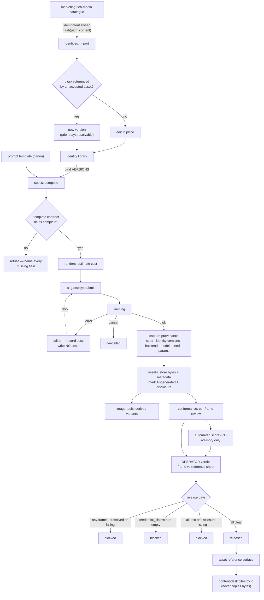

# Flows — Asset Studio

This document is the canonical workflow and state-transition map for
the scenario. Use it when behavior depends on ordered states, retries,
cancellation, stale completion, background jobs, polling, or mutually
exclusive UI modes.

## Purpose Of This Document

Use this document to answer:

- Which user/system workflows matter?
- Which workflows have explicit states and events?
- Which transitions are illegal?
- Which tests prove workflow correctness?
- Which flows are known but not modeled yet?

Plain CRUD with no meaningful ordering constraints does not need a
workflow model.

## Flow Inventory

`health` is a stateless reporting domain and ships no workflows. List
each real stateful flow your domains add below, with its owner, trigger,
outcome, statefulness, and validation level.

| Flow | Domain | Trigger | Outcome | Statefulness | Validation |
|---|---|---|---|---|---|
| Render job | renders | A validated spec is submitted. | One produced artifact plus its provenance and cost, or a recorded failure with no artifact. | Long-running external call. Retryable per attempt, cancellable while running, aborts cleanly with no partial asset. | L5 — the one flow that earns a checked formal model. |
| Canon import sweep | identities | Scheduled, or on demand; also the initial backfill. | New and changed catalogue items appear as identity versions; unchanged items produce nothing. | **Idempotent by content-addressed key** — safe to run at any frequency. A per-source schema failure aborts that item rather than recording a partial sweep as complete. | L3 — scheduled, resumable, no partial completion. |
| Identity versioning | identities | An edit to an identity block. | Either an in-place edit (unreferenced) or a new version (referenced). | Branchpoint depends on whether an accepted asset binds the block. Never destructive. | L2 — deterministic, additive. |
| Spec resolution | specs | Compose or re-resolve a spec. | A stored model-facing payload. | Pure function of spec, bound identity versions, and template. No retries, nothing to cancel. | L1 — stateless computation. |
| Conformance judgement | conformance | An asset with unresolved frames enters review. | A verdict per frame, plus policy check results. | Additive. A re-judgement is a new verdict; history is retained. | L2 — additive, reversible. |
| Release | assets | Operator releases a conformance-clean asset. | The asset becomes resolvable through the reference surface. | Gated on every frame verdict, policy checks, alt text, and disclosure state. One-way. | L2 — gate-enforced, terminal. |

## Flow Details

Document each real flow here with its owner domain, trigger, inputs,
ordered steps, outputs, failure modes, retry/cancel behavior, tests, and
generated subpackages. The worked example below shows the expected shape.

<!-- EXAMPLE-DOMAIN:notes START -->
### Example domain — `notes` (removed by `template-manager detemplate`)

The template ships an `Attachment upload` flow on the `notes` domain as a
worked Level 5 temporal-workflow vertical slice. Copy its shape for your
own stateful flows, then remove it.

Add this row to the Flow Inventory above:

| Flow | Domain | Trigger | Outcome | Statefulness | Validation |
|---|---|---|---|---|---|
| Attachment upload | notes | User/CLI uploads a file for a note. | Blob is stored and metadata is persisted. | Stateful upload request with validation and failure paths. | Level 5 workflow tests: matrix, traces, declarative spec, checked Quint model, generated artifacts, and production replay. |

#### Attachment upload

- Owner domain: notes.
- Trigger: multipart upload request from UI or CLI.
- Inputs: note id, file key/name, file bytes, content type, file size.
- Steps:
  1. Parse multipart request.
  2. Validate note id and file metadata.
  3. Store opaque bytes through BlobStore.
  4. Persist attachment metadata through notes repository seam.
  5. Return proto-typed metadata response.
- Outputs: uploaded attachment metadata or typed error response.
- Failure modes: missing note id, missing file, invalid metadata, blob
  write failure, metadata persistence failure.
- Retry/cancel behavior: caller may retry after transport/storage
  failure; duplicate handling belongs to the owning real domain when
  product requirements demand it.
- Tests: `api/handlers/notes/attachments_handler_test.go`,
  `api/internal/notes/attachments_service_test.go`,
  `api/internal/notes/flow/flow_test.go`,
  `ui/src/features/notes/AttachmentUpload.test.tsx`, and
  `ui/src/features/notes/flow/flow.test.ts`.
- Generated subpackages: `api/internal/notes/flow/generated/`
  (`model.qnt`, `artifact.json`, `runtime.go`, `replay.go`) and
  `ui/src/features/notes/flow/generated/` (`model.qnt`, `artifact.json`,
  `runtime.ts`, `replay.helper.ts`).
- Requirements: template starter only.

These example state machines belong in the State Machines table below:

| Domain/Flow | States | Illegal Transitions | Enforcement |
|---|---|---|---|
| notes / attachment upload API | received, bytes_stored, metadata_recorded, failed | metadata before bytes, terminal-state escape, duplicate terminal events | `*.flow.json` contract, generated Quint model, generated formal artifact replay, side-effect cleanup tests |
| notes / attachment upload UI | idle, selected, uploading, succeeded, failed | start before select, stale completion after reset/reselect, retry without file context | `*.flow.json` contract, generated Quint model, generated formal artifact replay, attempt-id stale completion tests |
<!-- EXAMPLE-DOMAIN:notes END -->

## State Machines

List each modeled flow's states, illegal transitions, and how they are
enforced. Plain CRUD with no ordering constraints does not appear here.

| Domain/Flow | States | Illegal Transitions | Enforcement |
|---|---|---|---|
| renders / render job | `draft → validated → estimated → submitted → running → succeeded` (terminal). Branches: `running → failed` (terminal), `running → cancelled` (terminal), `failed → submitted` (retry, new attempt). | Submitting without a validated spec; reaching `succeeded` without a provenance record; reaching any terminal state without a cost record; any transition out of a terminal state; a second artifact from one attempt. | `*.flow.json` contract, generated Quint model, formal artifact replay, and a no-partial-asset side-effect test (`ASSET-P0-006`, `ASSET-P0-007`, `ASSET-P0-008`). |
| identities / identity version | `draft → active → referenced → superseded`. `referenced` and `superseded` are both permanent — a superseded version stays resolvable. | Editing a block in `referenced` or `superseded`; deleting any version that provenance points at; a version chain with two heads. | Repository immutability tests; provenance-resolution test after a newer version exists (`ASSET-P0-002`). |
| assets / release | `produced → in_review → released` (terminal), and `produced → discarded` (terminal). | `produced → released` skipping review; release with any unresolved or failing frame verdict; release with non-empty credential claims, missing alt text, or missing disclosure state; any transition out of `released`. | Gate tests per blocking condition, each asserting the specific typed cause (`ASSET-P0-010`, `ASSET-P0-012`, `ASSET-P0-013`). |
| conformance / verdict | `unresolved → passed` or `unresolved → failed`; either may be superseded by a later verdict. | A verdict authored by a non-operator actor; an automated score alone moving a frame out of `unresolved`; deleting a prior verdict on re-judgement. | Actor-kind rejection test; a test asserting release stays blocked at maximum automated score without an operator verdict (`ASSET-P0-011`, `ASSET-P1-005`). |

## Maturity Ladder

Temporal workflows mature in layers. Do not skip the executable layers
to add a standalone formal document.

| Level | Name | What exists |
|---|---|---|
| 0 | Unmodeled risk | Lifecycle behavior exists only inside handlers, components, callbacks, or jobs. |
| 1 | Inventory | The flow is listed here with owner, source links, risk, and next step. |
| 2 | Workflow model | State/status values, event values, `Transition`, and `CheckInvariants` live beside the owning domain or feature. |
| 3 | Matrix + traces | Tests cover every state/event pair and replay representative traces against production transition logic. |
| 4 | Declarative contract | A domain-local `*.flow.json` declares states, events, transitions, invariants, and named traces. |
| 5 | Checked formal model | Quint/TLA+ or an equivalent tool is generated from the contract, checked, and replayed by production tests. |

## Production Shape

Three (Go) or four (UI) files per flow at the top of the feature folder,
plus one `generated/` sibling. Everything in `generated/` is codegen output.

Every flow lives in a `flow/` subdirectory next to its consumer with
conventional file names. API domains that own durable lifecycle state use:

```text
api/internal/<domain>/
  flow/
    flow.json                   # hand: source of truth (schema v6)
    transition.go               # hand: wrapper (package flow)
    flow_test.go                # hand: thin replay delegation (package flow)
    generated/
      model.qnt
      artifact.json
      runtime.go                # package generated
      replay.go
```

UI features that own client-side modes use:

```text
ui/src/features/<domain>/
  flow/
    flow.json                   # hand: source of truth (schema v6)
    transition.ts               # hand: wrapper
    fixtures.ts                 # hand: replay fixtures
    flow.test.ts                # hand: thin replay delegation
    generated/
      model.qnt
      artifact.json
      runtime.ts
      replay.helper.ts
```

Every flow uses the same file names. The `flow/` directory IS the unit;
the contract no longer declares any output paths or module names.

The workflow owns state/status values, events, `Transition`, and
`CheckInvariants`. It should be pure or nearly pure. Effects live
outside the workflow behind seams: repositories, BlobStore, clocks,
timers, HTTP clients, or UI API modules.

The `*.flow.json` contract is the source of truth. Level 5 generated
Quint models, formal artifacts, and Go/TypeScript declarations are
checked-in source artifacts for reviewability, but they are refreshed
and checked by the `flow-verifier` scenario CLI; the
scenario lifecycle runs `make temporal-models` (which calls
`flow-verifier verify check`) before the normal test
suite. A Quint file by itself is not accepted: the model must typecheck,
test, verify named invariants, emit deterministic artifacts, and those
artifacts must replay against the production Go/TypeScript transition
functions.

The generated declarations keep state/event topology and formal
freshness metadata out of hand-maintained test lists. They also provide
pure status-transition helpers generated from the `*.flow.json`
transition matrix. For TypeScript flows, the same declarations can own
the discriminated state/event union shape and replay fixture contract.
Production workflow wrappers call those helpers for abstract validity
and next-status outcomes, while keeping payload validation, side-effect
orchestration, and rich state construction in hand-authored code. API
replay tests get expected paths, hashes, invariants, and generated checks
from `generated/<folder>/runtime.go`; UI replay tests import the same metadata
from `generated/<folder>/runtime.ts`. The generated `replay.{go,helper.ts}`
files own the assertion calls; the hand-authored top-level test simply binds
the wrapper's transition function and the fixtures and invokes
`RunReplay`/`runFormalReplay` once.

Formal artifacts use schema v6 coverage metadata. Matrix completeness,
terminal transition checks, named trace coverage, and generated MBT trace
coverage are separate fields. Do not treat generated trace
`allPairsCovered` as required proof of correctness; replay tests require
the complete transition matrix and named traces, while generated trace
coverage reports how much the model explorer happened to visit.

Schema v6 `flow.json` files carry no path or module information. The
`replay` block declares only `transition.function` (plus
`transition.statusAccessor` for TS or `transition.stateType` /
`transition.statusField` for Go). Everything else is derived from the
flow directory.

Go flows emit `flow/generated/replay.go` and require a hand-authored
`flow/flow_test.go` (package `flow`) that calls `generated.RunReplay`.
TypeScript flows emit `flow/generated/replay.helper.ts` and require a
hand-authored `flow/flow.test.ts` that calls
`runFormalReplay({ transition, fixtures })` at module top level.
`flow-verifier verify check` byte-compares every generated file and runs an
AST-level lint over the hand-authored test, so a silent bypass — missing
import, stubbed transition, or call buried inside a guarded block —
fails the check.

To scaffold a new flow:

```bash
flow-verifier flows new ui/src/features/<feature> --flow-id <flow-id> --lang ts --root .
flow-verifier flows new api/internal/<domain>     --flow-id <flow-id> --lang go --root .
```

The scaffold writes the hand-authored files and immediately runs
`generate`, so `check` is green from the moment it returns.

To add or rename a state/event:

1. Edit the owning `*.flow.json`.
2. Regenerate that flow with `flow-verifier verify run --flow <flow-id>`.
3. Update only payload-specific wrapper branches that need new runtime
   data; the abstract transition table is generated.
4. Update the UI replay fixture module. The generated formal replay fixture
   interface should make missing state/event fixtures a type error.
5. Run `make temporal-models` and the scenario tests.

## Deferred / Unmodeled Flows

| Flow | Risk | Next Step |
|---|---|---|
| Capture session | Deferred to `ASSET-P1-003`. A scripted browser or desktop session has its own failure modes — target unreachable, step timeout, viewport drift — but it lands on the same job lifecycle, so the risk is contained to the dispatch seam. | Once the generative path has released an artifact end to end. |
| Compositing | Deferred to `ASSET-P1-004`. Assembling ordered segments introduces a second producer of an asset. The scope guard is that slots are named and ordered, not freely positioned. | Once multi-frame specs exist to compose from. |
| Spend-budget confirmation | Deferred to `ASSET-P1-006`. Holding a job pending human confirmation adds a blocking state to a flow that is otherwise autonomous. | Once real cost data exists to set a budget from. Setting one now would be guessing. |
| Drift monitoring across generations | Deferred to `ASSET-P2-003`. The slow-walk failure — every frame within tolerance of the last, the tenth nothing like the first — is invisible to per-frame conformance by construction. | Once several accepted generations exist for one identity to calibrate against. |

## Flow Diagram — declaration, production, and the release gate



An unchecked frame is not a passing frame: the gate blocks on an *unresolved*
verdict, not only on a failing one. Every blocked edge above states its own
cause, and the workbench renders that cause inline rather than disabling the
control silently.

Note the two edges that never exist. Nothing flows from `assets` back into
`identities` or `specs` — produced output is never authoritative for a
declaration. And nothing flows from this scenario back into the catalogue;
import is one-directional by design.

## Cross-References

- [`DOMAINS.md`](DOMAINS.md) — owning domain map
- [`DATA.md`](DATA.md) — persisted state and retention
- [`../internal/SEAMS.md`](../internal/SEAMS.md) — side-effect boundaries
- [`../internal/TESTING.md`](../internal/TESTING.md#temporal-workflow-tests) — matrix and trace testing
