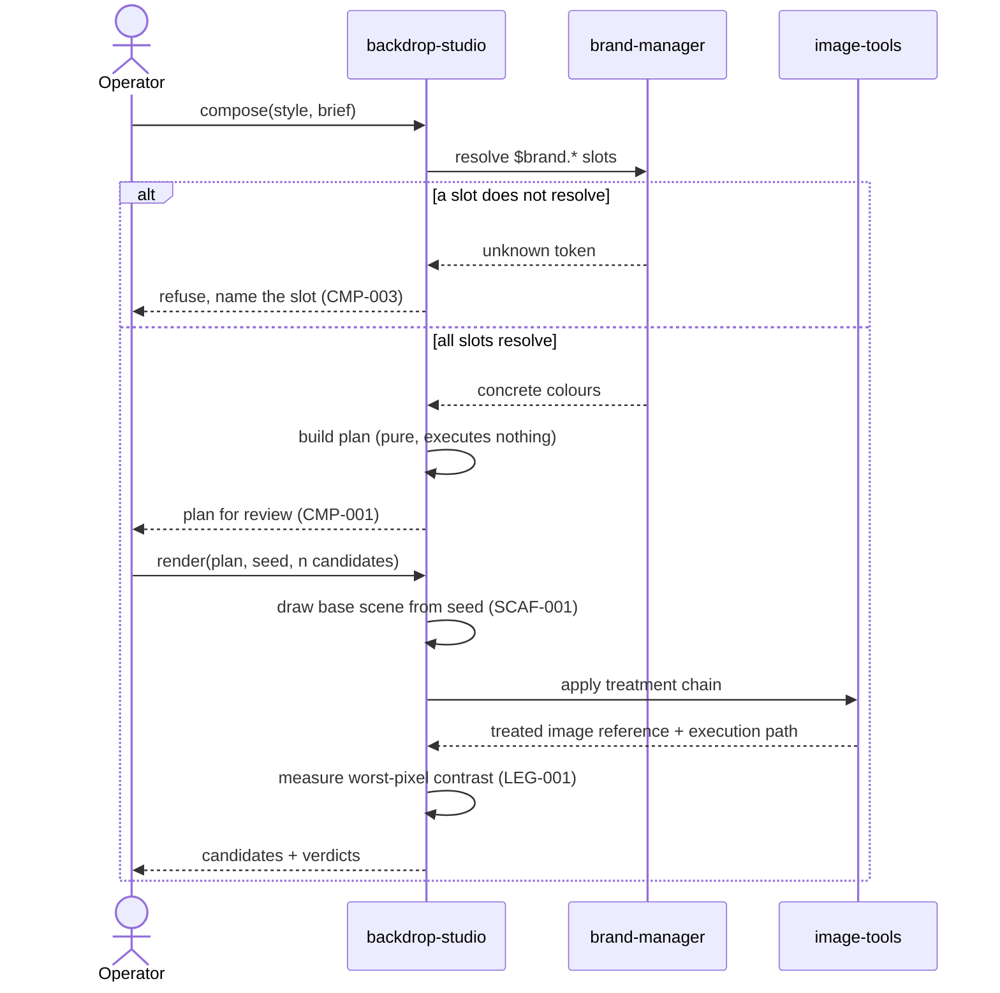
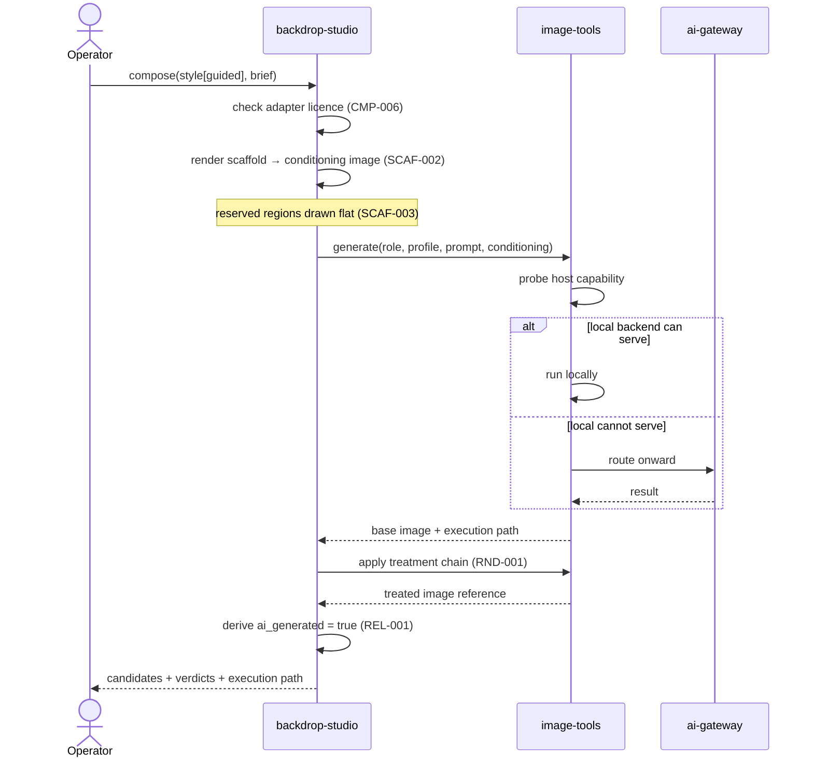
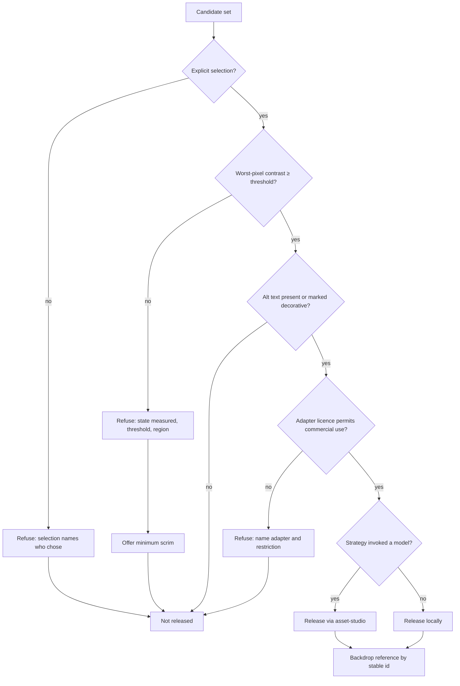
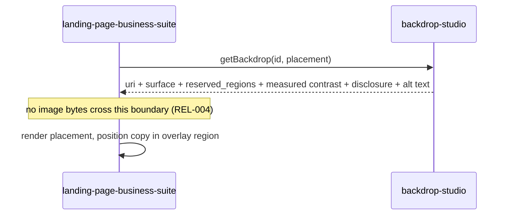

# Flows

## 1 · Compose and render a procedural backdrop

The lane that must work with no model, no network, and no `asset-studio`.

The plan is returned **before** anything executes. That is the debuggability
seam: a caller reads exactly what would run without spending anything.

## 2 · Compose and render a guided backdrop

Adds the scaffold, the model, and the disclosure obligation.

Backdrop Studio does not choose between local and routed execution. That decision
belongs to `image-tools`, which already probes the host and holds the routing
policy. This scenario only **records which path ran** (`RND-004`) so a degraded
result is attributable.

## 3 · Judge and release

Every refusal states its cause and, where one exists, the amendment that would
pass (`UIX-002`). A disabled control without a stated reason is a defect.

## 4 · Consume a released backdrop

The consumer receives the reserved regions as data, so it positions its own copy
correctly without re-deriving a layout judgement that was already made and
measured.

## 5 · Degradation behaviour

What happens when a dependency is unavailable — stated as behaviour, because a
product that only works with everything running is not deployable.

| Unavailable | Procedural lanes | Model-backed lanes |
|---|---|---|
| `ai-gateway` | unaffected | `image-tools` serves locally if capable; otherwise refuse with cause |
| Local GPU / capable host | unaffected | `image-tools` routes onward if configured; otherwise refuse with cause |
| `asset-studio` | **unaffected** — release locally (`REL-003`) | blocked; refuse with cause |
| `brand-manager` | blocked — no palette lock is possible without the brand | blocked |
| `image-tools` | blocked — every treatment runs there | blocked |

The two hard dependencies are `image-tools` and `brand-manager`. Everything else
degrades to "the procedural catalog still works", which is the posture that makes
this shippable as a desktop product on an ordinary machine.

## Related

- `DOMAINS.md` — which domain owns each step
- `INTEGRATIONS.md` — the seams these flows cross
- `../internal/DECISIONS.md` — why the asset-studio split falls where it does
