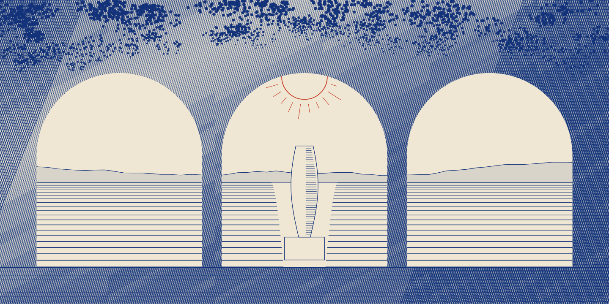
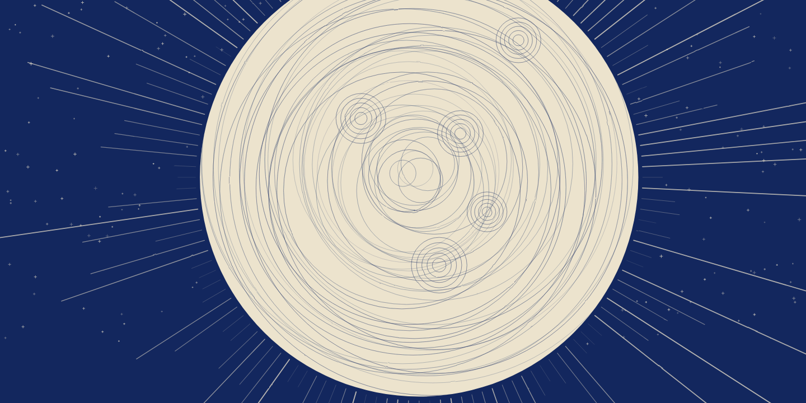
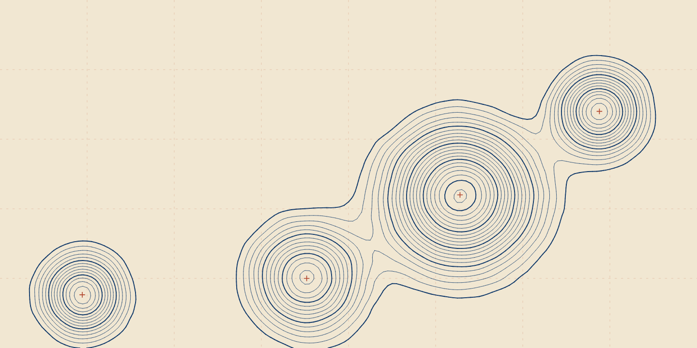
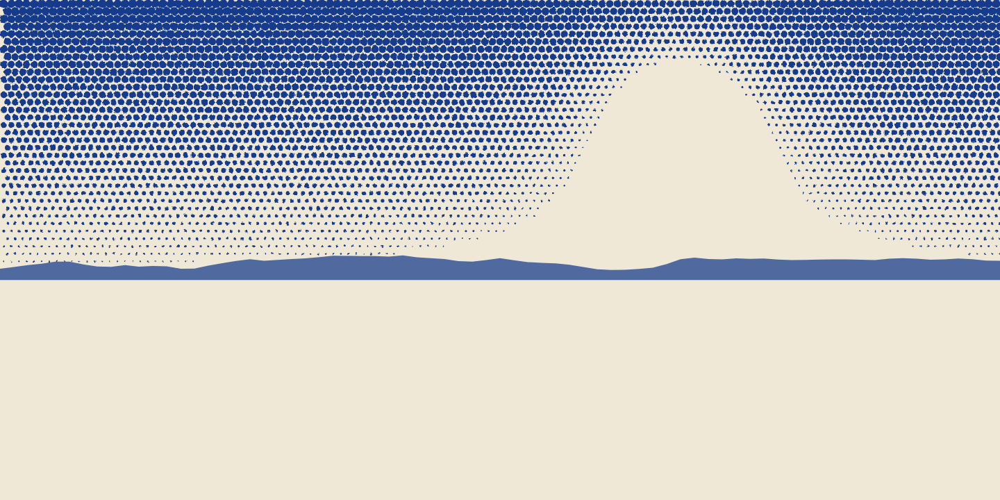

# Plate stacks

Every style whose generator separates depth planes: the composite that ships,
and the stack it was assembled from.

The plate images are deliberately NOT here. Plate pixels do not travel on the
job record — a three-plate candidate at store geometry is tens of megabytes,
and inlining them would make every list call expensive for a field most
callers ignore — so this lane can only show what the wire carries. What it
proves is that the declared stack really reached a running compositor and came
back as one picture at the delivery geometry.

The alpha behind each plate is exact rather than estimated: a plate is the
generator's own layer, and `internal/vector`'s partition test proves every mark
lands in exactly one of them.

**Reproduce:** `make integration-evidence` from `scenarios/backdrop-studio`.

## `engraved-colonnade-vector`

At `web.hero` (1440x720), seed 7.

| Plate | Depth | Blend | Opacity | Treatments |
|---|---|---|---|---|
| `distance` | 0 | normal | 1.00 | — |
| `arcade` | 1 | normal | 1.00 | — |
| `canopy` | 2 | normal | 1.00 | — |

## `pale-moon`

At `web.hero` (1440x720), seed 7.

| Plate | Depth | Blend | Opacity | Treatments |
|---|---|---|---|---|
| `void` | 0 | normal | 1.00 | — |
| `burst` | 1 | normal | 1.00 | — |
| `orb` | 2 | normal | 1.00 | — |

## `survey-relief`

At `web.hero` (1440x720), seed 7.

| Plate | Depth | Blend | Opacity | Treatments |
|---|---|---|---|---|
| `paper` | 0 | normal | 1.00 | — |
| `contours` | 1 | normal | 1.00 | — |
| `survey` | 2 | normal | 1.00 | — |

## `tidal-halftone`

At `web.hero` (1440x720), seed 7.

| Plate | Depth | Blend | Opacity | Treatments |
|---|---|---|---|---|
| `paper` | 0 | normal | 1.00 | — |
| `sky` | 1 | normal | 1.00 | — |
| `headland` | 2 | normal | 1.00 | — |

