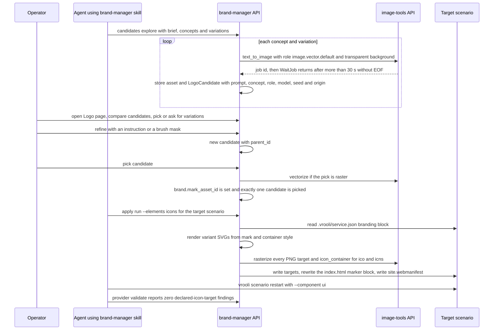
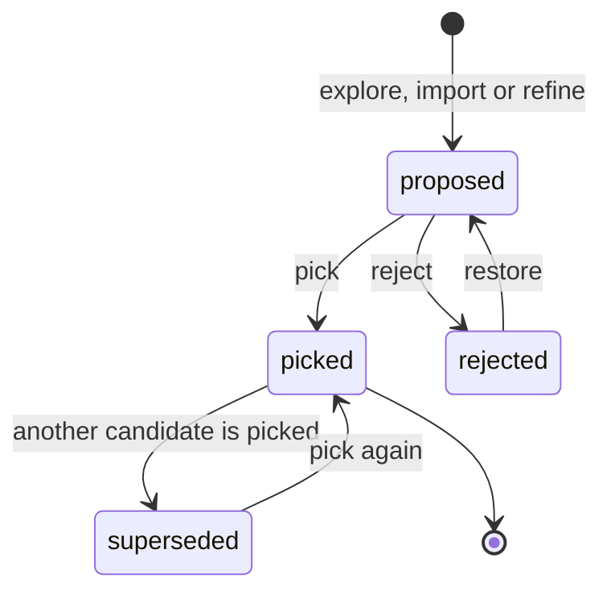

# Brand asset pipeline

Status: built (see the execution evidence under
`~/.vrooli/plan-artifacts/brand-identity-pipeline/evidence/`).

## Purpose

One governed flow from logo concepts to an applied, validated icon set. The
operator (or an agent) explores concepts, picks one, refines it, vectorizes it,
and applies it to a scenario. The scenario declares which icon targets it ships;
brand-manager renders every target from the one vector mark and writes them;
validation proves the declared targets exist, are the right size and format, and
are not placeholders.

The 2026-09-15 Aquila refresh needed thirteen AI concepts, three hand-written
inpainting attempts, an ad-hoc OpenCV tracer and manual discovery of eleven icon
targets because brand-manager could not build and image-tools lacked the
operations. This pipeline replaces that work with five commands (or the Logo
page).

## Roles and ownership

| Capability | Owner | Notes |
|---|---|---|
| Pixel and vector operations: generate, edit, object removal, vectorize, rasterize, icon pack | image-tools | Deterministic ops are pure Go; AI ops go through image-tools' providers. brand-manager calls only its HTTP/Connect API. |
| Brand meaning: candidates, marks, container styles, product lines, target profiles, render composition, apply, validation | brand-manager | |
| `service.json` schema and lifecycle | control plane (`vrooli`) | The `branding` block and component-scoped restart. |
| Desktop packaging | scenario-to-desktop | Consumes declared targets; never overwrites correctly sized assets. |
| Dependency governance | scenario-dependency-analyzer | go.mod replace reconcile and go.sum drift check. |

No scenario reaches into another scenario's storage.

## The logo-refresh flow



## Candidate lifecycle



A refine always creates a **new** proposed candidate whose `parent_id` points at
its source; it never mutates the source. Picking stores the mark on the brand. A
raster pick is vectorized first, and the vectorized SVG becomes a child candidate
that is the one actually picked.

## Mark versus container

The pipeline stops asking the model for a tile. Generation requests a **mark
only**, on a transparent background, preferring the SVG-native role
`image.vector.default` and falling back to `image.generate.logo`. The container is
data.

### Container style fields

| Field | Meaning |
|---|---|
| shape | `rounded_square` or `square`. |
| corner_ratio | Corner radius as a fraction of the edge. |
| background | Gradient stops (top/bottom) or a solid fill. |
| mark_scale | Mark bounding-box edge as a fraction of the tile edge. |
| maskable_scale | Mark circumscribed-circle radius as a fraction of the tile edge (safe zone). |
| accent_glow | Accent colour plus halo layers (width, opacity). |
| small_mark_threshold_px | Sizes at or below which a small mark is used if the brand has one. |

### constellation-midnight

Seeded from the approved Aquila tile.

| Field | Value |
|---|---|
| shape | rounded_square |
| corner_ratio | 0.21875 (112 of 512) |
| background | linear gradient, top `#15243c`, bottom `#0b1728` |
| mark_scale | 0.86 of the edge (measured from the approved mark) |
| maskable_scale | 0.40 (W3C manifest safe zone) |
| accent_glow | colour `#22d3ee`, three halo layers, stroke widths 2, 5 and 9 px at 512, opacity 0.45, 0.22 and 0.10 |
| small_mark_threshold_px | 32 |

**Glow without SVG filters.** image-tools rasterizes SVG with pure-Go oksvg and
switches to headless Chrome only when an SVG contains `<filter>`, `<mask>`,
`<pattern>` or CSS. Rendered SVGs therefore draw the glow as layered translucent
strokes under each accent-coloured path. Every target rasterizes deterministically
in Go with no Chrome dependency.

## Target profiles

The scenario declares what it ships. brand-manager defines once what each profile
means.

### `web-public-v1`

Files are under `ui/public/public/` and served at `/public/*`.

| Target id | File | Format and size | Variant | Wiring |
|---|---|---|---|---|
| logo | logo.svg | SVG, viewBox 512 | rounded | `<link rel="icon" type="image/svg+xml" href="/public/logo.svg">` |
| favicon-16 | favicon-16.png | PNG 16×16 | rounded, small mark if present | `<link rel="icon" type="image/png" sizes="16x16" href="/public/favicon-16.png">` |
| favicon-32 | favicon-32.png | PNG 32×32 | rounded, small mark if present | `<link rel="icon" type="image/png" sizes="32x32" href="/public/favicon-32.png">` |
| favicon-196 | favicon-196.png | PNG 196×196 | rounded | file only |
| icon-192 | icon-192.png | PNG 192×192 | rounded | manifest `purpose: "any"` |
| icon-512 | icon-512.png | PNG 512×512 | rounded | manifest `purpose: "any"` |
| maskable-192 | maskable-icon-192.png | PNG 192×192, opaque | full-bleed, mark inside the safe zone | manifest `purpose: "maskable"` |
| maskable-512 | maskable-icon-512.png | PNG 512×512, opaque | full-bleed, mark inside the safe zone | manifest `purpose: "maskable"` |
| apple-touch | apple-touch-icon.png | PNG 180×180, opaque | full-bleed | `<link rel="apple-touch-icon" sizes="180x180" href="/public/apple-touch-icon.png">` |
| og-image | og-image.png | PNG 1200×630, opaque | social card: background, mark centred at 0.8 of height | `og:image` and `twitter:image` content `/public/og-image.png` |
| manifest | site.webmanifest | JSON | — | `<link rel="manifest" href="/public/site.webmanifest" crossorigin="use-credentials">`; icon srcs relative (`icon-192.png`) |

### `electron-v1`

Files are under `platforms/electron/assets/`, and the profile applies only when
that directory exists.

| Target id | File | Format and size | Variant |
|---|---|---|---|
| icon | icon.png | PNG 512×512 | rounded |
| icon-N | icon-16x16.png, icon-32x32.png, icon-48x48.png, icon-128x128.png, icon-256x256.png, icon-512x512.png, icon-1024x1024.png | PNG at each exact size | rounded; small mark at 32 px and below if present |
| ico | icon.ico | ICO with PNG entries 16, 24, 32, 48, 64, 128, 256 | rounded |
| icns | icon.icns | ICNS with PNG entries ic11 (32), ic12 (64), ic07 (128), ic08 (256), ic09 (512), ic10 (1024), ic13 (256), ic14 (512) | rounded |

## `index.html` marker block

`index.html` wiring is written between marker comments, and only that block is
replaced:

```html
<!-- brand-manager:icons:start profile=web-public-v1 brand=aquila version=3 -->
<link rel="icon" type="image/svg+xml" href="/public/logo.svg" />
<link rel="icon" type="image/png" sizes="32x32" href="/public/favicon-32.png" />
<link rel="icon" type="image/png" sizes="16x16" href="/public/favicon-16.png" />
<link rel="apple-touch-icon" sizes="180x180" href="/public/apple-touch-icon.png" />
<link rel="manifest" href="/public/site.webmanifest" crossorigin="use-credentials" />
<!-- brand-manager:icons:end -->
```

The first apply against a file with no markers replaces the existing icon,
apple-touch and manifest `<link>` tags in `<head>` with the marked block. Every
later apply rewrites the block in place. `og:image` and `twitter:image` `<meta>`
tags are updated in place.

## Branding declaration

```json
// scenarios/web-console/.vrooli/service.json (excerpt)
"branding": {
  "brand": "aquila",
  "targets": ["web-public-v1", "electron-v1"]
}
```

## Validation rules

The branding validation provider resolves the declared profiles and checks each
target. Severities are WARNING except where noted; only `has-display-name`
(ERROR) gates the branding phase.

| Rule | Checks |
|---|---|
| `declared-icon-targets` | Existence, format (PNG signature, ICO header, ICNS magic, SVG root), exact dimensions, opacity for opaque variants, maskable safe-zone containment, known placeholder hashes, marker-block presence/uniqueness, relative manifest srcs. |
| extended dimension checks | `<link rel="icon" sizes>`, apple-touch at 180, og:image at 1200×630. |

## Current versus target

| Area | Status | Notes |
|---|---|---|
| Candidates | built | `candidates` domain: explore, import, refine with lineage, pick, reject, restore; one picked per brand enforced by a partial unique index. |
| Marks vs containers | built | Mark-only generation with the vector roles; `styles` domain holds `ContainerStyle` and `ProductLine` records, seeded with `constellation-midnight` and the Star line. |
| Vector source of truth | built | A raster pick is vectorized through image-tools; render composes the SVG and every raster derives from it. |
| Target profiles | built | `internal/profiles` defines `web-public-v1` and `electron-v1`; declared in `service.json` `branding.targets`. |
| Apply | built | `/public/*` layout, marked `index.html` block, relative-src `site.webmanifest`, og/twitter meta, electron PNGs + ICO/ICNS; the old root-layout writer and `derive-icons` are deleted. |
| Vectorize / rasterize / icon pack | built | image-tools deterministic ops with golden and Aquila-parity tests. |
| Object removal | built | builtin `mask_fill` always available; iopaint remains the quality path (manual provisioning). |
| Validation | built | `declared-icon-targets` checks existence, format, exact dimensions, opacity, maskable safe-zone containment, placeholder hashes, the marker block and relative manifest srcs; dimension checks cover `<link sizes>`, apple-touch and og:image. Detection only — the fixer set is filesystem-deterministic, so remediation is `apply run --elements icons`. |
| Component-scoped restart | pending | `vrooli scenario restart --component` is not yet implemented; publish currently uses a full restart. |
