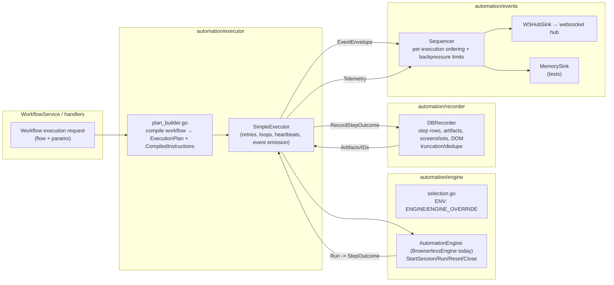

# Automation Engine Refactor

This folder hosts the engine-agnostic automation stack we are building to replace the monolithic `browserless/client.go`. It introduces clear seams (engine / executor / recorder / events / contracts) so multiple automation engines (Browserless today, Desktop/Playwright next) can plug in without changing API or replay contracts.

## Architecture at a Glance

Key invariants:
- Contracts own schema/versioning and size limits; engines cannot add vendor-specific fields.
- Executors own orchestration/heartbeats/telemetry; engines run a single instruction and return a normalized `StepOutcome`.
- Recorder generates durable IDs/dedupe keys and shapes artifacts so UI/replay stay stable.
- Event sinks enforce ordering/backpressure; completion/failure events must never drop.

## Layout
- `contracts/` — Stable payload shapes (`StepOutcome`, telemetry, capabilities, event envelopes) plus size limits and schema versions. Keep these backward-compatible; bump versions when shapes change.
- `engine/` — `AutomationEngine` interface, env-based selection, static factory, and the `BrowserlessEngine` adapter around the existing CDP session.
- `executor/` — Orchestration (`SimpleExecutor`) that drives engines, emits heartbeats/telemetry, and enforces capability checks. `plan_builder.go` compiles workflows into the contract plan shape.
- `recorder/` — Persists normalized outcomes/telemetry into the DB (`DBRecorder`) while owning IDs/dedupe and storage uploads.
- `events/` — Event sinks and sequencing/backpressure helpers. `ws_sink` bridges to the websocket hub; `memory_sink` supports tests.
- See also:
  - [contracts/README.md](contracts/README.md)
  - [engine/README.md](engine/README.md)
  - [executor/README.md](executor/README.md)
  - [recorder/README.md](recorder/README.md)
  - [events/README.md](events/README.md)

## Feature Flags / Selection
- `ENGINE` sets the default engine (e.g., `browserless`).
- `ENGINE_OVERRIDE` forces all executions to use a specific engine.
- `ENGINE_FEATURE_FLAG` controls whether the new executor path is enabled (`on` by default; set `off` to disable).
- `ENGINE_SHADOW_MODE=on` runs the new executor alongside the legacy path without affecting status.
- Routing logic lives in `services/workflow_service_execution.go`:
  - If feature flag enabled and workflow uses only supported nodes (currently linear/basic loop repeat), we run the new executor.
  - Shadow mode runs the new executor in the background while legacy remains source of truth.

## Current Coverage vs. Legacy
- Covered: linear + basic graph execution, heartbeats, retries, capability checks, DB persistence of step outcomes/console/network/assert/assertion/screenshot artifacts, websocket event emission.
- Not yet covered: full branching semantics parity, variable interpolation, session reuse policy (`reuse/clean/fresh`), detailed failure taxonomy mapping, cursor trails/timeline framing/DOM truncation and dedupe, crash reconciliation, and backpressure/drop metrics parity.

## How to Gain Confidence (and Delete Legacy Code)
1. Add contract/golden tests that compare DB artifacts + websocket event ordering between the new stack and the legacy path for a small workflow slice (navigate/click/assert).
2. Expand executor parity (variable interpolation, cancellation/timeout, reuse modes) for those covered nodes until tests pass.
3. Route compatible workflows through the new path (fallback only for unsupported features), then trim the duplicated persistence/event logic in `browserless/client.go`.

## Testing
- Unit tests live alongside packages (`contracts_test.go`, `selection_test.go`, `simple_executor_test.go`, etc.).
- Integration tests should prefer `testcontainers-go` + `DBRecorder` + `MemorySink` so we exercise real persistence and event sequencing without relying on Browserless.

## What to Tackle Next (to delete legacy code)
1) Golden parity: add tests that run the same mini workflow through legacy `browserless.Client` and `SimpleExecutor+BrowserlessEngine+DBRecorder+WSHubSink`, then diff DB artifacts + WS payloads.
2) Executor parity: fill gaps for variable interpolation, retry taxonomy, reuse/clean/fresh, cancellation/timeout, cursor trails/timeline framing, DOM truncation/dedupe.
3) Legacy reuse: point `browserless/client.go` at `DBRecorder` + `WSHubSink` for persistence/events on supported nodes so we can delete duplicated logic.
4) Capability matrix: codify workflow feature → capability requirements (HAR, multi-tab, upload/download) and fail fast when unsupported.
