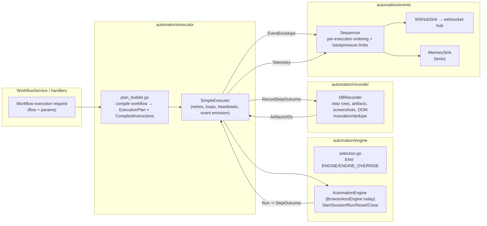

# Automation Engine Refactor

This folder hosts the engine-agnostic automation stack we are building to replace the monolithic `browserless/client.go`. It introduces clear seams (engine / executor / recorder / events / contracts) so multiple automation engines (Browserless today, Desktop/Playwright next) can plug in without changing API or replay contracts.

## Architecture at a Glance

Key invariants:
- Contracts own schema/versioning and size limits; engines cannot add vendor-specific fields.
- Executors own orchestration/heartbeats/telemetry; engines run a single instruction and return a normalized `StepOutcome`.
- Recorder generates durable IDs/dedupe keys and shapes artifacts so UI/replay stay stable.
- Event sinks enforce ordering/backpressure; completion/failure events must never drop.

## Layout
- `contracts/` — Stable payload shapes (`StepOutcome`, telemetry, capabilities, event envelopes) plus size limits and schema versions. Keep these backward-compatible; bump versions when shapes change.
- `engine/` — `AutomationEngine` interface, env-based selection, static factory, and the `BrowserlessEngine` adapter around the existing CDP session.
- `executor/` — Orchestration (`SimpleExecutor`) that drives engines, emits heartbeats/telemetry, and enforces capability checks. `plan_builder.go` compiles workflows into the contract plan shape.
- `recorder/` — Persists normalized outcomes/telemetry into the DB (`DBRecorder`) while owning IDs/dedupe and storage uploads.
- `events/` — Event sinks and sequencing/backpressure helpers. `ws_sink` bridges to the websocket hub; `memory_sink` supports tests.
- See also:
  - [contracts/README.md](contracts/README.md)
  - [engine/README.md](engine/README.md)
  - [executor/README.md](executor/README.md)
  - [recorder/README.md](recorder/README.md)
  - [events/README.md](events/README.md)

### Legacy isolation
- The legacy Browserless client (`browserless/client.go`) has been removed. Runtime execution flows exclusively through `automation/executor` + `BrowserlessEngine` + `DBRecorder` + `WSHubSink`.
- There is no feature-flag fallback to the legacy executor; `executeWithAutomationEngine` is the sole workflow execution path.
- Subflows: only `subflow` nodes are supported for child execution; legacy `workflowCall` is rejected.

### Flow navigation (where complex orchestration lives)
- Planning/compilation: `executor/plan_builder.go`
- Graph + branching + loop execution: `executor/flow_executor.go` (helpers in `executor/flow_utils.go`)
- Loop coverage: repeat + forEach + while (basic variable condition); built-in `set_variable` node for executor-scoped vars; `${var}` interpolation on instruction params.
- Capability preflight (tabs/iframe/upload/HAR/video/download/viewport): `executor/preflight.go`
- Retry/heartbeat/normalization shell: `executor/simple_executor.go`
- Future variable interpolation/cancellation/session policy should also land in `executor/` alongside these files so flow logic stays discoverable.

## Feature Flags / Selection
- `ENGINE` sets the default engine (e.g., `browserless`).
- `ENGINE_OVERRIDE` forces all executions to use a specific engine.
- The automation executor is now the only execution path; `ENGINE_FEATURE_FLAG` / shadow mode are ignored for routing. Legacy browserless execution is no longer invoked from the WorkflowService.

## Current Coverage
- Covered: linear + graph execution (repeat/forEach/while loops with executor-owned `set_variable`), `${var}` interpolation, heartbeats, retries, capability preflight, DB persistence of step outcomes/console/network/assert/assertion/screenshot artifacts, websocket event emission, clean reuse mode (session reset between steps).
- Not yet covered (needs implementation/parity work):
  - Rich variable expressions/interpolation beyond simple replacements.
  - Session reuse policies: true `fresh` (per-step session spin-up) and policy-driven reset/failure recovery.
  - Cancellation/timeout taxonomy and propagation (executor now enforces `timeoutMs` per step and `executionTimeoutMs` at the plan level; still need workflow-level status/artifact/event semantics).
  - Retry/failure taxonomy alignment (failure kinds/messages, retryable flags) and telemetry parity/drop metrics.
  - Capability enforcement matrix (tabs/iframes/HAR/tracing/uploads/downloads/video/viewport) with clear fail-fast gaps.
  - Artifact shaping: DOM truncation/dedupe, cursor trails/timeline framing payloads, screenshot handling parity, backpressure/drop counters.
  - Crash handling/recovery markers.

## How to Gain Confidence (post-legacy removal)
1. Grow executor/recorder contract tests (artifact shaping, capability gaps, telemetry/drop counters) to stand on their own without legacy comparisons.
2. Expand executor parity features (variable interpolation, cancellation/timeout, reuse modes) until the suites are green.
3. Codify capability matrix + artifact shaping and add targeted contract tests for truncation/dedupe/backpressure so the executor+recorder path stands on its own.

## Testing
- Unit tests live alongside packages (`contracts_test.go`, `selection_test.go`, `simple_executor_test.go`, etc.).
- Integration tests should prefer `testcontainers-go` + `DBRecorder` + `MemorySink` so we exercise real persistence and event sequencing without relying on Browserless.
## What to Tackle Next
1) Executor parity: fill gaps for variable interpolation, retry taxonomy, reuse/clean/fresh, cancellation/timeout, cursor trails/timeline framing, DOM truncation/dedupe.
2) Capability matrix: codify workflow feature → capability requirements (HAR, multi-tab, upload/download) and fail fast when unsupported.
3) Artifact shaping/backpressure: add truncation/dedupe/drop-counter coverage so recorder + events stand independently.
