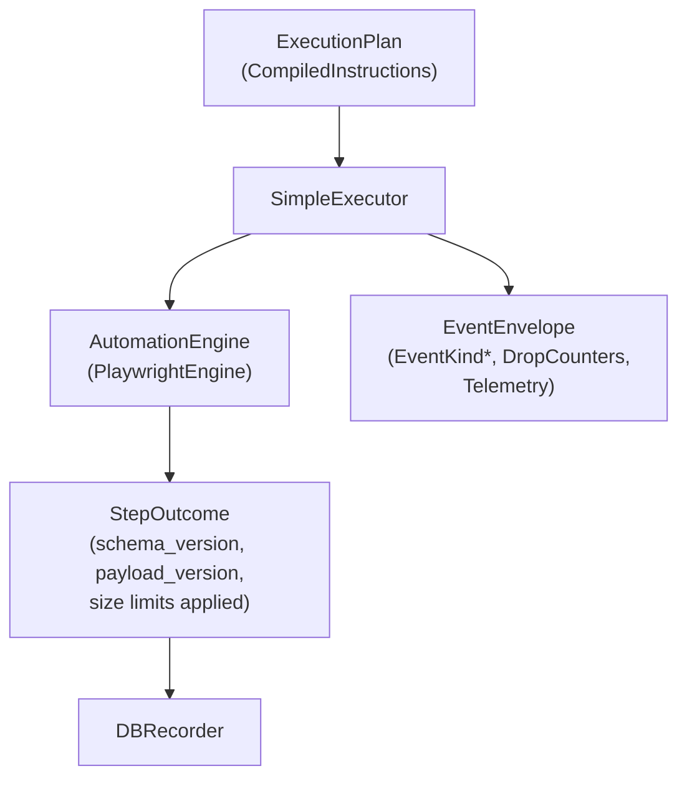

# Contracts

Defines the stable, engine-agnostic payloads for automation. These types are the seam between engines, executor, recorder, and event sinks.

Key shapes:
- `StepOutcome` (+ `StepFailure`, `Screenshot`, `DOMSnapshot`, console/network/assertion/cursor metadata)
- `ExecutionPlan` / `CompiledInstruction` (from `plan_builder.go`)
- `EngineCapabilities` + `CapabilityRequirement`
- Event plumbing: `EventEnvelope`, `StepTelemetry`, `EventBufferLimits`
- Schema + payload versions and size limits (DOM/console/network)

Guarantees:
- Vendors cannot add fields: engines return normalized `StepOutcome`, recorder owns IDs/dedupe/truncation.
- SchemaVersion/PayloadVersion must be bumped when shapes change; size limits are enforced centrally.
- Backpressure semantics are encoded via `EventBufferLimits` and drop counters in `EventEnvelope`.

Testing: `contracts_test.go` validates capability compatibility and buffer limits. Update tests when schema/version or limits change.***
