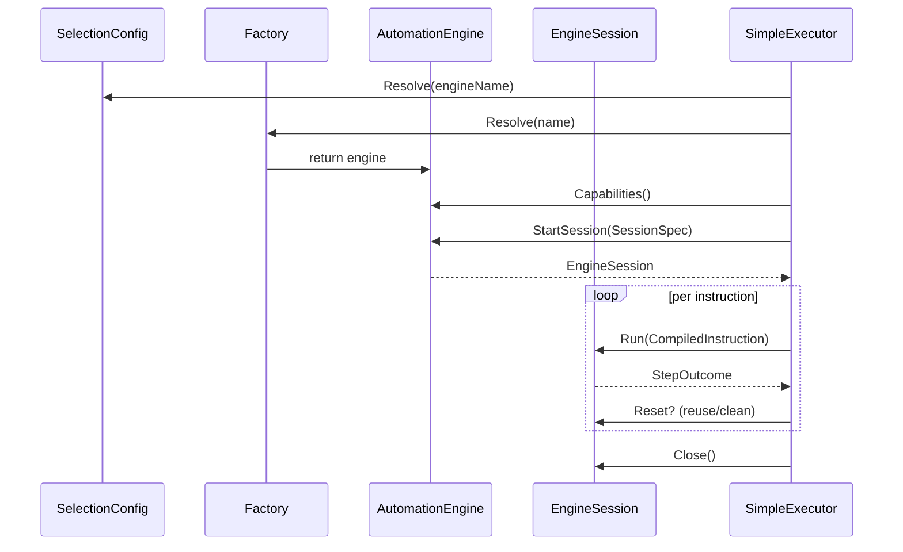

# Engine

Interfaces and implementations that run browser instructions.

What lives here:
- `AutomationEngine` / `EngineSession`: StartSession → Run/Reset/Close
- `SessionSpec`: execution/workflow IDs, viewport, reuse mode, capability requirements
- Env-based selection (`ENGINE`, `ENGINE_OVERRIDE`, `ENGINE_FEATURE_FLAG`, `ENGINE_SHADOW_MODE`) via `selection.go`
- Static factory for dependency injection
- `BrowserlessEngine`: thin adapter over CDP session; converts runtime responses → contract `StepOutcome`

Session reuse modes: `fresh` (always new), `clean` (reuse process, reset storage), `reuse` (stick to existing state).

Current engines: Browserless only. Desktop/Playwright will plug in behind the same interfaces. Selection defaults to Browserless unless overridden.***
