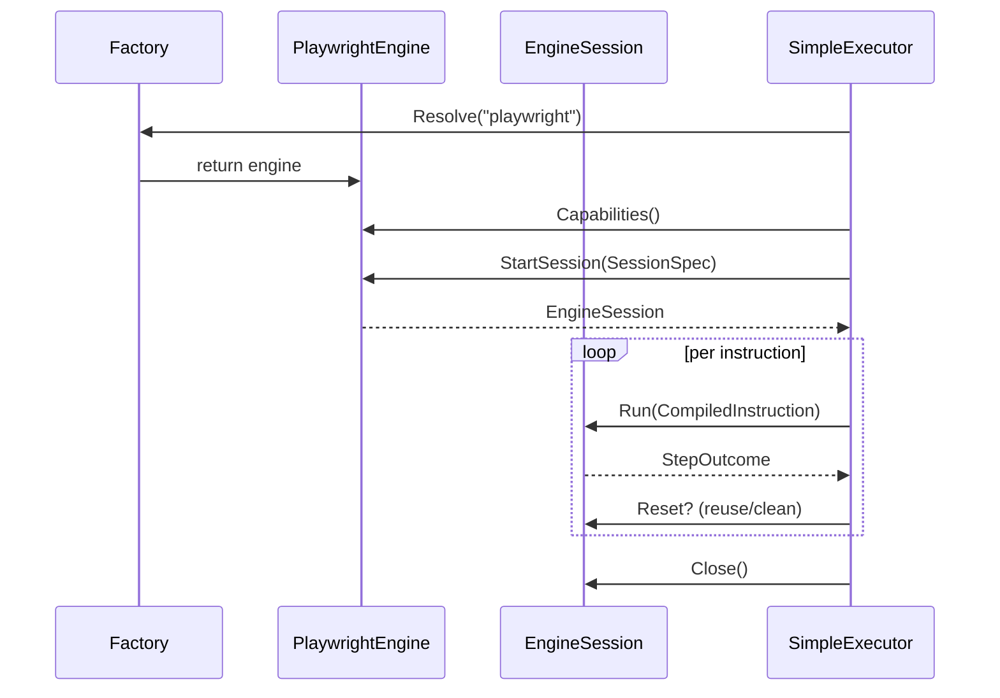

# Engine

Interfaces and implementations that run browser instructions.

What lives here:
- `AutomationEngine` / `EngineSession`: StartSession → Run/Reset/Close
- `SessionSpec`: execution/workflow IDs, viewport, reuse mode, capability requirements
- Static factory for dependency injection
- `PlaywrightEngine`: HTTP client for the local Playwright driver (Node.js server); emits contract `StepOutcome` payloads
  - Performs `/health` checks against the driver endpoint before reporting capabilities
  - Supports advanced features: HAR capture, video recording, trace collection

Session reuse modes: `fresh` (always new), `clean` (reuse process, reset storage), `reuse` (stick to existing state).

Current engine: **Playwright only**. The system previously supported Browserless (CDP-based) but migrated entirely to Playwright for improved stability, better feature support (HAR/video/tracing), and simpler desktop/Electron integration.

## Configuration

Set `PLAYWRIGHT_DRIVER_URL` to point to the local Playwright driver server:
- Default: `http://127.0.0.1:39400`
- The driver is automatically started when using the scenario lifecycle (see `.vrooli/service.json`)
