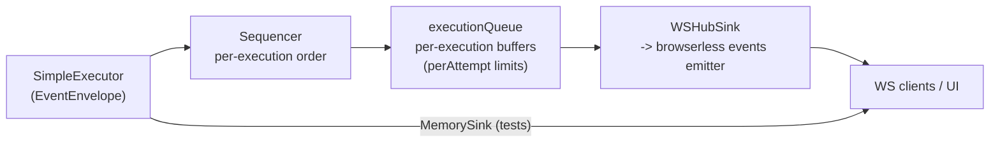

# Events

Bridges executor emissions to downstream consumers with ordering and backpressure guarantees.

Components:
- `Sequencer`: per-execution ordering; enforces drop policy using `EventBufferLimits`
- `WSHubSink`: pushes contract `EventEnvelope` payloads to the websocket hub; maintains per-execution queues; drops only heartbeat/telemetry under pressure, never completion/failure
- `MemorySink`: in-memory capture for tests
- `backpressure_helpers.go`: drop rules, attempt-level keys

Contract payloads come from `contracts.EventEnvelope` / `StepTelemetry` (with drop counters populated when applicable).

Limits: defaults `PerExecution=200`, `PerAttempt=50`. Droppable kinds: heartbeat/telemetry/screenshot; completion/failure are never dropped. Drop counters surface `dropped` and `oldest_dropped` to aid parity checks. Tests: `sequencer_test.go`, `ws_sink_test.go`, `contracts_test.go`, `memory_sink_test.go`.***
