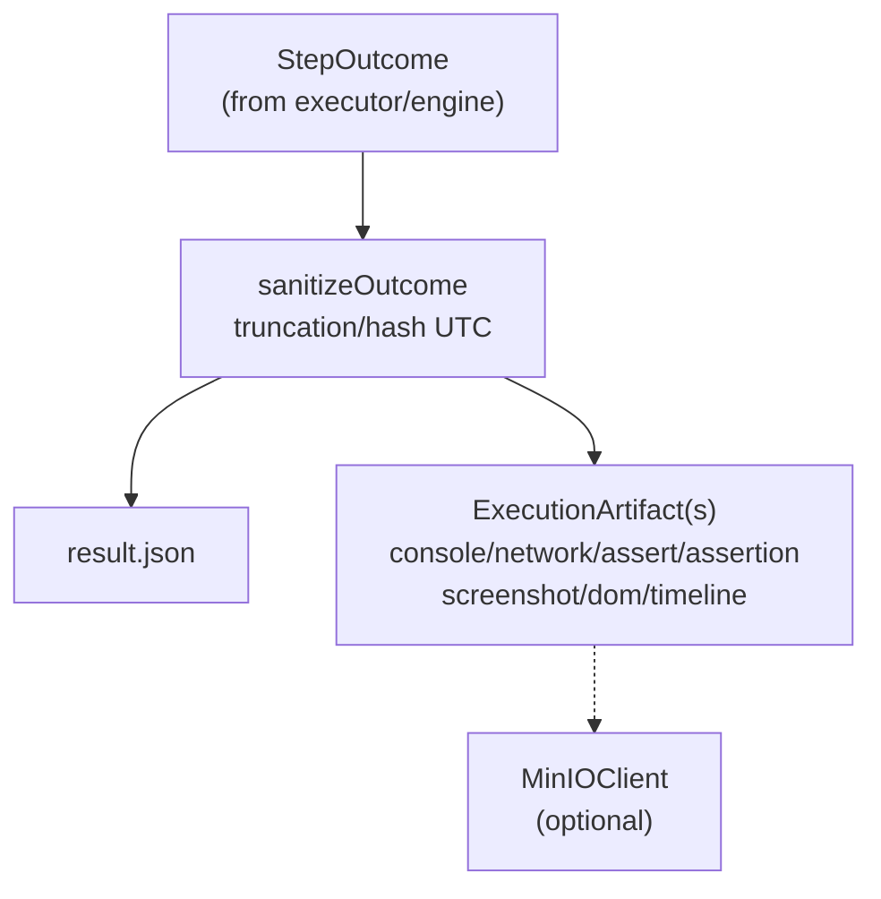

# Execution Writer

Normalizes and persists engine outcomes into the existing DB/timeline/screenshot stores.

Primary implementation: `FileWriter`.
- Writes execution results to JSON files on disk (status, duration, attempt metadata, failure details).
- Stores artifacts: `step_outcome`, console, network, assertion, extracted_data, screenshot (MinIO or inline), DOM snapshot (with truncation), timeline frame.
- Telemetry persistence for rollout/debug (`telemetry` artifacts).
- Crash marker helper: `MarkCrash`.

Key rules:
- Writer generates IDs/dedupe keys; engines stay vendor-agnostic.
- Enforces size limits (DOM, console, network previews) and UTC normalization.
- Screenshot persistence prefers MinIO; falls back to base64 inline when storage unavailable.
- Timeline frames reference artifact IDs to keep UI/replay stable.

Tests: `file_writer_test.go` covers artifact shape and truncation; integration tests in `executor/integration_test.go` exercise writer with Postgres + MemorySink.

## Migration Notes

This package was renamed from `automation/recorder` to better reflect its responsibility.
All legacy aliases have been removed (2025-12-17):

| Old Name | New Name |
|----------|----------|
| `Recorder` | `ExecutionWriter` |
| `FileRecorder` | `FileWriter` |
| `DBRecorder` | `FileWriter` |
| `NewFileRecorder()` | `NewFileWriter()` |
| `NewDBRecorder()` | `NewFileWriter()` |
