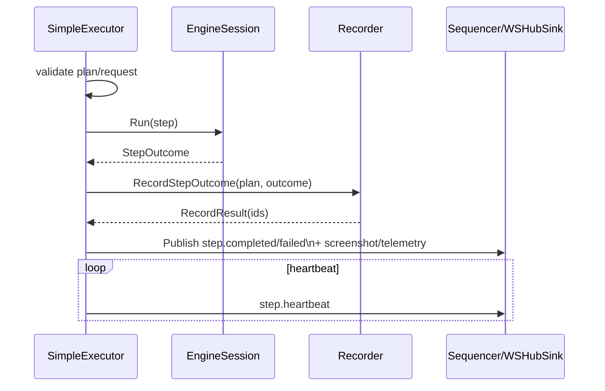

# Executor

Orchestrates instructions against an engine and emits normalized artifacts/events.

Core pieces:
- `plan_builder.go`: compiles workflow → `ExecutionPlan` + `CompiledInstruction`
- `SimpleExecutor`: sequential executor with basic graph/loop-repeat, heartbeats, retries, capability checks, telemetry/event emission, and normalization of outcomes
- Capability preflight via `deriveRequirements` + `EngineCapabilities.CheckCompatibility`
- Sequencing/backpressure delegation to `events.Sequencer`

Behavior snapshot:
- For each instruction (or graph node): emit `step.started`, start heartbeats, run with retries, normalize `StepOutcome`, persist via recorder, emit `step.completed/failed` and screenshot/telemetry events.
- Graph: follows outgoing edges using condition/assertion/failure routing; loop-repeat supported.
- Heartbeats/telemetry: executor-managed, engine only returns `StepOutcome`.

Not yet parity-complete: full branching semantics, variable interpolation, reuse/clean/fresh policy, cancellation/timeout taxonomy, cursor trails/timeline framing. Tests: `simple_executor_test.go`, `integration_test.go`, `requirements_test.go`.***
