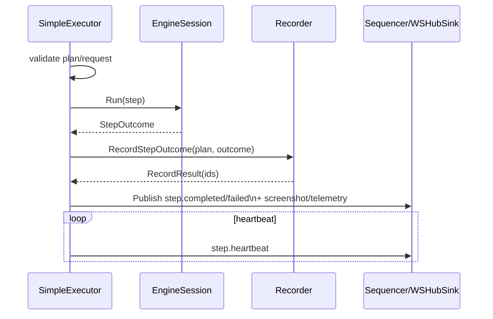

# Executor

Orchestrates instructions against an engine and emits normalized artifacts/events.

Core pieces:
- `plan_builder.go`: compiles workflow → `ExecutionPlan` + `CompiledInstruction`
- `flow_executor.go`: graph traversal and loop orchestration
- `flow_utils.go`: graph helpers and value coercion
- `preflight.go`: capability requirement derivation for engine compatibility checks
- `SimpleExecutor`: orchestration shell (heartbeats, retries, outcome normalization, persistence + events)
- Sequencing/backpressure delegation to `events.Sequencer`

Behavior snapshot:
- For each instruction (or graph node): emit `step.started`, start heartbeats, run with retries, normalize `StepOutcome`, persist via recorder, emit `step.completed/failed` and screenshot/telemetry events.
- Graph: follows outgoing edges using condition/assertion/failure routing; loop-repeat supported (other loop/branch shapes should be added here).
- Heartbeats/telemetry: executor-managed, engine only returns `StepOutcome`.
- Session policy: `BAS_SESSION_STRATEGY` or `plan.metadata.sessionReuseMode` controls `reuse|clean|fresh`; clean mode triggers `EngineSession.Reset` between steps, fresh spins a new session per step/graph node.

Flow feature map (where to look/extend):
- Branching/graph traversal: `flow_executor.go` (+ helpers in `flow_utils.go`)
- Loop semantics: `flow_executor.go` (repeat + forEach + while conditionals)
- Capability preflight (tabs/iframe/upload/HAR/video/download/viewport): `preflight.go` (step-type matrix + param heuristics)
- Variable scope + `${var}` interpolation (nested maps/slices, dot/index paths): `flow_utils.go` (`flowState`, `interpolateInstruction`)
- Built-in variable mutation node for flow control: `set_variable` / `setVariable` handled in `flow_executor.go`
- Session/retry/timing normalization: `simple_executor.go`
- Tests to extend for new flow shapes: `simple_executor_test.go`, `integration_test.go`, `requirements_test.go`
- Plan compiler selection: contract-native compiler is the only path; custom engines register a compiler via `RegisterPlanCompiler`.

Not yet parity-complete (to implement here):
- Variable expressions (beyond replacement) / advanced evaluation
- Session reuse policies (`fresh` should spin new sessions per-step) and deeper reset semantics
- Cancellation/timeout taxonomy and propagation (per-step `timeoutMs` and plan-level `executionTimeoutMs` now emit failed outcomes with timeout/cancel kinds; still need workflow-level semantics)
- Retry/failure taxonomy alignment + telemetry/drop metrics
- Capability enforcement matrix (tabs/iframes/HAR/tracing/uploads/downloads/video/viewport) with fail-fast behavior
- Artifact shaping: DOM truncation/dedupe, cursor trails/timeline framing, screenshot handling, backpressure/drop counters
- Crash handling/recovery markers
- Subflows: `subflow` nodes run as child executions with recursion/depth guards; variables merge back into the parent scope using the same engine session by default. Legacy `workflowCall` is no longer accepted.

Keep new logic discoverable in the flow/preflight/simple_executor files above.
