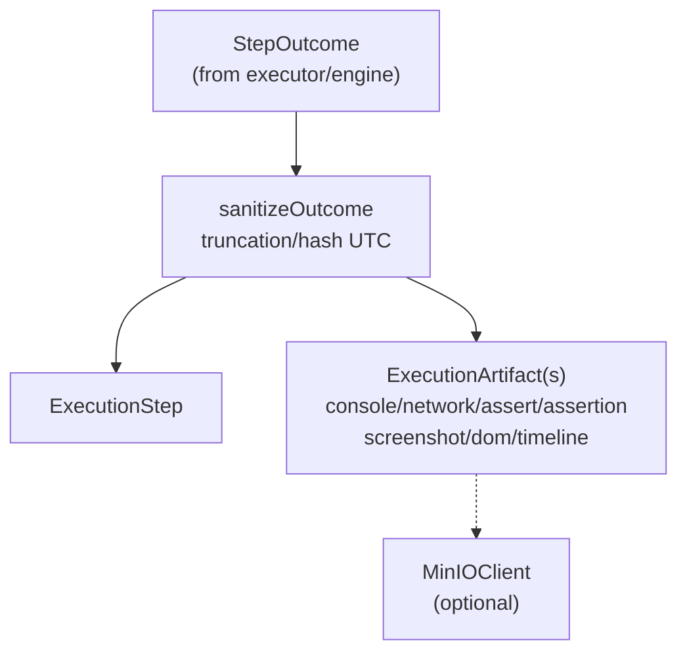

# Recorder

Normalizes and persists engine outcomes into the existing DB/timeline/screenshot stores.

Primary implementation: `DBRecorder`.
- Writes `ExecutionStep` rows (status, duration, attempt metadata, failure details).
- Stores artifacts: `step_outcome`, console, network, assertion, extracted_data, screenshot (MinIO or inline), DOM snapshot (with truncation), timeline frame.
- Telemetry persistence for rollout/debug (`telemetry` artifacts).
- Crash marker helper: `MarkCrash`.

Key rules:
- Recorder generates IDs/dedupe keys; engines stay vendor-agnostic.
- Enforces size limits (DOM, console, network previews) and UTC normalization.
- Screenshot persistence prefers MinIO; falls back to base64 inline when storage unavailable.
- Timeline frames reference artifact IDs to keep UI/replay stable.

Tests: `db_recorder_test.go` covers artifact shape and truncation; integration tests in `executor/integration_test.go` exercise recorder with Postgres + MemorySink.***
