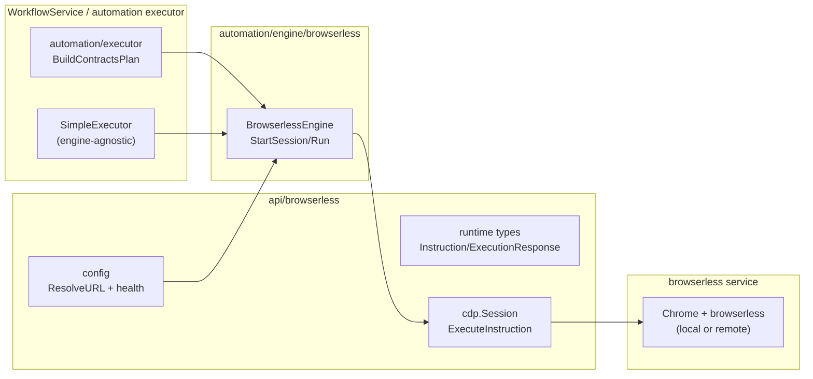

# Browserless Adapter

This package keeps the Browserless-specific pieces contained while the automation stack stays engine-agnostic. It resolves Browserless configuration, exposes shared Browserless types, and drives a CDP session that the automation executor treats as just another engine.

## What lives here
- `config.go`: environment detection (`BROWSERLESS_URL`/`PORT`), normalization, and health checks.
- `runtime/`: shared Browserless instruction/result types consumed by the CDP adapter.
- `cdp/`: thin Chrome DevTools client (`Session`) plus action adapters (click, navigate, assert, file upload, etc.).

## Flow at a Glance

## Key guarantees
- The executor owns orchestration, retries, and recording; this layer only runs a single instruction and returns normalized step outcomes.
- No vendor-specific fields leak into contracts; conversions happen inside the engine adapter.
- Browserless defaults (timeouts, resilience, viewport) stay centralized here so other engines can evolve independently.

## Maintenance notes
- The legacy monolithic `browserless/client.go` path is removed; execution flows through the automation executor + engine adapter.
- If you add new Browserless primitives, keep the shapes minimal and let the recorder/events stack handle persistence and sequencing.
