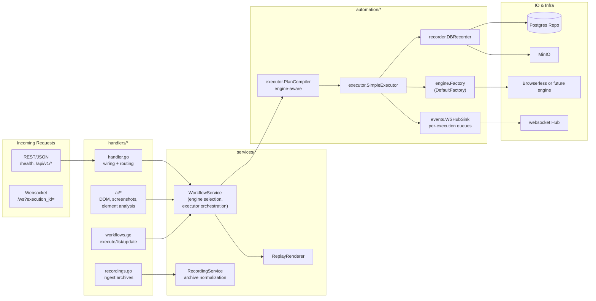

# Handlers

Thin HTTP façade for the Browser Automation Studio API. Handlers validate requests, invoke services, and stream execution updates via websockets.

Notes:
- Handlers are intentionally logic-light; business rules live in `services/`.
- Engine choice honors `ENGINE` / `ENGINE_OVERRIDE` and flows through `automation/engine.DefaultFactory`, keeping runtime engine-agnostic as new engines arrive.
- Websocket clients receive ordered automation envelopes via `WSHubSink`; payloads are contract `EventEnvelope` objects.
