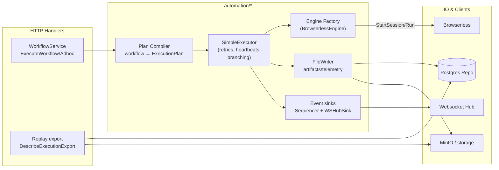

# Services

Business logic layer for the Vrooli Ascension API. The services wire repositories, the automation executor stack, and websocket/eventing so handlers stay thin.

## Execution Flow

## Notes
- `WorkflowService` is the single entry point for workflow execution; it always routes through `executeWithAutomationEngine` (executor + engine + recorder + event sinks).
- Plan compilation is engine-agnostic: `PlanCompiler` emits `ExecutionPlan` + `CompiledInstruction` without embedding browser-specific details.
- Event emission uses the `Sequencer` and `WSHubSink` so UI clients see ordered envelopes with backpressure controls.
- Replay export (`DescribeExecutionExport`) reuses persisted artifacts/timelines and surfaces readiness without re-running automation.
- Recording ingestion is contract-first: extension archives are converted to `automation/contracts` outcomes and stored via the recorder; set `BAS_RECORDING_STORAGE=local` to force filesystem storage, otherwise injected storage (e.g., MinIO) is used.***
