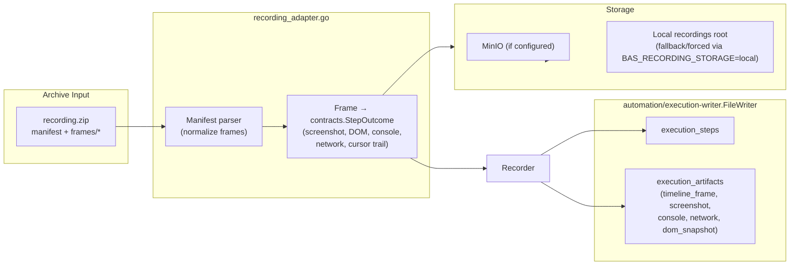

# Recording Ingestion

Engine-agnostic ingestion path for Chrome extension recordings. Converts archive manifests into `automation/contracts` outcomes and persists via the recorder so replay/export stays consistent with automation runs.

Key behaviors:
- Storage selection: `BAS_RECORDING_STORAGE=local` forces filesystem storage; otherwise uses the injected storage client (MinIO when available) with filesystem fallback.
- Contract-first: outcomes use `automation/contracts` (no browserless runtime types). Screenshots are persisted through the recorder and referenced from timeline payloads.
- Timeline parity: recorder emits `timeline_frame` artifacts with screenshot IDs, DOM snapshot references, and cursor/overlay metadata so replay/export stays consistent with automation executions.
- Safety limits: frames enforce max asset size (`maxRecordingAssetBytes`) and max archive size (`maxRecordingArchiveBytes`); oversize assets fail fast.
