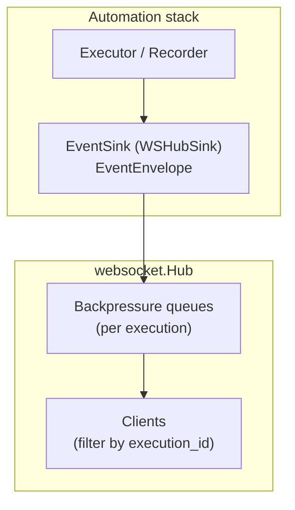

# WebSocket Hub

The hub fanouts execution updates and automation event envelopes to connected clients. It is now envelope-first: automation sinks push `EventEnvelope` structs directly instead of legacy browserless event wrappers.

## Flow

Key points:
- `WSHubSink` enqueues `EventEnvelope` objects and the hub broadcasts them as-is (in `ExecutionUpdate.Data`) while preserving ordering/drop counters.
- The hub still supports coarse `ExecutionUpdate` broadcasts for non-automation notifications; both paths share the same client filters.
- Consumers should prefer the envelope payload for telemetry, heartbeat, and artifact events to stay aligned with contract versions.***
