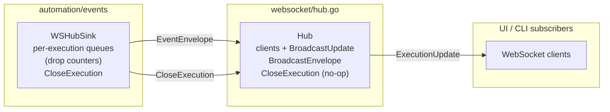

# Websocket Hub

Real-time fan-out for automation events. The hub keeps websocket clients subscribed to execution updates while staying decoupled from automation internals.

## Flow

Notes:
- `WSHubSink` adapts `contracts.EventEnvelope` to `ExecutionUpdate` payloads while keeping sequence/drops intact. Queues are per-execution and respect backpressure limits.
- `CloseExecution` drains and stops per-execution queues after a run finishes to avoid goroutine leaks; hub implements it as a no-op for interface parity.
- The hub remains unaware of automation semantics; it simply broadcasts updates to connected clients or execution-scoped subscribers.***
- Clients should prefer the `EventEnvelope` payload in `ExecutionUpdate.Data`; `ExecutionUpdate` is retained for backward compatibility only.
