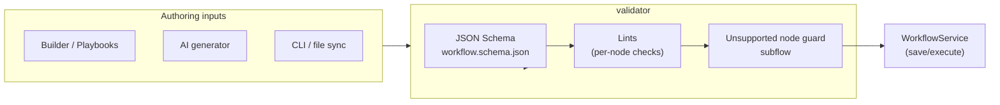

# Workflow Validator

Lint and schema checks for workflow definitions before they hit the automation executor. The validator keeps runtime predictable by blocking unsupported nodes and surfacing actionable issues early.

## What it enforces
- JSON Schema compliance (`workflow.schema.json`) for structural safety.
- Node-level lint rules (`lint*` helpers) for required fields, sensible defaults, and friendly errors.
- Subflow support only: `subflow` nodes require either `workflowId` or `workflowDefinition`; legacy `workflowCall` is rejected.

## Extension guide
- Add node-specific lint in `validator.go` via the `nodeValidators` map; keep messages crisp and actionable.
- Prefer failing fast on unsupported runtime behavior rather than letting the executor discover it later.
- When re-enabling subflows, replace the hard block with validations that ensure child execution metadata is complete and compatible with the automation contracts.***
