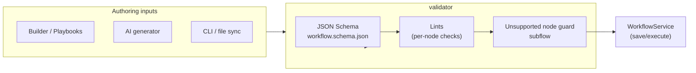

# Workflow Validator

Lint and schema checks for workflow definitions before they hit the automation executor. The validator keeps runtime predictable by blocking unsupported nodes and surfacing actionable issues early.

```mermaid
flowchart LR
    subgraph Ingress["Authoring inputs"]
        UI["Builder / Playbooks"]
        AI["AI generator"]
        CLI["CLI / file sync"]
    end
    subgraph Validator["validator"]
        SCHEMA["JSON Schema\nworkflow.schema.json"]
        LINT["Lints\n(per-node checks)"]
        UNSUP["Unsupported node guard\nsubflow"]
    end
    HANDLERS["WorkflowService\n(save/execute)"]

    Ingress --> Validator
    Validator --> SCHEMA --> LINT --> UNSUP --> HANDLERS
```

## What it enforces
- JSON Schema compliance (`workflow.schema.json`) for structural safety.
- Node-level lint rules (`lint*` helpers) for required fields, sensible defaults, and friendly errors.
- Subflows use a durable `workflowId` reference; inline workflow definitions and legacy `workflowCall` are rejected.

## Extension guide
- Add node-specific lint in `validator.go` via the `nodeValidators` map; keep messages crisp and actionable.
- Prefer failing fast on unsupported runtime behavior rather than letting the executor discover it later.
- Keep subflow validation aligned with the typed V2 `SubflowParams` contract and require a durable reference for every child workflow.
