# Vrooli Ascension - Complete System Architecture

## 🎯 Mental Model: The Big Picture

This document provides a holistic view of how all major components of Vrooli Ascension fit together, from HTTP request to browser automation to database persistence to WebSocket streaming.

---

## 📊 System Overview Diagram


---

## 🏗️ Component Deep Dive

### 1. Client Layer

**React UI** (`ui/`)
- Visual workflow builder using React Flow
- Execution viewer with real-time updates
- Replay tab with timeline scrubbing
- WebSocket connection for live telemetry
- State management via Zustand

**Bash CLI** (`cli/`)
- Thin wrapper around API
- WebSocket support for `execution watch`
- Export/render commands
- JSON output for automation

### 2. HTTP/API Layer

**Router** (`main.go`)
- Chi HTTP router
- CORS middleware
- Health checks
- Request/response logging

**Handlers** (`handlers/`)
- **Workflows**: CRUD, execute, validate
- **Executions**: List, get, cancel, export
- **AI**: Generate, debug, analyze DOM
- **Recordings**: Import Chrome extension archives
- **Export**: Replay packages, video rendering

### 3. Services Layer (`services/`)

**WorkflowService**
- Orchestrates workflow execution
- Selects automation engine
- Invokes compiler → executor → recorder → events
- Handles validation

**ReplayRenderer**
- Captures frames via Playwright
- Processes video with FFmpeg
- Assembles export bundles

**RecordingService**
- Parses extension archives
- Normalizes to standard format
- Stores artifacts

**ExportService**
- Assembles replay packages
- Resolves asset URLs
- Bundles screenshots/DOM/metadata

### 4. Automation Stack (`automation/`)

This is the **heart of the system** - an engine-agnostic execution framework.

#### **Contracts** (`contracts/`)
Engine-agnostic type definitions:
- `CompiledInstruction` - Generic instruction format (type + params)
- `StepOutcome` - Normalized result (success, telemetry, screenshots, errors)
- `EngineCapabilities` - Feature advertisement (HAR, video, iframes, etc.)
- `StepFailure` - Taxonomized errors for retry logic
- Schema versioning for backward compatibility

#### **Compiler** (`compiler/`)
- Transforms workflow JSON → `ExecutionPlan`
- Validates node types and parameters
- Generates `CompiledInstruction` array
- No engine-specific code

#### **Executor** (`executor/`)
The orchestration layer:
- **SimpleExecutor**: Retry logic, heartbeats, outcome normalization
- **FlowExecutor**: Graph traversal, branching, loops (repeat/forEach/while)
- Variable interpolation (`${var}` replacement)
- Capability preflight checks
- Session lifecycle management (fresh/clean/reuse modes)

Flow:
```
1. Receive ExecutionPlan
2. Validate engine capabilities
3. For each instruction:
   a. Emit step.started event
   b. Start heartbeat timer
   c. Run with retries
   d. Normalize outcome
   e. Record to DB
   f. Emit step.completed/failed
4. Handle loops/branches
5. Clean up session
```

#### **Engine** (`engine/`)
Browser automation abstraction:
- `AutomationEngine` interface (Name, Capabilities, StartSession)
- `EngineSession` interface (Run, Reset, Close)
- `PlaywrightEngine` - HTTP client to Playwright driver
- Factory pattern for engine selection
- Environment-based selection (`ENGINE`, `ENGINE_OVERRIDE`)

#### **Recorder** (`recorder/`)
Persistence layer:
- `DBRecorder` - Saves `StepOutcome` to PostgreSQL
- Generates UUIDs and correlation IDs
- Applies size limits to DOM/console/network
- Uploads screenshots to MinIO
- Handles truncation/deduplication

#### **Events** (`events/`)
Real-time streaming:
- `EventSink` interface
- `Sequencer` - Enforces per-execution ordering
- `WSHubSink` - WebSocket broadcasting
- `MemorySink` - In-memory for tests
- Backpressure handling (drop counters)
- Never drops completion/failure events

### 5. Playwright Driver (`playwright-driver/`)

**TypeScript HTTP server** (port 39400):
- Session management (browser/context/page lifecycle)
- 28 instruction handlers (navigation, interaction, assertions, etc.)
- Telemetry collection (console, network, screenshots, DOM)
- Returns `StepOutcome` JSON to Go adapter
- Modular architecture (50+ files)

**Endpoints**:
- `POST /session/start` - Create session
- `POST /session/:id/run` - Execute instruction
- `POST /session/:id/reset` - Clear state
- `POST /session/:id/close` - Cleanup
- `GET /health` - Health check

### 6. Data Layer

**PostgreSQL** (`database/`)
- Workflows, projects, folders
- Executions, steps, artifacts
- Timeline frames
- Users, auth

**MinIO** (S3-compatible)
- Screenshots (PNG)
- Videos, traces, HAR files
- Export bundles

**Filesystem**
- Chrome extension recordings
- Temporary exports
- Local development assets

### 7. WebSocket Layer

**WebSocket Hub** (`websocket/`)
- Per-execution rooms
- Client registry
- Event broadcasting
- Message ordering

**Event Types**:
- `execution.started/completed/failed`
- `step.started/heartbeat/completed/failed`
- `step.telemetry` (console, network)
- `step.screenshot`

### 8. Workflow System (`workflow/`)

**Validator**
- JSON schema validation
- Type checking
- Selector resolution (`@selector/key`)
- Parameter validation

**Schema Definitions**
- Node type registry (28 types)
- Parameter schemas
- Validation rules

### 9. AI Layer (`handlers/ai/`)

- **Workflow Generation**: Prompt → workflow JSON (OpenRouter)
- **Debug Loop**: Failure analysis and fix suggestions
- **DOM Analysis**: Extract element metadata
- **Screenshot Analysis**: Visual element detection

---

## 🔄 Data Flow: Workflow Execution

Let's trace a complete execution from UI click to WebSocket update:

```mermaid
sequenceDiagram
    participant UI as React UI
    participant API as HTTP Handler
    participant SVC as WorkflowService
    participant COMP as Compiler
    participant EXEC as Executor
    participant ENG as PlaywrightEngine
    participant DRV as Playwright Driver
    participant REC as DBRecorder
    participant EVT as WSHubSink
    participant WS as WebSocket Hub
    participant DB as PostgreSQL

    UI->>API: POST /api/v1/workflows/{id}/execute
    API->>SVC: ExecuteWorkflow(workflowID, params)

    SVC->>DB: Load workflow JSON
    DB-->>SVC: Workflow nodes/edges

    SVC->>COMP: Compile(workflow) → ExecutionPlan
    COMP-->>SVC: ExecutionPlan{instructions[]}

    SVC->>EXEC: Execute(plan, engine, recorder, eventSink)

    EXEC->>ENG: Capabilities(ctx)
    ENG-->>EXEC: EngineCapabilities{iframes, HAR, video...}

    EXEC->>EXEC: Validate capabilities vs plan requirements

    EXEC->>ENG: StartSession(spec)
    ENG->>DRV: POST /session/start
    DRV-->>ENG: {session_id}
    ENG-->>EXEC: EngineSession

    loop For each instruction
        EXEC->>EVT: Emit(step.started)
        EVT->>WS: Broadcast to clients
        WS->>UI: WebSocket message

        EXEC->>ENG: session.Run(instruction)
        ENG->>DRV: POST /session/{id}/run
        DRV->>DRV: Execute in browser
        DRV-->>ENG: StepOutcome{success, screenshot, DOM, telemetry}
        ENG-->>EXEC: StepOutcome

        EXEC->>REC: RecordStepOutcome(outcome)
        REC->>DB: Insert execution_step
        REC->>DB: Insert artifacts (console, network, assertions)
        REC->>DB: Upload screenshot → MinIO, save URL
        REC-->>EXEC: RecordResult{IDs}

        EXEC->>EVT: Emit(step.completed, screenshot, telemetry)
        EVT->>WS: Broadcast
        WS->>UI: Live update with screenshot

        opt If session mode = clean
            EXEC->>ENG: session.Reset()
            ENG->>DRV: POST /session/{id}/reset
        end
    end

    EXEC->>ENG: session.Close()
    ENG->>DRV: POST /session/{id}/close

    EXEC->>EVT: Emit(execution.completed)
    EVT->>WS: Broadcast
    WS->>UI: Execution complete

    EXEC-->>SVC: ExecutionResult
    SVC-->>API: HTTP 200 {execution_id}
    API-->>UI: JSON response
```



---

## 🎯 Key Design Principles

### 1. **Engine Agnosticism**
- Contracts define stable types (`CompiledInstruction` → `StepOutcome`)
- Engines are pluggable (Browserless removed, Playwright active)
- No vendor-specific fields in instructions
- Engine selection via environment variables

### 2. **Separation of Concerns**
- **Handlers**: HTTP validation, thin façade
- **Services**: Business logic orchestration
- **Automation**: Pure execution logic
- **Engines**: Browser control only
- **Recorder**: Persistence only
- **Events**: Streaming only

### 3. **Contract-First**
- Schema versioning (`automation-step-outcome-v1`)
- Payload versioning for backward compatibility
- Size limits enforced centrally
- Taxonomized failures for retry logic

### 4. **Observability**
- Comprehensive telemetry (console, network, screenshots, DOM)
- Real-time WebSocket streaming
- Heartbeat events during long operations
- Structured logging throughout

### 5. **Testability**
- `MemorySink` for event testing
- Mock engines for unit tests
- Contract tests for compatibility
- Integration tests with testcontainers

---

## 🔑 Critical Paths & Where to Look

### Adding a New Instruction Type
1. Define in `api/automation/compiler/step_types.go`
2. Add handler in `playwright-driver/src/handlers/`
3. Register in `playwright-driver/src/handlers/registry.ts`
4. Update `EngineCapabilities` if needed
5. Add tests in `playwright-driver/tests/unit/handlers/`

### Modifying Execution Flow
1. Graph logic: `api/automation/executor/flow_executor.go`
2. Retry/heartbeat: `api/automation/executor/simple_executor.go`
3. Variable interpolation: `api/automation/executor/flow_utils.go`
4. Capability checks: `api/automation/executor/preflight.go`

### Changing Persistence
1. DB schema: `api/database/migrations/`
2. Repository: `api/database/repository*.go`
3. Recorder: `api/automation/recorder/db_recorder.go`
4. Storage: `api/storage/` (MinIO client)

### Adding WebSocket Events
1. Event types: `api/automation/contracts/events.go`
2. Emission: `api/automation/executor/simple_executor.go`
3. Sink: `api/automation/events/ws_sink.go`
4. UI handling: `ui/src/hooks/useExecutionWebSocket.ts`

### Modifying Replay/Export
1. Capture: `api/services/replay_renderer_playwright_client.go`
2. FFmpeg: `api/services/replay_renderer_ffmpeg.go`
3. Export API: `api/handlers/export/`
4. UI viewer: `ui/src/pages/ReplayTab.tsx`

---

## 🎓 Understanding the System - Mental Shortcuts

**Think of it as layers**:
1. **Presentation**: UI + CLI
2. **API**: HTTP handlers (thin)
3. **Business Logic**: Services (orchestration)
4. **Execution Engine**: Automation stack (the core innovation)
5. **Browser Control**: Playwright driver
6. **Persistence**: DB + Storage
7. **Real-time**: WebSocket events

**The Automation Stack is the key innovation**:
- Before: Monolithic `browserless/client.go` (tightly coupled)
- After: Modular stack with clean interfaces (engine swappable)
- Result: Migrated Browserless → Playwright without touching orchestration

**Contracts are the glue**:
- `CompiledInstruction` - What to do (engine-agnostic)
- `StepOutcome` - What happened (normalized result)
- Everything else builds on these two types

**Data flows in a pipeline**:
```
Workflow JSON → Compiler → ExecutionPlan → Executor → Engine → Browser
                                              ↓
                                           Recorder → DB
                                              ↓
                                           Events → WebSocket → UI
```

---

## 📚 Where to Start

**Want to understand execution?**
- Start: `api/automation/README.md`
- Read: `api/automation/executor/README.md`
- Trace: `api/services/workflow_service_execution.go`

**Want to add features?**
- Instructions: `playwright-driver/docs/ARCHITECTURE.md`
- Flow control: `api/automation/executor/flow_executor.go`
- Validation: `api/workflow/validator/`

**Want to debug issues?**
- Logs: Check `api/automation/executor/simple_executor.go`
- WebSocket: `api/automation/events/ws_sink.go`
- Persistence: `api/automation/recorder/db_recorder.go`

**Want the full picture?**
- This document! 🎯
