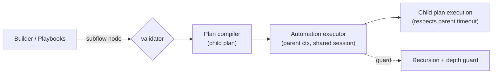
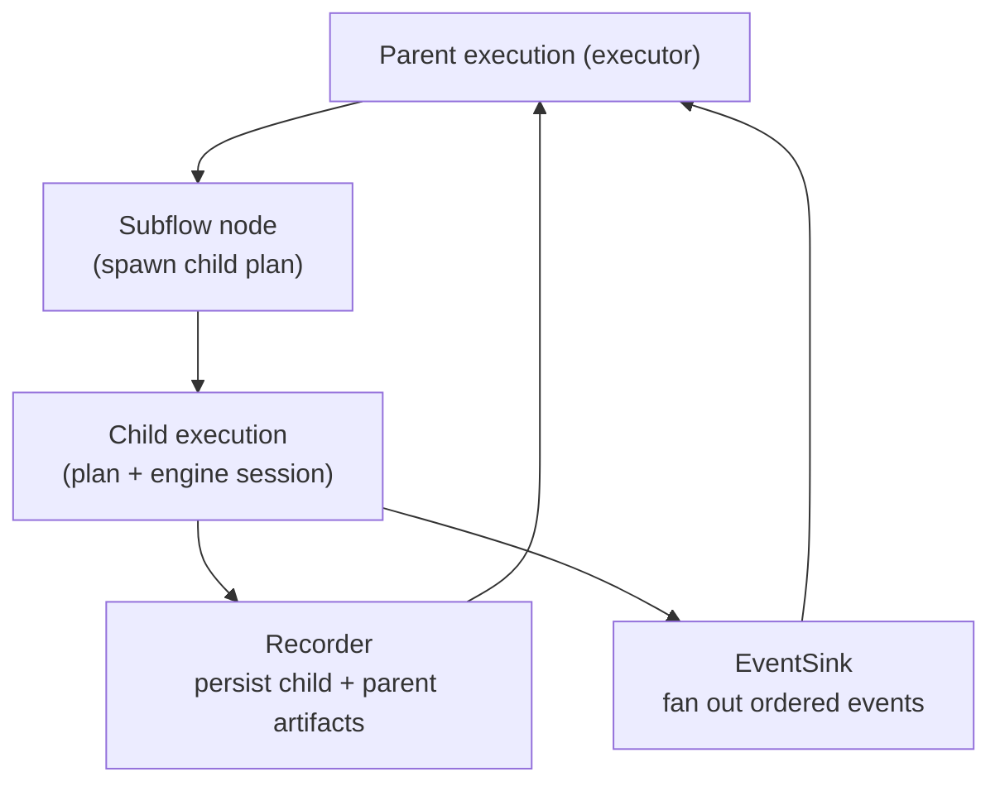

# Subflow

`subflow` nodes run child workflows (inline or by ID) through the automation executor. The engine-agnostic path compiles and runs child plans without touching legacy Browserless client code. The legacy `workflowCall` type has been removed; migrate any remaining nodes to `subflow`.

## Current Status

- **Supported**: executor runs `subflow` nodes with child plans, variable passing, nested children, and recursion/depth guards.
- **Required**: use `workflowId` or `workflowDefinition`; `workflowCall` definitions are rejected by validation.

## Why It Works

- Executor manages retries, heartbeats, recording, and events. Subflows reuse the parent execution/session by default, respect the parent timeout, and merge variables back into the parent scope.
- Recursion and excessive depth are prevented via call-stack checks and a configurable depth limit.

## How to Use

- Add a `subflow` node with either a `workflowId` or inline `workflowDefinition`.
- Pass parameters via the node’s `parameters` map; child flows can mutate variables that the parent can read after completion.
- Avoid circular references; the executor fails fast on recursion.

## Future

Subflows may grow richer export packaging and parent/child execution IDs, but today they run within the parent execution for continuity.***
