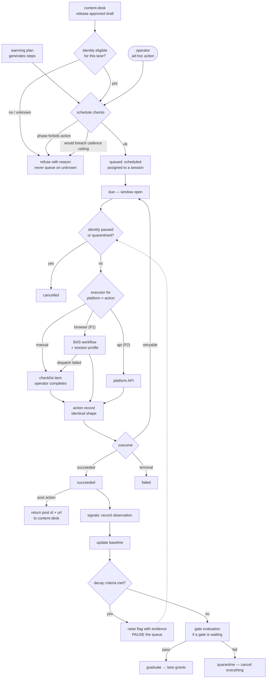

# Flows — Channel Manager

This document is the canonical workflow and state-transition map for
the scenario. Use it when behavior depends on ordered states, retries,
cancellation, stale completion, background jobs, polling, or mutually
exclusive UI modes.

## Purpose Of This Document

Use this document to answer:

- Which user/system workflows matter?
- Which workflows have explicit states and events?
- Which transitions are illegal?
- Which tests prove workflow correctness?
- Which flows are known but not modeled yet?

Plain CRUD with no meaningful ordering constraints does not need a
workflow model.

## Flow Inventory

`health` is a stateless reporting domain and ships no workflows. List
each real stateful flow your domains add below, with its owner, trigger,
outcome, statefulness, and validation level.

| Flow | Domain | Trigger | Outcome | Statefulness | Validation |
|---|---|---|---|---|---|
| Queued action lifecycle | queue | An action is scheduled by a warming plan, a release, or an operator. | The action is executed and recorded, or cancelled. | Full lifecycle with windows, executor dispatch, retry classification, and cancellation by pause or quarantine. **The scenario's one genuine state machine.** | **L5** — declarative contract, checked Quint model, replayed against the production transition function. |
| Warming program run | warming | An operator starts a program for an identity whose preconditions are satisfied. | The identity graduates with lane grants, or is quarantined. | Spans weeks. Phase progression, gate waits, repeat limits, and two terminal outcomes. | L3 — matrix plus representative traces; promote to L5 if phase progression grows conditional. |
| Gate evaluation | warming | A gate's declared wait interval elapses after its phase completes. | Pass, inconclusive with a bounded repeat, or fail to quarantine. | Idempotent — re-evaluating an already-resolved gate returns the recorded outcome rather than re-measuring. | L3 — outcome matrix over threshold boundaries. |
| Release handoff | queue | `content-desk` releases an approved draft. | A post action is queued; post id and URL return once executed. | Idempotent by key. A retry returns the original result and never creates a second publish record. | L2 — deterministic, idempotency asserted directly. |
| Signal sweep | signals | Scheduled, or an observation is recorded manually. | Baselines updated; a flag raised if decay criteria are met. | Read-mostly. Raising a flag pauses the identity's queue and does nothing else. | L2 — deterministic given a fixed clock and observation series. |
| Descriptor seeding | platforms, warming | Boot, or an explicit reseed. | Descriptor tables match the JSON files on disk. | Idempotent. Reseeding replaces rows; it never duplicates. A malformed descriptor fails the seed loudly rather than being skipped. | L2 — idempotent write. |

## Flow Details

Document each real flow here with its owner domain, trigger, inputs,
ordered steps, outputs, failure modes, retry/cancel behavior, tests, and
generated subpackages. The worked example below shows the expected shape.

## State Machines

List each modeled flow's states, illegal transitions, and how they are
enforced. Plain CRUD with no ordering constraints does not appear here.

| Domain/Flow | States | Illegal Transitions | Enforcement |
|---|---|---|---|
| queue / queued action | `scheduled → due → executing → succeeded`, plus `executing → failed → due` (retryable only), and `scheduled\|due → cancelled` (terminal). | `scheduled → executing` skipping `due`, so an action can never run before its window opens. `succeeded → anything`. `failed(terminal) → due`. Any transition into `executing` while the identity is paused or quarantined. Any transition into `executing` for an action the active phase forbids. | `flow.json` contract, generated Quint model, replay against the production transition function (`CHANMGR-P0-006`, `-007`, `-010`). |
| warming / program run | `pending-preconditions → ready → running → graduated` (terminal), and `running → quarantined` (terminal). | `pending-preconditions → running` with any required precondition unsatisfied. `running → graduated` without every graduation criterion passing — elapsed time alone never qualifies. `quarantined → running`; a quarantined identity is rebuilt, not resumed. | Precondition gate tests, graduation criteria tests, quarantine cancellation tests (`CHANMGR-P0-005`, `-011`, `-012`). |
| warming / gate | `waiting → measurable → resolved(pass\|inconclusive\|fail)`. | `waiting → measurable` before the declared interval elapses. Repeating past the declared `max_repeats` — an inconclusive result must resolve rather than loop. Re-measuring a resolved gate. | Gate evaluation tests over threshold boundaries and repeat limits (`CHANMGR-P0-011`). |
| identities / lifecycle | `draft → warming → active → paused → active`, and `warming\|active\|paused → retired` (terminal). | `draft → active` bypassing warming. `retired → anything`. `paused → active` while an unresolved flag remains open. | Identity service tests and eligibility tests (`CHANMGR-P0-001`, `-013`, `-017`). |

## Maturity Ladder

Temporal workflows mature in layers. Do not skip the executable layers
to add a standalone formal document.

| Level | Name | What exists |
|---|---|---|
| 0 | Unmodeled risk | Lifecycle behavior exists only inside handlers, components, callbacks, or jobs. |
| 1 | Inventory | The flow is listed here with owner, source links, risk, and next step. |
| 2 | Workflow model | State/status values, event values, `Transition`, and `CheckInvariants` live beside the owning domain or feature. |
| 3 | Matrix + traces | Tests cover every state/event pair and replay representative traces against production transition logic. |
| 4 | Declarative contract | A domain-local `*.flow.json` declares states, events, transitions, invariants, and named traces. |
| 5 | Checked formal model | Quint/TLA+ or an equivalent tool is generated from the contract, checked, and replayed by production tests. |

## Production Shape

Three (Go) or four (UI) files per flow at the top of the feature folder,
plus one `generated/` sibling. Everything in `generated/` is codegen output.

Every flow lives in a `flow/` subdirectory next to its consumer with
conventional file names. API domains that own durable lifecycle state use:

```text
api/internal/<domain>/
  flow/
    flow.json                   # hand: source of truth (schema v6)
    transition.go               # hand: wrapper (package flow)
    flow_test.go                # hand: thin replay delegation (package flow)
    generated/
      model.qnt
      artifact.json
      runtime.go                # package generated
      replay.go
```

UI features that own client-side modes use:

```text
ui/src/features/<domain>/
  flow/
    flow.json                   # hand: source of truth (schema v6)
    transition.ts               # hand: wrapper
    fixtures.ts                 # hand: replay fixtures
    flow.test.ts                # hand: thin replay delegation
    generated/
      model.qnt
      artifact.json
      runtime.ts
      replay.helper.ts
```

Every flow uses the same file names. The `flow/` directory IS the unit;
the contract no longer declares any output paths or module names.

The workflow owns state/status values, events, `Transition`, and
`CheckInvariants`. It should be pure or nearly pure. Effects live
outside the workflow behind seams: repositories, BlobStore, clocks,
timers, HTTP clients, or UI API modules.

The `*.flow.json` contract is the source of truth. Level 5 generated
Quint models, formal artifacts, and Go/TypeScript declarations are
checked-in source artifacts for reviewability, but they are refreshed
and checked by the `flow-verifier` scenario CLI; the
scenario lifecycle runs `make temporal-models` (which calls
`flow-verifier verify check`) before the normal test
suite. A Quint file by itself is not accepted: the model must typecheck,
test, verify named invariants, emit deterministic artifacts, and those
artifacts must replay against the production Go/TypeScript transition
functions.

The generated declarations keep state/event topology and formal
freshness metadata out of hand-maintained test lists. They also provide
pure status-transition helpers generated from the `*.flow.json`
transition matrix. For TypeScript flows, the same declarations can own
the discriminated state/event union shape and replay fixture contract.
Production workflow wrappers call those helpers for abstract validity
and next-status outcomes, while keeping payload validation, side-effect
orchestration, and rich state construction in hand-authored code. API
replay tests get expected paths, hashes, invariants, and generated checks
from `generated/<folder>/runtime.go`; UI replay tests import the same metadata
from `generated/<folder>/runtime.ts`. The generated `replay.{go,helper.ts}`
files own the assertion calls; the hand-authored top-level test simply binds
the wrapper's transition function and the fixtures and invokes
`RunReplay`/`runFormalReplay` once.

Formal artifacts use schema v6 coverage metadata. Matrix completeness,
terminal transition checks, named trace coverage, and generated MBT trace
coverage are separate fields. Do not treat generated trace
`allPairsCovered` as required proof of correctness; replay tests require
the complete transition matrix and named traces, while generated trace
coverage reports how much the model explorer happened to visit.

Schema v6 `flow.json` files carry no path or module information. The
`replay` block declares only `transition.function` (plus
`transition.statusAccessor` for TS or `transition.stateType` /
`transition.statusField` for Go). Everything else is derived from the
flow directory.

Go flows emit `flow/generated/replay.go` and require a hand-authored
`flow/flow_test.go` (package `flow`) that calls `generated.RunReplay`.
TypeScript flows emit `flow/generated/replay.helper.ts` and require a
hand-authored `flow/flow.test.ts` that calls
`runFormalReplay({ transition, fixtures })` at module top level.
`flow-verifier verify check` byte-compares every generated file and runs an
AST-level lint over the hand-authored test, so a silent bypass — missing
import, stubbed transition, or call buried inside a guarded block —
fails the check.

To scaffold a new flow:

```bash
flow-verifier flows new ui/src/features/<feature> --flow-id <flow-id> --lang ts --root .
flow-verifier flows new api/internal/<domain>     --flow-id <flow-id> --lang go --root .
```

The scaffold writes the hand-authored files and immediately runs
`generate`, so `check` is green from the moment it returns.

To add or rename a state/event:

1. Edit the owning `*.flow.json`.
2. Regenerate that flow with `flow-verifier verify run --flow <flow-id>`.
3. Update only payload-specific wrapper branches that need new runtime
   data; the abstract transition table is generated.
4. Update the UI replay fixture module. The generated formal replay fixture
   interface should make missing state/event fixtures a type error.
5. Run `make temporal-models` and the scenario tests.

## Deferred / Unmodeled Flows

| Flow | Risk | Next Step |
|---|---|---|
| Browser execution dispatch | Deferred to `CHANMGR-P1-001`; the CLI contract is now verified, but no account-backed dispatch is authorized in P0. | Model `session-profile create → workflow execute → execution terminal result` as a sub-flow when the optional executor is implemented. The exact parameter shape is recorded in `docs/internal/SEAMS.md`. |
| Portfolio scheduling | Deferred to `CHANMGR-P1-002`. Cross-identity separation is a constraint over many queues rather than a lifecycle, so it may never need a state machine. | Revisit if shifting a post for separation acquires its own states (proposed, shifted, refused). |
| Credential rotation | Not modelled. Rotation happens in `vault`; this scenario holds a path and reads through it. | Only becomes a flow here if an execution failure must trigger a rotation request, which nothing currently requires. |

## Flow Diagram — action scheduling and execution



Two edges carry most of the scenario's safety. `ELG` resolves *unknown* to refusal
rather than to a queue entry, and `SCH` refuses rather than defers when a phase
forbids the action — a silent deferral would look like success to the caller. Both
are asserted directly (`CHANMGR-P0-013`, `CHANMGR-P0-010`).

## Cross-References

- [`DOMAINS.md`](DOMAINS.md) — owning domain map
- [`DATA.md`](DATA.md) — persisted state and retention
- [`../internal/SEAMS.md`](../internal/SEAMS.md) — side-effect boundaries
- [`../internal/TESTING.md`](../internal/TESTING.md#temporal-workflow-tests) — matrix and trace testing
