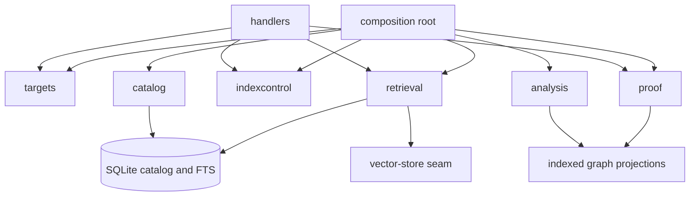

# Architecture

## Purpose Of This Document

This document defines the durable Code Facts architecture before implementation. Code Facts is a broker and evidence synthesizer; it is not a language parser.

## Scenario Shape

Code Facts has three surfaces:

- API: Connect-RPC service for target resolution, describe queries, proof queries, and cache diagnostics.
- CLI: thin agent/operator wrapper over the same Connect-RPC operations.
- UI: operator workbench for target entry, surface/fact inspection, warnings, evidence, and cache status.

## System Boundaries

In bounds:

- Resolve bounded targets.
- Read shallow Vrooli metadata such as `.vrooli/service.json`, `.vrooli/endpoints.json`, `cli/manifest.json`, and `.vrooli/testing.json`.
- Call `go-code-graph` and `typescript-code-graph` through provider seams.
- Normalize provider output into Code Facts fact families.
- Synthesize higher-level evidence such as proto adoption and endpoint proof.

Out of bounds:

- Parsing Go or TypeScript source directly.
- Owning proto-health policy.
- Mutating target source code.
- Running unbounded monorepo analysis.

## Contracts And Data Flow

Fact-family filtering is applied at the Code Facts service boundary. Provider-level extraction may still be full graph extraction until providers add selective extraction.

Endpoint proof is intentionally two-stage. Graph providers emit generic route,
import, reference, call, and type facts. Code Facts framework adapters then
interpret only the generic attributes they support and produce normalized
endpoint implementation evidence. The final proof step compares that evidence
to `.vrooli/endpoints.json`; downstream consumers such as proto-health consume
only the resulting proof statuses and evidence.

## Shared Infrastructure

| Area | Purpose | Expected Shape |
|---|---|---|
| Provider clients | Hide graph-provider transport behind fakes | API internal analyzer seams |
| Target filesystem | Resolve paths and metadata deterministically | API internal target seams |
| Cache store | Store graph/report entries, hash evidence, and diagnostics | API internal cache seams with SQLite production repository and in-memory tests |
| Rendering | Keep CLI output thin and proto-shaped for JSON | CLI domain renderers |

## Zone Map

| Directory | Zone | May import | Enforcement |
|---|---|---|---|
| `api/handlers/facts/` | Transport edge | generated proto, Connect, domain contracts, module/httpx substrate | architecture tests and endpoint coverage |
| `api/handlers/health/` | Transport edge | health contract and substrate | architecture tests and endpoint coverage |
| `api/internal/targets/` | Domain core | standard library only | transport, sibling-domain, and ambient-dependency gate |
| `api/internal/catalog/` | Domain core and persistence contract | standard library and `database/sql` only in adapter files | transport, sibling-domain, and ambient-dependency gate |
| `api/internal/analysis/` | Domain core | standard library only | transport, sibling-domain, and ambient-dependency gate |
| `api/internal/retrieval/` | Domain core | standard library only | transport, sibling-domain, and ambient-dependency gate |
| `api/internal/proof/` | Domain core | standard library only | transport, sibling-domain, and ambient-dependency gate |
| `api/internal/indexcontrol/` | Domain core | standard library only | transport, sibling-domain, and ambient-dependency gate |
| `api/internal/cache/` | Domain core and persistence contract | standard library and `database/sql` only in adapter files | transport, sibling-domain, and ambient-dependency gate |
| `api/internal/facts/` | Evidence orchestration | analyzer providers, report cache, and typed Describe APIs | public Search delegates to the generation-fenced retrieval boundary |
| `api/internal/database/` | Cross-cutting substrate | database drivers and standard library | package tests |
| `api/internal/logging/` | Cross-cutting substrate | standard library only | compile-time interface use |
| `api/internal/httpc/` | Cross-cutting substrate | `net/http` | package tests |
| `api/internal/httpx/` | Cross-cutting substrate | `net/http` | package tests |
| `api/internal/middleware/` | Cross-cutting substrate | HTTP and logging | package tests |
| `api/internal/module/` | Transport substrate | Gorilla mux and endpoint descriptors | module tests |
| `api/internal/modules/` | Composition registry | handler modules | registry tests |
| `api/internal/registration/` | Search Hub integration adapter | HTTP, Connect, generated registry client | integration tests |
| `api/internal/server/` | Composition root | all mounted modules and transport substrate | server tests |
| `api/internal/testutil/` | Test-only substrate | domain contracts and deterministic fakes | no-production-import gate |
| `api/main.go` | Composition root | all concrete adapters | lifecycle and server tests |
| `api/cmd/` | Operator/build tooling | domain and substrate packages | command tests |
| `cli/` | Transport edge | generated clients and renderers | manifest/service coverage tests |
| `ui/src/api/` | UI transport edge | generated web clients | UI unit tests |
| `ui/src/features/` | UI capability domains | UI types and shared components | UI unit and selector tests |

`api/internal/facts/` retains analyzer-provider and Describe orchestration. It
does not own a query corpus: Search fails closed unless composition injects the
generation-fenced `ProductionIndex`. Storage, retrieval, proof, index-control,
and cache policy live in their owning domains.

## Boundary Maturity

| Zone | Level | Evidence | Remaining drift |
|---|---:|---|---|
| New API domains | 5 | `TestDomainPackagesAreTransportFreeAndIndependent`, source-free production-search proof, and seam reconciliation | no cutover drift remains |
| API transport/substrate | 5 | Handler, module, server, production-index, and no-production-test-import tests | analyzer-provider orchestration intentionally remains in `facts` |
| CLI | 5 | Manifest-driven generated Connect client plus authenticated build, promote, rollback, cancel, reconcile, and cleanup controls | destructive controls remain server-authorized and generation-fenced |
| UI | 5 | Responsive evidence workspace, provenance and relationship inspection, freshness/degradation status, generation controls, and evaluation comparison | desktop, tablet, and mobile journeys are covered by stable test IDs |

## Extension Rules

- Add new fact families as explicit enum/contract values.
- Add new analyzer providers behind the analyzer seam.
- Add new endpoint framework coverage through Code Facts adapters backed by
  generic graph facts.
- Add new proof families in the proof domain, backed by generic facts.
- Keep provider-specific language details out of shared Code Facts evidence unless normalized.
- Keep opinion-bearing architecture policy out of Code Facts. The `file_domain`
  fact family is exposed here as a cache/query contract, but Architecture
  Cartographer produces the verdicts because it owns domain-map authority,
  signal aggregation, and confidence thresholds.

## Architecture Maturity

| Surface | Level | Evidence | Remaining Drift |
|---|---:|---|---|
| Docs | 5 | Domain, data, flow, integration, performance, testing, operations, and UX contracts describe the indexed platform | no phase-11 documentation drift remains |
| API | 5 | Describe/proof/cache APIs plus source-free persistent Search and durable generation controls | optional semantic/graph resources may truthfully degrade |
| CLI | 5 | Generated Connect clients expose facts, cache, status, build, promote, rollback, cancel, reconcile, and cleanup | none for the cutover |
| UI | 5 | Evidence workspace exposes ranked trust/provenance, relationships, filters, generations, controls, degradation, and evaluation comparison | none for the phase-11 journeys |

## Intentional Deviations

Analyzer-backed generic language evidence remains the authority for deep Describe relationships. Public Search uses the promoted SQLite catalog/FTS generation and returns stable identity, source hash, active generation, retrieval regime, ranking explanation, and proof status. Optional semantic/graph stages name their degradation without disabling lexical service. Architecture Cartographer's `file_domain` family remains query-backed through cartographer: Code Facts delegates verdict production, normalizes returned verdicts into `GenericFact`s, and emits typed unsupported evidence when no cartographer provider is configured.

## Documentation Architecture

- [DOMAINS.md](DOMAINS.md) owns bounded contexts.
- [FLOWS.md](FLOWS.md) will own lifecycle/state flows once cache and describe jobs exist.
- [DATA.md](DATA.md) owns fact/cache data shape.
- [INTEGRATIONS.md](INTEGRATIONS.md) owns provider and consumer relationships.
- [../internal/SEAMS.md](../internal/SEAMS.md) owns test seams.
- [../internal/TESTING.md](../internal/TESTING.md) owns validation strategy.

## Cross-References

- [Fact Families](../reference/fact-families.md)
- [Evidence Status](../reference/evidence-status.md)
- [Cache](../reference/cache.md)
