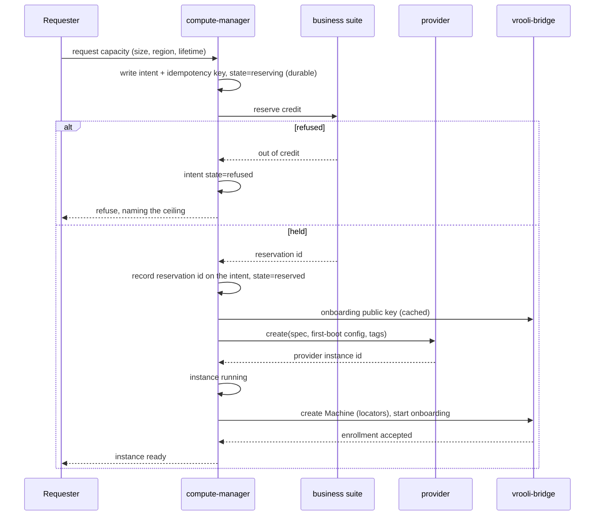
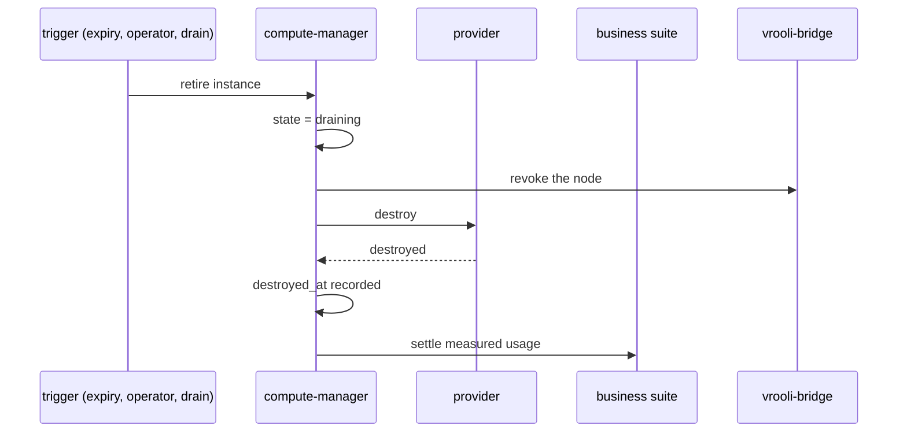
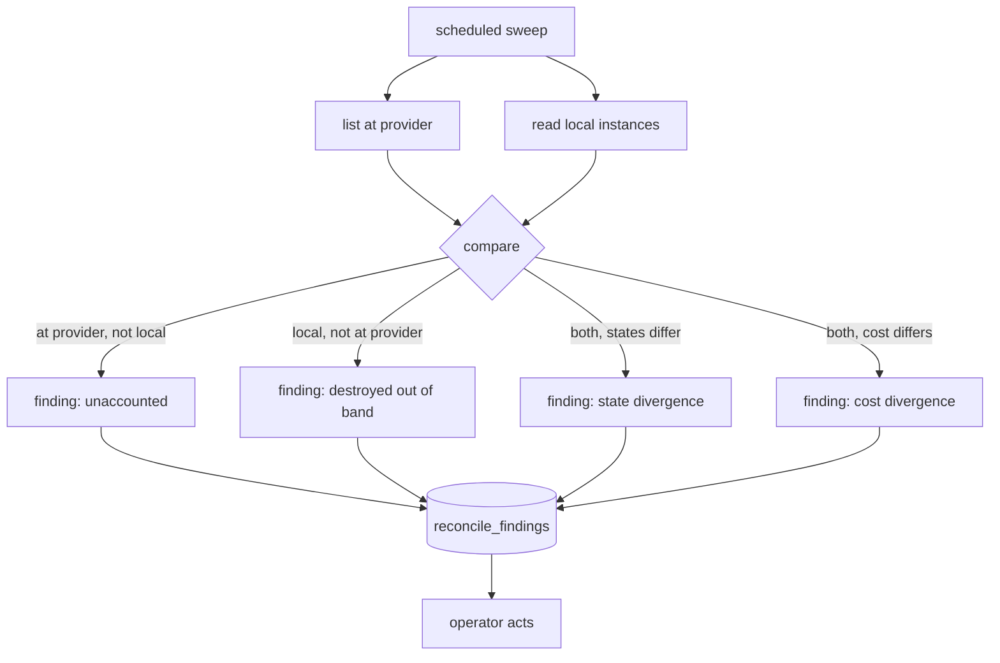
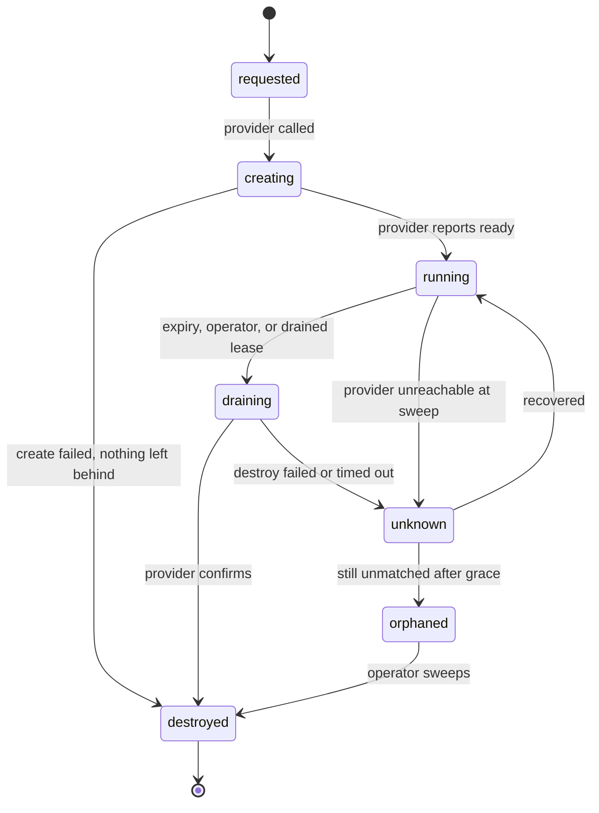
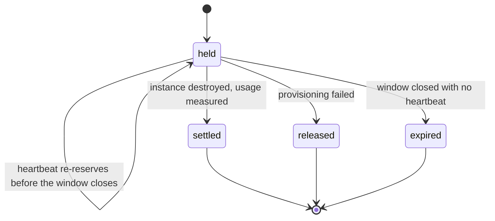
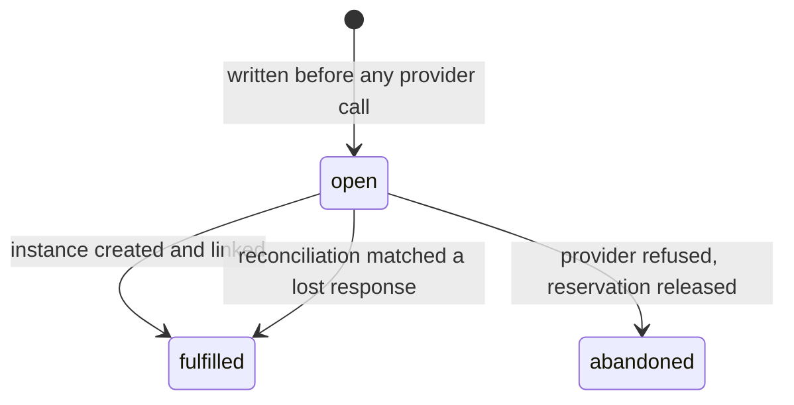

# Flows — Compute Manager

## Purpose Of This Document

This document is the sequence contract: the order in which domains act, which
step is allowed to fail, and what must already be durable before the next step
runs. Ordering is the substance here. Most of this scenario's failure modes are
ordering mistakes rather than logic mistakes.

> **Status: partially implemented.** Provision, retire, reconcile, extend and
> adopt have executable slices and focused fake-boundary tests. Provider-live
> enrollment, billing and the remaining post-launch flows are still open.

## Flow Inventory

| Flow | Trigger | Ends when | Owns targets |
|---|---|---|---|
| Provision | An operator, scenario or customer requests capacity | The instance is running and enrolled, or the request is refused with nothing left behind | `OT-P0-001`, `OT-P0-002`, `OT-P0-005`, `OT-P0-006` |
| Retire | Expiry, an explicit destroy, or a drained lease | The instance is destroyed and its usage is settled | `OT-P0-004`, `OT-P0-007` |
| Reconcile | A schedule | Findings are recorded; the sweep itself mutates nothing | `OT-P0-003`, `OT-P1-003` |
| Extend | An operator asks for more lifetime before expiry | Both enforcement points agree on the new expiry, or the request is refused | `OT-P0-004` |
| Adopt | An operator points at a host they already own | The host is a trusted node, with no instance and no meter | `OT-P1-001` |

## Flow Details

### Provision

The order is the contract. Two steps are placed where they are for reasons that
cost money if reversed.

**Intent before reservation, reservation before provider.** The intent row is
the genuine first write on this path, which is what makes the rule in
`OT-P0-002` literally true rather than nearly true. Reserving first would be
tidier, because a refusal would leave no row at all, but it opens a window in
which a crash between the reservation call and the first local write strands a
credit hold with no local record of it anywhere. That is the same class of
failure the intent-before-action rule exists to prevent, applied to money
instead of machines, and money is the half nobody notices.

So the intent is written in state `reserving` before the business suite is
called, carries the reservation id once one is held, and moves to `refused` if
credit is denied. A refusal therefore does leave a row. That row is cheap, it
is prunable, and it is the price of never leaking a hold. A crash anywhere in
this sequence leaves a `reserving` intent the reconciler can find and release.

**Enrollment is after running and is allowed to fail.** The instance is real,
metered and expiring whether or not bridge is reachable. A queued enrollment is
a flagged instance, not a rollback.

**Nothing partially succeeds silently.** If the provider call fails, the intent
is marked abandoned and the reservation is released rather than left to expire.

### Retire

Usage is measured from `running_at` to `destroyed_at`, both of which are
transitions this scenario caused. It is never measured by a loop that observes
what is running, because a dead observer stops billing while the provider keeps
charging.

Node revocation precedes destruction so a machine is never unreachable while
still trusted.

There is no pause. A stopped instance still bills at the full rate on most
providers, so a pause control would charge full price for no value. Destroy is
the only stop, and `COMPUTEM-P0-007` specifies a structural test that will
assert no such method exists anywhere in the scenario.

### Reconcile

Runs on a schedule and compares both directions.

**It reports and never destroys.** A finding is a row someone or something
else acts on, not a provider action the sweep takes. Marking precedes any
destructive sweep, so a reconciler defect cannot destroy a running node. For a
local record whose provider instance is absent, the sweep uses the injected
meter settlement callback to close that usage window; it does not destroy a
provider resource.

That second property is why the destroyed-out-of-band edge produces a finding
and uses only the meter-owned settlement callback. Closing a window settles
credit, and settlement belongs to the meter domain; the reconciler supplies
the observed local record but never implements billing or provider mutation.

Building only the provider-side direction is the common shortcut. The
local-side direction is what stops billing for a machine destroyed out of
band.

Provider billing data is compared here too, and only here. It lags by hours to
more than a day, so it is a reconciliation signal and never a control.

### Extend

The operator surface offers extension, so the contract has to say what it means
when there are two enforcement points and only one of them is reachable.

The control-plane expiry is a column and moves freely. The instance-side timer
was written into first-boot configuration and this scenario has no way to reach
back into a running machine to change it, because it holds no SSH and dispatch
belongs to bridge. So a naive extension would move the sweeper's deadline while
the machine still powers itself off at the original one.

Three options were considered and the third is the contract:

1. Reach into the instance and rewrite the timer. Rejected: it needs an
   execution channel this scenario deliberately does not have.
2. Move only the control-plane expiry. Rejected: the machine still dies at the
   original moment, so the operator is told the extension worked and it did not.
3. **Set the instance-side timer to a bounded lease rather than the full
   lifetime, and have the instance renew it from the control plane.** The timer
   becomes a dead-man switch: absent a renewal it fires, so an unreachable
   control plane still drains the fleet, and an extension is a renewal the
   instance collects on its next check.

That makes extension a normal operation and keeps the guarantee that the fleet
drains when this scenario is down. It costs one outbound check from the
instance, which is the same shape as everything else here: the machine reaches
out, nothing reaches in.

An extension is also a metering event. The reservation heartbeat already covers
the credit, but the extension must be refused when the new lifetime would take
the tenant past a ceiling, for the same reason the original request would be.

### Adopt

An operator points at a host they already own. The scenario creates no instance,
takes no reservation and meters nothing. It hands the host to bridge onboarding
and stops.

Adoption is free forever. Gating something a self-hoster could do with their own
keys would be the wrong product boundary, and the monetization contract forbids
it.

## State Machines

### Instance

`orphaned` and `unknown` are outcomes reconciliation assigns. Nothing requests
them, and no automated path leaves `orphaned` except through an operator.

A destroy that errors or times out is the most expensive failure in this
design, because destroy is the only stop. The instance moves to `unknown`
rather than staying in `draining`, which keeps it inside the reconciler's
attention and stops it from sitting in a terminal-looking state while the
provider still bills. Retry is bounded and then the instance is surfaced for
an operator, because the alternative to a stuck `draining` row is a machine
nobody is looking at.

### Reservation

The `held --> held` self-transition exists because the upstream reservation
window is ten minutes and an instance lives for hours. Each renewal is recorded
rather than mutated, so the history survives.

### Intent

## Maturity Ladder

| Rung | Meaning | State |
|---|---|---|
| L0 | Flows designed, nothing executes | **Current** |
| L1 | Provision and retire run end to end against a fake provider, with intent-before-action and reserve-before-provision proven by test | Next |
| L2 | Reconcile and expiry run on a schedule; the instance-side drain is proven with the scenario stopped | |
| L3 | One real provider adapter; a real instance enrolls unattended | Blocked on the bridge onboarding-key endpoint |
| L4 | Cost reconciliation against a real provider statement; per-tenant ceilings enforced | |
| L5 | A customer buys capacity through the subscription | Requires an operator to promote the offer |

Nothing above L0 is claimed. The ladder exists so a later reader can see which
rung a change is trying to reach.

## Production Shape

Two loops run unattended and must be safe to leave alone.

**The reconciler** compares both directions on a schedule and writes findings.
It holds no lock on the serving path, mutates nothing, and bounds every query.
Its failure mode is silence, which is why expiry does not depend on it.

**The expiry sweeper** destroys instances past their lifetime. Because it cannot
run when this scenario is down, the same guarantee is enforced a second time by
a timer installed in the instance's own first-boot configuration. Two
enforcement points for one promise, because an unbounded instance costs money
for as long as nobody notices.

Both loops are idempotent, resumable, and bounded. Neither retries a provider
create without the original idempotency key.

## Deferred / Unmodeled Flows

| Flow | Why not modelled | Trigger |
|---|---|---|
| Warm pooling | Reuse only pays once measured churn shows hourly rounding dominating the bill | Real usage data |
| Resize | Providers differ sharply in whether this is live or a rebuild, and the billing consequences differ with them | A concrete need |
| Snapshot and restore | Adds storage cost that bills separately and outlives the instance | A durable-state workload |
| Migration between providers | Requires two adapters and a reason | A second adapter exists |
| Customer refund | Belongs to the business suite, not here | Never in this scenario |

## Cross-References

- [DOMAINS.md](DOMAINS.md) — the domains these flows sequence
- [DATA.md](DATA.md) — the rows each step writes
- [INTEGRATIONS.md](INTEGRATIONS.md) — the failure behaviour of each participant
- [ARCHITECTURE.md](ARCHITECTURE.md) — the shape these flows run inside
