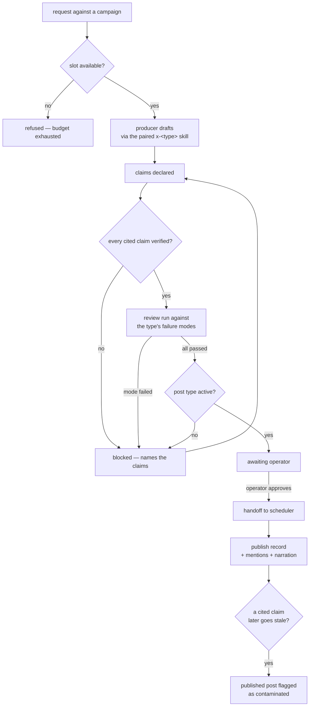

# Flows — Content Desk

This document is the canonical workflow and state-transition map for
the scenario. Use it when behavior depends on ordered states, retries,
cancellation, stale completion, background jobs, polling, or mutually
exclusive UI modes.

## Purpose Of This Document

Use this document to answer:

- Which user/system workflows matter?
- Which workflows have explicit states and events?
- Which transitions are illegal?
- Which tests prove workflow correctness?
- Which flows are known but not modeled yet?

Plain CRUD with no meaningful ordering constraints does not need a
workflow model.

## Flow Inventory

`health` is a stateless reporting domain and ships no workflows. List
each real stateful flow your domains add below, with its owner, trigger,
outcome, statefulness, and validation level.

| Flow | Domain | Trigger | Outcome | Statefulness | Validation |
|---|---|---|---|---|---|
| Draft lifecycle | artifacts | A producer picks up a request or starts a draft against a campaign. | An approved draft, or an abandoned one. | The spine of the scenario. Illegal transitions are refused by a generated transition table, not by handler checks. | L5 — declarative contract, checked Quint model, replayed against production transitions. |
| Claim verification | claims | A claim is asserted, or a scheduled sweep re-runs its check. | A claim in verified, stale, expired, or refuted state. | A claim's state changes independently of any draft citing it; a change propagates to every citing draft. | L2 — modelled states with matrix tests. |
| Review run | review | A draft reaches the reviewed-eligible state, or a reviewer re-runs scoring. | Per-failure-mode verdicts and a blocked-or-passed outcome. | Re-runnable; a later run supersedes an earlier one without deleting it. | L2 — additive, no partial runs. |
| Campaign lifecycle | campaigns | Operator accepts a launch proposal; later, a close. | An active campaign with slots, then a closed historical record. | Activation is evidence-gated. Closing does not delete drafts already attached. | L2 — deterministic, gated. |
| State import | ledger | Initial backfill, then scheduled or on demand. | New records from each source; unchanged items produce nothing. | **Idempotent by content-addressed key.** A per-source failure skips that source rather than recording a partial sweep as complete. | L3 — scheduled, resumable, no partial completion. |
| Publish handoff | ledger | An approved draft is released. | A publish record carrying the URL and post id the scheduler returned. | A failed handoff leaves the draft approved rather than published. Retried release must not create a second record. | L3 — idempotent, externally dependent. |

## Flow Details

Document each real flow here with its owner domain, trigger, inputs,
ordered steps, outputs, failure modes, retry/cancel behavior, tests, and
generated subpackages. The worked example below shows the expected shape.

## State Machines

List each modeled flow's states, illegal transitions, and how they are
enforced. Plain CRUD with no ordering constraints does not appear here.

| Domain/Flow | States | Illegal Transitions | Enforcement |
|---|---|---|---|
| artifacts / draft lifecycle | `requested → drafting → drafted → checking → reviewed → approved → published`. Branches: `checking → blocked`, `reviewed → blocked`, `blocked → checking`, and `→ abandoned` from any pre-approval state. `published` and `abandoned` are terminal. | `drafted → approved` (skipping verification); any transition into `approved` whose actor is not the operator; approval while the post type is inactive; approval while the slot budget is exhausted; any transition out of `published`. | `flow.json` contract, generated Quint model, formal artifact replay against the production transition function (`CONTENTD-P0-003`, `CONTENTD-P0-006`, `CONTENTD-P0-007`, `CONTENTD-P0-008`). |
| claims / claim lifecycle | `asserted → verified`, `asserted → refuted`, `verified → stale`, `verified → expired`, `stale → verified`, `stale → refuted`, `expired → verified`. `refuted` is terminal. | `asserted → verified` without attached evidence; any transition that deletes a claim; a novelty claim reaching `verified` with no search date. | Matrix tests over the modelled states (`CONTENTD-P0-005`, `CONTENTD-P1-001`, `CONTENTD-P1-003`). |
| campaigns / campaign lifecycle | `proposed → active → closed`. `closed` is terminal. | `proposed → active` with zero evidence references; accepting a draft against a `closed` campaign; exceeding the declared slot budget. | Campaign gate tests (`CONTENTD-P0-001`, `CONTENTD-P0-002`). |

## Maturity Ladder

Temporal workflows mature in layers. Do not skip the executable layers
to add a standalone formal document.

| Level | Name | What exists |
|---|---|---|
| 0 | Unmodeled risk | Lifecycle behavior exists only inside handlers, components, callbacks, or jobs. |
| 1 | Inventory | The flow is listed here with owner, source links, risk, and next step. |
| 2 | Workflow model | State/status values, event values, `Transition`, and `CheckInvariants` live beside the owning domain or feature. |
| 3 | Matrix + traces | Tests cover every state/event pair and replay representative traces against production transition logic. |
| 4 | Declarative contract | A domain-local `*.flow.json` declares states, events, transitions, invariants, and named traces. |
| 5 | Checked formal model | Quint/TLA+ or an equivalent tool is generated from the contract, checked, and replayed by production tests. |

## Production Shape

Three (Go) or four (UI) files per flow at the top of the feature folder,
plus one `generated/` sibling. Everything in `generated/` is codegen output.

Every flow lives in a `flow/` subdirectory next to its consumer with
conventional file names. API domains that own durable lifecycle state use:

```text
api/internal/<domain>/
  flow/
    flow.json                   # hand: source of truth (schema v6)
    transition.go               # hand: wrapper (package flow)
    flow_test.go                # hand: thin replay delegation (package flow)
    generated/
      model.qnt
      artifact.json
      runtime.go                # package generated
      replay.go
```

UI features that own client-side modes use:

```text
ui/src/features/<domain>/
  flow/
    flow.json                   # hand: source of truth (schema v6)
    transition.ts               # hand: wrapper
    fixtures.ts                 # hand: replay fixtures
    flow.test.ts                # hand: thin replay delegation
    generated/
      model.qnt
      artifact.json
      runtime.ts
      replay.helper.ts
```

Every flow uses the same file names. The `flow/` directory IS the unit;
the contract no longer declares any output paths or module names.

The workflow owns state/status values, events, `Transition`, and
`CheckInvariants`. It should be pure or nearly pure. Effects live
outside the workflow behind seams: repositories, BlobStore, clocks,
timers, HTTP clients, or UI API modules.

The `*.flow.json` contract is the source of truth. Level 5 generated
Quint models, formal artifacts, and Go/TypeScript declarations are
checked-in source artifacts for reviewability, but they are refreshed
and checked by the `flow-verifier` scenario CLI; the
scenario lifecycle runs `make temporal-models` (which calls
`flow-verifier verify check`) before the normal test
suite. A Quint file by itself is not accepted: the model must typecheck,
test, verify named invariants, emit deterministic artifacts, and those
artifacts must replay against the production Go/TypeScript transition
functions.

The generated declarations keep state/event topology and formal
freshness metadata out of hand-maintained test lists. They also provide
pure status-transition helpers generated from the `*.flow.json`
transition matrix. For TypeScript flows, the same declarations can own
the discriminated state/event union shape and replay fixture contract.
Production workflow wrappers call those helpers for abstract validity
and next-status outcomes, while keeping payload validation, side-effect
orchestration, and rich state construction in hand-authored code. API
replay tests get expected paths, hashes, invariants, and generated checks
from `generated/<folder>/runtime.go`; UI replay tests import the same metadata
from `generated/<folder>/runtime.ts`. The generated `replay.{go,helper.ts}`
files own the assertion calls; the hand-authored top-level test simply binds
the wrapper's transition function and the fixtures and invokes
`RunReplay`/`runFormalReplay` once.

Formal artifacts use schema v6 coverage metadata. Matrix completeness,
terminal transition checks, named trace coverage, and generated MBT trace
coverage are separate fields. Do not treat generated trace
`allPairsCovered` as required proof of correctness; replay tests require
the complete transition matrix and named traces, while generated trace
coverage reports how much the model explorer happened to visit.

Schema v6 `flow.json` files carry no path or module information. The
`replay` block declares only `transition.function` (plus
`transition.statusAccessor` for TS or `transition.stateType` /
`transition.statusField` for Go). Everything else is derived from the
flow directory.

Go flows emit `flow/generated/replay.go` and require a hand-authored
`flow/flow_test.go` (package `flow`) that calls `generated.RunReplay`.
TypeScript flows emit `flow/generated/replay.helper.ts` and require a
hand-authored `flow/flow.test.ts` that calls
`runFormalReplay({ transition, fixtures })` at module top level.
`flow-verifier verify check` byte-compares every generated file and runs an
AST-level lint over the hand-authored test, so a silent bypass — missing
import, stubbed transition, or call buried inside a guarded block —
fails the check.

To scaffold a new flow:

```bash
flow-verifier flows new ui/src/features/<feature> --flow-id <flow-id> --lang ts --root .
flow-verifier flows new api/internal/<domain>     --flow-id <flow-id> --lang go --root .
```

The scaffold writes the hand-authored files and immediately runs
`generate`, so `check` is green from the moment it returns.

To add or rename a state/event:

1. Edit the owning `*.flow.json`.
2. Regenerate that flow with `flow-verifier verify run --flow <flow-id>`.
3. Update only payload-specific wrapper branches that need new runtime
   data; the abstract transition table is generated.
4. Update the UI replay fixture module. The generated formal replay fixture
   interface should make missing state/event fixtures a type error.
5. Run `make temporal-models` and the scenario tests.

## Deferred / Unmodeled Flows

| Flow | Risk | Next Step |
|---|---|---|
| Publish-performance ingestion | Deferred to `CONTENTD-P2-001`. No social accounts and no measurement source exist, so an ingestion flow could be neither built against real shapes nor validated. | Once accounts are live and producing measurable posts. |
| Variant derivation | Deferred to `CONTENTD-P2-002`. Deriving per-channel variants before the single-draft path has run end to end would fix the wrong shape. | Once the P0 loop has published repeatedly. |
| Account eligibility handshake | Deferred to `CONTENTD-P1-005`. The scheduler is pre-template and exposes no Connect surface to call; the seam is designed but has nothing to talk to. | Once the scheduler is modernized and can answer the eligibility question. |

## Flow Diagram — the draft path



Only the operator edge into `PUB` is human. Every other gate is mechanical, and
each refusal names the specific reason — an unverified claim, a failed mode, an
inactive type, an exhausted budget — because a blocked draft with no stated
cause is the failure this surface exists to prevent.

## Cross-References

- [`DOMAINS.md`](DOMAINS.md) — owning domain map
- [`DATA.md`](DATA.md) — persisted state and retention
- [`../internal/SEAMS.md`](../internal/SEAMS.md) — side-effect boundaries
- [`../internal/TESTING.md`](../internal/TESTING.md#temporal-workflow-tests) — matrix and trace testing
