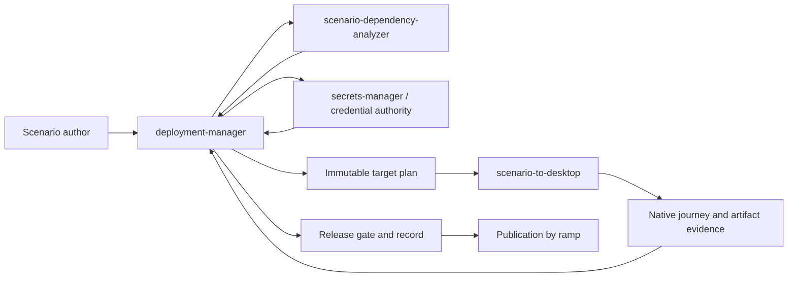

# Desktop bundle pipeline architecture

This document describes the current control flow for a deployment Tier 2
desktop bundle. It is an architecture reference, not a user walkthrough.

## Ownership flow

## Responsibilities

### deployment-manager

Owns target profiles, dependency fitness, swap decisions, deployment plans,
approval gates, release records, and promotion state. It does not own Electron
processes or target-specific installer behavior.

### scenario-dependency-analyzer

Resolves the scenario/resource graph and supplies requirements, platform fitness,
host requirements, and compatible alternatives. A fitness score is an input to
the decision; it is not release evidence.

### secrets-manager and the credential authority

Classify declared credentials for the target and provide the safe strategy:
exclude infrastructure material, generate per-install material, prompt users,
or require an explicit remote route. Storage and resolution follow the
[credential configuration contract](../../../../docs/configuration/secrets.md).

### scenario-to-desktop

Consumes the target plan, stages the selected UI/API/resource artifacts, creates
the Electron wrapper, builds installers, starts the runtime supervisor for
bundled journeys, and produces target evidence. See its [architecture
documentation](../../../scenario-to-desktop/docs/concepts/ARCHITECTURE.md).

## Immutable target plan

Before bundle output is written, the plan must resolve every required resource
for the selected OS and architecture. Each item records:

- requested and selected provider;
- deployment mode and support status;
- privilege and bundling policy;
- artifact identity and checksum;
- ports, health checks, and readiness;
- fallback and functional limitations;
- promotability and evidence requirements.

The runtime consumes this plan. It must not silently discover a different
resource, build source on the customer machine, or omit a required item.

The separate [bundle manifest schema](../guides/bundle-manifest-schema.md)
describes the service-level runtime manifest. The target plan and bundle
manifest are related but are not interchangeable documents.

## Runtime boundary

Electron starts the runtime supervisor and communicates with its authenticated
loopback control API. The supervisor owns only private bundled services. It
allocates ports, resolves credentials, applies migrations, starts services in
dependency order, checks native readiness, records logs and telemetry, and
shuts down cleanly.

Thin clients do not start the remote Tier 1 resource graph. Shared providers
use broker-issued scoped leases. A desktop peer candidate is not a peer protocol.

## Evidence boundary

The pipeline produces separate evidence for:

1. source and build identity;
2. artifact integrity and release trust;
3. target eligibility and host requirements;
4. native launch and semantic interaction;
5. provider route and communication;
6. update and restart behavior;
7. clean shutdown and redaction.

The [desktop evidence and communication contract](../../../../docs/reference/scenario-to-desktop-evidence-and-tier-contract.md)
defines the verdict vocabulary and promotion requirements.

## Known boundaries

- A target package may exist without being promotable.
- Windows and macOS package output is not native runtime evidence.
- A remote bridge execution ID is not local desktop-session evidence.
- Tier 2 peer communication remains unsupported.
- Cloud API mode is not a supported desktop mode.

For the operator sequence, read the [desktop deployment workflow](../workflows/desktop-deployment.md).
