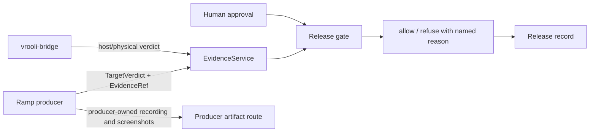
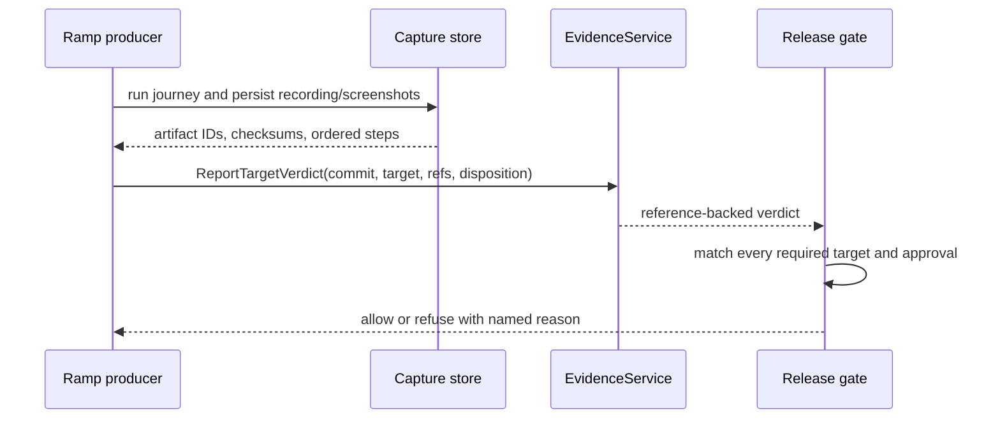

# Deployment Manager Architecture

Deployment-manager is the governance plane. Domain policy and persistence are
kept behind repositories; HTTP/Connect handlers translate at the edge. The
evidence plane produces target verdicts, the reach plane supplies bridge
results, and the governance plane joins exact-commit evidence with human
approvals.

Desktop recordings are ordinary scenario-to-desktop captures. The capture
store computes the checksum and confines artifact serving to its managed root;
deployment-manager never downloads or stores artifact bytes.

