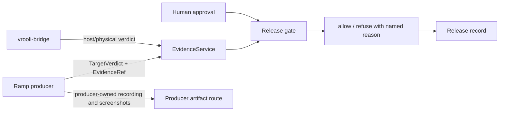
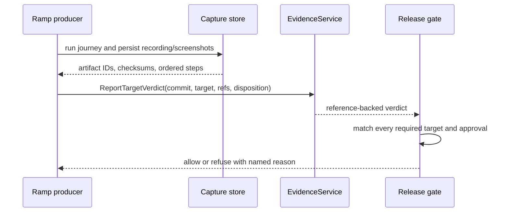

# Deployment Manager Architecture

Deployment-manager is the governance plane. Domain policy and persistence are
kept behind repositories; HTTP/Connect handlers translate at the edge. The
evidence plane produces target verdicts, the reach plane supplies bridge
results, and the governance plane joins exact-commit evidence with human
approvals.

Release identity is owned by `api/releases` and has four separate immutable
boundaries: `Candidate` identifies source, build inputs, policy, final signed
bytes, and its non-secret operational capability declaration;
`DestinationRevision` identifies non-secret publication
coordinates; `ReviewBinding` identifies the exact evidence and authorization
covered by approval; and `Operation` records server-owned execution standing.
The canonical Go types serialize through the generated contracts in
`packages/proto/schemas/deployment-manager/v1/releases/contracts.proto`.
Target architecture is retained from `api-core/targetmodel`; installer format
is an artifact dimension and is never inferred from platform alone.

The reviewer read authority is the release dossier. `GET
/api/v1/releases/{release_id}/dossier`, the typed `ReleasesService.Dossier`
RPC, and `deployment-manager releases dossier` all project the same durable
release, receipt-backed health, immutable identities, and explicit
`missing_proof` list. A missing candidate, destination, review, receipt, or
owner observation remains visible as an unresolved proof item; no transport
adapter can turn it into a successful release decision. Health, reconciliation,
and recovery are projections and owner-routed operations of this release
authority, not independent state stores.

Mutation authority is explicit at every mounted operator boundary. The server
uses `api-core/authn` middleware only to attach a verified principal; domain
handlers then require a verified human operator before profile, approval,
release, LPBS configuration, swap, telemetry, migration, or deployment
mutations. Approval and release attribution is derived from that principal,
so request fields such as `reviewer` and `released_by` cannot forge audit
identity. Readiness evidence reporting remains a producer boundary and uses
its own typed service contract.

| Boundary | Required authority | Caller supplied identity accepted for authorization? |
|---|---|---|
| Profiles Connect mutations | Verified human operator | No |
| Routed operator mutations | Verified human operator | No |
| Readiness goal closure, approval, waiver, human check | Verified human reviewer | No |
| Release start, reverify, reconcile, and recovery | Verified human release operator plus exact current review; recovery also requires destructive capability and owner binding | No |
| Readiness evidence report | Typed producer/service contract | No |

Desktop recordings are ordinary scenario-to-desktop captures. The capture
store computes the checksum and confines artifact serving to its managed root;
deployment-manager never downloads or stores artifact bytes.

