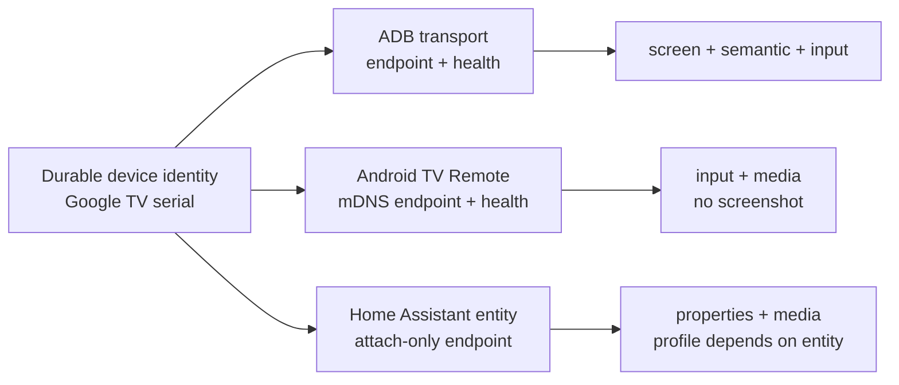
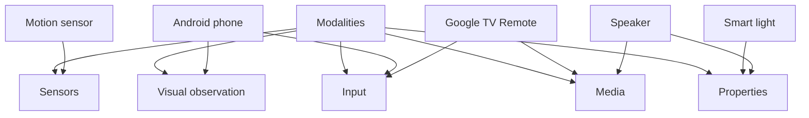

# Device model

Device Control is a general control plane for owner-authorized physical and
virtual devices. Phones are one supported class; televisions, speakers, lights,
sensors, cameras, locks, and other endpoints are equally valid when a strategy
can prove the required capability.

## Terms

- **Device** — one durable physical or virtual identity. A device remains the
  same device when its network address or selected transport changes.
- **Transport** — one way to reach a device, such as Android ADB, Android TV
  Remote, or an attached Home Assistant entity. A transport owns its endpoint,
  health, and capability profile.
- **Capability** — a declared and probed operation available through one
  device/transport pair. Unsupported operations are explicit unavailable
  declarations with a reason.
- **Modality** — the kind of interaction a capability provides: visual
  observation, input, property control, sensing, or media control.

Capability belongs to the device/transport pair, not to an adapter name. For
example, the same Google TV may be reachable through ADB with screenshots and
semantic input, and through Android TV Remote with directional input and media
control but no frame. Those are two transports of one device, with different
profiles.

## Device classes and modalities

The scenario covers these classes without forcing them through a screen model:

| Class | Typical modalities | Example |
|---|---|---|
| Screen-bearing | visual observation, input, semantic | Android phone or desktop |
| Screenless input-driven | input, media | Google TV through Remote |
| Google TV receiver | directional input plus receiver state | Android TV Remote + Google Cast |
| Property-driven | property control | light brightness or lock state |
| Sensor-only | sensing | motion or temperature sensor |
| Media-controllable | media control, properties | speaker or media player |

A strategy may expose several modalities, but it must never claim a modality
because the device class usually has one. Each capability is independently
declared, probed, and surfaced to operators.

## Google TV transport pair

The Android TV Remote transport is event-bearing: it sends directional, text,
and media commands but does not expose a screen or unsolicited state. Google
Cast is state-bearing: it reports receiver/media state, absolute volume, mute,
and application identity, and pushes receiver status changes. A television
uses both transports and keeps their capability profiles separate.

| | Android TV Remote | Google Cast |
|---|---|---|
| Class | event-bearing | state-bearing |
| Operations | keys, text, relative media keys | receiver status, absolute volume, mute, launch, media state |
| Pairing | six-character hexadecimal code once | none on a trusted LAN |
| Change notice | command response only | unsolicited push status |
| Identity key | `bt` TXT key | `id` TXT key |
