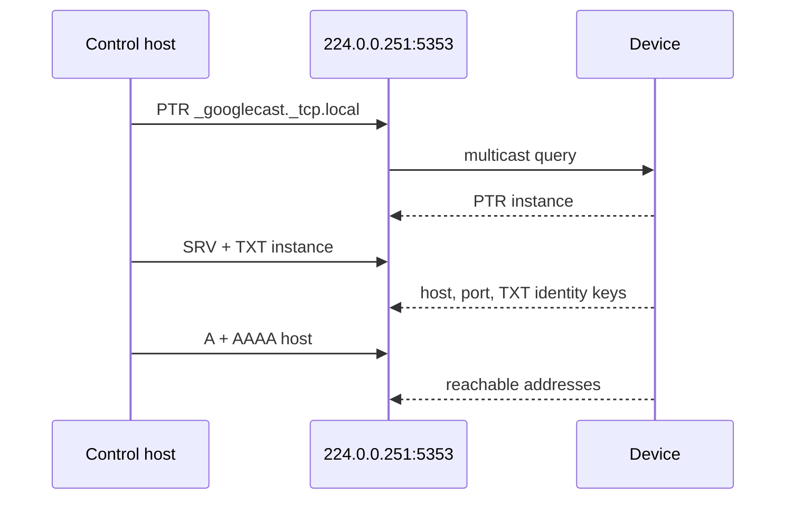

# LAN discovery

Device Control browses the local network with multicast DNS service discovery
(DNS-SD). The browse is read-only and is implemented by the shared
`packages/mdns-go` package; it does not publish records and does not invoke an
OS command or the host unicast resolver.

For each caller-supplied service type, the browser sends a PTR query to
`224.0.0.251:5353`. Every returned service instance is then resolved through
its SRV and TXT records, followed by A and AAAA address records for the SRV
target. A service instance therefore contains its instance name, service type,
host, addresses, port, and TXT key map.

The host's ordinary unicast resolver does not perform this multicast browse.
On the development host a unicast lookup of `_androidtvremote2._tcp.local`
returned zero records with `server misbehaving`, while an independent DNS-SD
browse at the same time returned the television, its port 6466, and its `bt`
TXT key.

The television transports browse these service types:

- `_androidtvremote2._tcp`
- `_androidtvremote._tcp`
- `_googlecast._tcp`

mDNS is link-local. It does not cross a subnet or VLAN boundary, so a guest
network or a separate access-point network requires a manually configured
endpoint rather than discovery.

