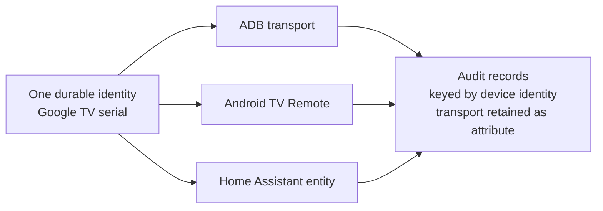
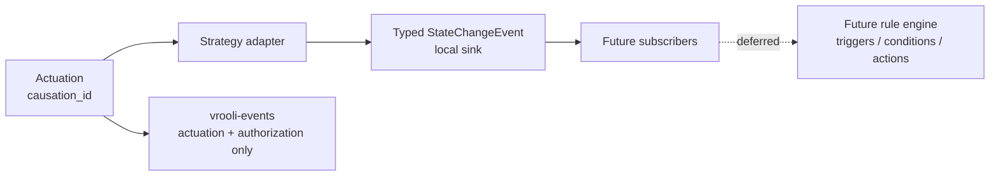

# Identity and events

## One identity, many transports

A device has one durable identity. The identity survives endpoint changes,
transport reconnects, and service restarts. A device-to-transport relation is
one-to-many: each transport records its strategy id, transport name, endpoint,
health, and its own capability profile.

The primary reconciliation key is a hardware serial reported by a trusted
strategy. Strategies also contribute their transport endpoint and a
strategy-scoped identity key. Two observations with the same verified serial
merge into one device identity; conflicting serials never merge merely because
their names or network addresses match. When no serial exists, the adapter's
stable entity id is retained as a transport-scoped identity until stronger
evidence is available.



Audit history follows the identity, not the endpoint or transport. The
existing wireless reconnect rule therefore changes the selected endpoint
without creating a new audit subject.

## State-change substrate

Device Control emits a local typed `StateChangeEvent` with exactly these
fields:

```text
device_id, transport, attribute, old_value, new_value, observed_at, causation_id
```

The event also carries the state-bearing or event-bearing classification. A
state-bearing event represents a transition from `old_value` to `new_value`;
an event-bearing record represents an occurrence and may leave the values
empty. Every actuation has a `causation_id`. The request boundary generates
one when the caller supplies none and preserves a caller-provided identifier;
an event produced by that actuation carries the same id. This gives a future
rule engine a way to suppress self-triggering and cannot be safely retrofitted
after actuations have crossed adapter boundaries.

State telemetry stays on a fast local subscription seam. It does not flow
through `vrooli-events`; that bus is reserved here for rule fires, actuations,
and authorization decisions.



The rule engine is explicitly deferred. Prior art is retained from the
retired `home-automation` schema at
`scenarios/home-automation/api/internal/home/schema.sql`; the deleted path is
historical reference material only, and device-control does not import or
depend on it. Its former `automation_rules` table had these columns:
`id`, `name`, `description`, `created_by`, `trigger_type`, `trigger_config`,
`conditions`, `actions`, `active`, `generated_by_ai`, `source_code`,
`execution_count`, `last_executed`, `created_at`, and `updated_at`. Its
`safety_rules` table had these columns: `id`, `name`, `description`,
`rule_type`, `conditions`, `actions`, `priority`, `is_enabled`, `created_at`,
and `updated_at`.

That schema is reference material for a successor plan, not an implementation
of triggers or actions in device-control.
