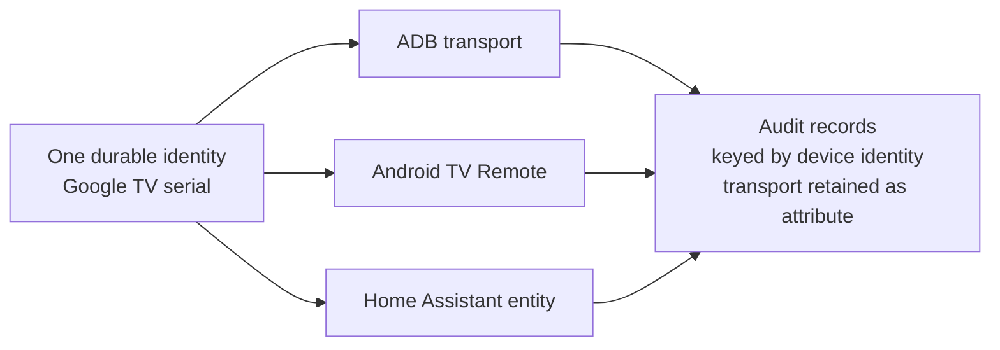
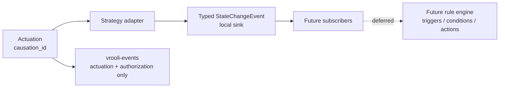

# Identity and events

## One identity, many transports

A device has one durable identity. The identity survives endpoint changes,
transport reconnects, and service restarts. A device-to-transport relation is
one-to-many: each transport records its strategy id, transport name, endpoint,
health, and its own capability profile.

The primary reconciliation key is a hardware-grade identity claim reported by
a trusted strategy. Accepted claims are an ADB serial, the Android TV Remote
`bt` TXT key, and the Google Cast `id` TXT key. Strategies also contribute
their transport endpoint and capability profile. Two observations merge only
when accepted claims agree; an IP address, hostname, mDNS instance name, or
friendly name never merges observations. Without a claim, the observation
remains transport-scoped until stronger evidence is available.

Each device record exposes the contributing `Claims` with kind, value,
strategy, and evidence. When observations share only an endpoint, the record
also exposes `address-only-correlation-refused`; an operator may use
`device merge <canonical> <member> --claim <kind>=<value>` to record an
explicit `owner-asserted` claim. `device split <canonical>` restores the
pre-merge snapshots, while durable alias links keep historical audit records
reachable from both identities.



Audit history follows the identity, not the endpoint or transport. The
existing wireless reconnect rule therefore changes the selected endpoint
without creating a new audit subject.

## State-change substrate

Device Control emits a local typed `StateChangeEvent` with exactly these
fields:

```text
device_id, transport, attribute, old_value, new_value, observed_at, causation_id
```

The event also carries the state-bearing or event-bearing classification. A
state-bearing event represents a transition from `old_value` to `new_value`;
an event-bearing record represents an occurrence and may leave the values
empty. Every actuation has a `causation_id`. The request boundary generates
one when the caller supplies none and preserves a caller-provided identifier;
an event produced by that actuation carries the same id. This gives a future
rule engine a way to suppress self-triggering and cannot be safely retrofitted
after actuations have crossed adapter boundaries.

State telemetry stays on a fast local subscription seam. It does not flow
through `vrooli-events`; that bus is reserved here for rule fires, actuations,
and authorization decisions.

Google Cast push receiver status is the event producer for receiver state.
Polling is a declared-degraded fallback only, and its interval is recorded in
the transport declaration. An event from a Vrooli actuation carries that
actuation's causation id; a physical remote or phone-originated change gets a
new observation causation id.



The rule engine is explicitly deferred. Prior art is retained only as
historical reference material from the retired home-automation schema; the
deleted path is not part of this scenario, and device-control does not import
or depend on it. Its former `automation_rules` table had these columns:
`id`, `name`, `description`, `created_by`, `trigger_type`, `trigger_config`,
`conditions`, `actions`, `active`, `generated_by_ai`, `source_code`,
`execution_count`, `last_executed`, `created_at`, and `updated_at`. Its
`safety_rules` table had these columns: `id`, `name`, `description`,
`rule_type`, `conditions`, `actions`, `priority`, `is_enabled`, `created_at`,
and `updated_at`.

That schema is reference material for a successor plan, not an implementation
of triggers or actions in device-control.
