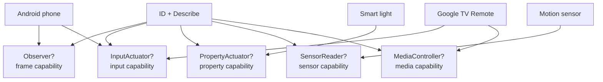

# Strategy contract

The mandatory strategy floor is deliberately small:

```go
type Strategy interface {
    ID() string
    Describe(context.Context) (Declaration, error)
}
```

`Observe` and `Actuate` are not required. A screenless sensor cannot produce a
frame, and a read-only device cannot accept an input event. They are optional
interfaces, alongside the existing `SessionRecorder` and `SemanticResolver`:

- `Observer` — `Observe(context.Context) (Frame, error)`.
- `InputActuator` — `Actuate(context.Context, Actuation) error`.
- `PropertyActuator` — typed `GetProperty` and `SetProperty` over declared
  attributes.
- `SensorReader` — read-only typed sensor readings.
- `MediaController` — play, pause, stop, next, previous, and volume.
- `StateReader` — returns the typed mobile subset plus every declared property
  and explicit unavailable reasons.
- `StateObserver` — runs until cancellation and publishes one event per changed
  attribute. Push transports use it directly; poll transports declare their
  interval and use `StateReader` as a bounded fallback.
- `Pairer` — performs an interactive pairing exchange from a non-serializable
  secret request and returns only a redacted outcome.

The capability constants added by this model are `CapProperty`, `CapSensor`,
and `CapMedia`. `CapProperty` describes state that can be read or changed;
`CapSensor` describes observed readings; `CapMedia` describes transport
commands. A state-bearing device, such as a light, has a current value that can
transition. An event-bearing device, such as a doorbell button, reports an
occurrence without a durable current value. The distinction is preserved in
state-change events.

`DeviceState` keeps the existing named mobile fields and adds a typed property
bag. Every property declared by a transport is either present with its value
and supplying transport or appears in `Unavailable` with a reason; a zero value
is never used to hide an unreadable television property. Cast declares push
observation, while transports without push observation may declare a poll
interval.

Unavailable capabilities are never omitted. A declaration includes the
capability with `status: unavailable` and a reason or next action. This lets an
operator distinguish “not supported by this transport” from “not probed yet”.



`Tiers` and `StepKinds` are derived from this declaration. A property-only
device receives a property rung and property steps; it receives no `observe`,
`tap`, `key`, or `wait` step. Screen rungs remain available for transports that
declare both screenshot and input, preserving the Android behavior.

Conformance accepts a floor-only strategy. It checks the declaration and only
probes an optional interface when the strategy implements that interface and
declares the corresponding capability. Existing strategies retain their
current capability sets: `android-adb` keeps screen/input/semantic and its
Android extensions; `host-desktop` keeps screenshot/input; `ios-mirror` keeps
its advisory visual capabilities; `ios-simctl` and `ios-xcuitest` keep their
simulator/test control capabilities. Their capability sets are transport
facts, not requirements imposed on new strategies.
